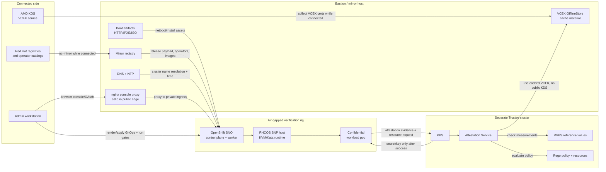
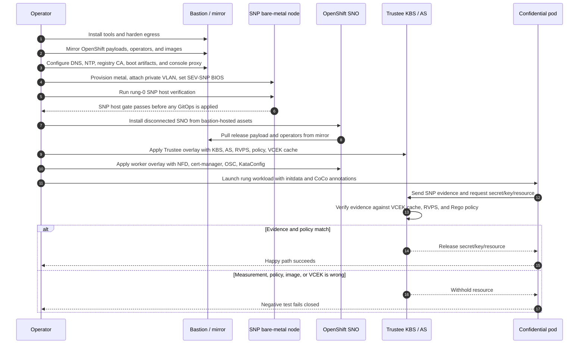
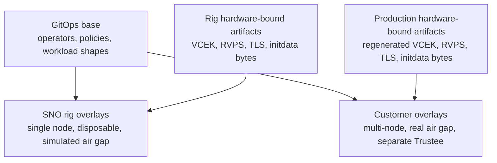

# Architecture and Flow — OpenShift Confidential Containers

This page is the visual map for the repo. It complements the manual
[`install-guide.md`](install-guide.md), the automated runbooks in
[`docs/runbooks/`](runbooks/), and the design rationale in
[`docs/design/engagement-design.md`](design/engagement-design.md).

## Big picture

The project proves OpenShift Confidential Containers (CoCo) on a disposable
single-node OpenShift (SNO) rig before applying the same GitOps shape to a
production, air-gapped, multi-node cluster. The rig intentionally simulates the
production air gap: the OpenShift node cannot reach the public Internet and must
use the bastion-hosted mirror and services.

## Component responsibilities

| Component | Lives on | Responsibility |
|-----------|----------|----------------|
| Admin workstation / repo checkout | Operator-controlled host | Runs the Makefile, Terraform/Ansible path, or manual commands; applies Kustomize overlays. |
| Bastion / mirror host | Persistent connected host with a private VLAN leg | Holds the mirror registry, DNS, NTP, and boot artifacts; downloads public content before the node is sealed off. |
| Mirror registry | Bastion | Serves OpenShift payloads, operator catalogs, and workload images to the disconnected cluster. |
| nginx console proxy | Bastion | Publishes the disposable rig's OpenShift console/OAuth routes through the bastion public IP while proxying to private VLAN ingress. |
| OpenShift SNO rig | SNP-capable bare-metal node | Disposable proof environment where the host kernel is the SEV-SNP/Kata host. |
| RHCOS + Kata | OpenShift worker node | Launches confidential VM pods using the bare-metal host path, not peer pods. |
| Trustee cluster | Separate cluster in rig and production | Runs KBS, Attestation Service, RVPS, policy, and OfflineStore-backed VCEK material. |
| VCEK OfflineStore | Trustee-side cache | Lets attestation validate AMD SEV-SNP evidence without reaching public AMD KDS. |
| GitOps overlays | `gitops/` | Keep rig and production shape aligned through reusable bases and environment overlays. |

## Visual step-by-step guide

## End-to-end phases

1. **Prepare the bastion.** Install pinned OpenShift tools, remove fragile IPv6 egress,
   clamp MTU/MSS for large registry pulls, and stand up the mirror registry.
2. **Populate disconnected content.** Mirror the OpenShift release, operator catalogs, CoCo
   images, Trustee images, and test workload images before the node depends on them.
3. **Provision SNP metal.** Create or rent an AMD SEV-SNP-capable bare-metal node, attach the
   private VLAN, and set the BIOS recipe required for SNP.
4. **Run rung-0.** Prove the host exposes SEV-SNP correctly before spending time on cluster
   installation or GitOps.
5. **Install disconnected OpenShift.** Boot the node from bastion-hosted artifacts and install
   SNO using only mirrored content and private-network services.
6. **Install platform operators.** Apply GitOps in order: Node Feature Discovery,
   cert-manager, OpenShift sandboxed containers, then Trustee.
7. **Load attestation inputs.** Generate or carry in hardware-bound VCEK certs and RVPS
   reference values; mount them into Trustee's OfflineStore and RVPS configuration.
8. **Prove capability rungs.** Run each happy path and then its negative test:
   secret-resource release, encrypted image, signed image, and air-gap/VCEK-cache proof.
9. **Promote to production.** Reuse the portable GitOps structure, but regenerate
   hardware-bound artifacts on the customer metal and separate Trustee cluster.

## What changes between rig and production

Portable items are the manifests, operator ordering, policy shape, KBS resource definitions,
and workload patterns. Hardware-bound items are VCEK certificates, RVPS reference values,
TLS identity, Trustee URL, and the exact initdata bytes measured by the TEE.
