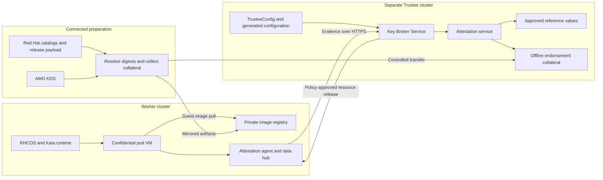
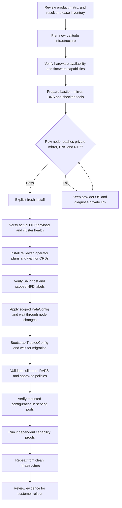
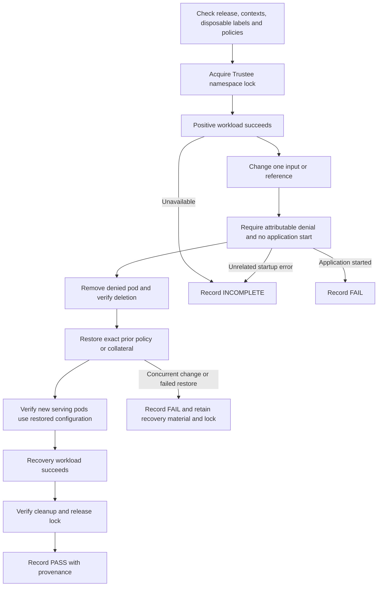

# Architecture and operational flow

This is the current candidate workflow for OSC 1.13 / Trustee 1.2. Follow [the quickstart](current-quickstart.md) and [release inventory](../install/release-manifest.json). Diagrams show intended boundaries, not a completed hardware validation.

## Components and trust domains

```mermaid
flowchart LR
  subgraph Connected[Connected preparation]
    Sources[Red Hat catalogs and release payload]
    Vendor[AMD KDS]
    Tools[Resolve digests and collect collateral]
    Sources --> Tools
    Vendor --> Tools
  end
  subgraph WorkerDomain[Worker cluster]
    Mirror[Private image registry]
    Host[RHCOS and Kata runtime]
    Guest[Confidential pod VM]
    AA[Attestation agent and data hub]
    Host --> Guest
    Guest --> AA
    Guest -->|Guest image pull| Mirror
  end
  subgraph TrusteeDomain[Separate Trustee cluster]
    TC[TrusteeConfig and generated configuration]
    KBS[Key Broker Service]
    AS[Attestation service]
    RVPS[Approved reference values]
    Offline[Offline endorsement collateral]
    TC --> KBS
    KBS --> AS
    AS --> RVPS
    AS --> Offline
  end
  Tools -->|Mirrored artifacts| Mirror
  Tools -->|Controlled transfer| Offline
  AA -->|Evidence over HTTPS| KBS
  KBS -->|Policy-approved resource release| AA
```

Customer operations select `WORKER_CONTEXT` and `TRUSTEE_CONTEXT` independently. Co-located HTTP Trustee is an explicit disposable-lab mode. Runtime selection is `kata-cc`, with the `kata-snp` handler checked explicitly. VCEK collection runs against the selected AMD worker; offline endorsement verification runs in the Trustee cluster.

## Installation checkpoints

```mermaid
flowchart TD
  BOM[Review product matrix and resolve release inventory] --> Plan[Plan new Latitude infrastructure]
  Plan --> Hardware[Verify hardware availability and firmware capabilities]
  Hardware --> Prepare[Prepare bastion, mirror, DNS and checked tools]
  Prepare --> Private{Raw node reaches private mirror, DNS and NTP?}
  Private -->|Pass| Fresh[Explicit fresh install]
  Private -->|Fail| Network[Keep provider OS and diagnose private link]
  Network --> Private
  Fresh --> OCP[Verify actual OCP payload and cluster health]
  OCP --> Operators[Install reviewed operator plans and wait for CRDs]
  Operators --> SNP[Verify SNP host and scoped NFD labels]
  SNP --> Kata[Apply scoped KataConfig and wait through node changes]
  Kata --> Trustee[Bootstrap TrusteeConfig and wait for migration]
  Trustee --> Policy[Validate collateral, RVPS and approved policies]
  Policy --> Serving[Verify mounted configuration in serving pods]
  Serving --> Proof[Run independent capability proofs]
  Proof --> Repeat[Repeat from clean infrastructure]
  Repeat --> Customer[Review evidence for customer rollout]
```

Preparation is the wrapper's default. Fresh installation is a separate operation and may replace the selected node's OS. It is not the customer upgrade procedure. A provider action with an ambiguous result requires inspection before retry; completion markers depend on the current inputs. Successful installation closes the temporary boot endpoint.

The [private-link check](latitude-validation.md#prove-the-private-link-before-reinstall) runs
from the raw node using the intended VLAN and trusted mirror CA. Mirror readiness on the
bastion alone cannot establish that path. Keep raw-host, installed RHCOS and guest evidence separate.

## Each proof has four controls

```mermaid
flowchart TD
  Ready[Check release, contexts, disposable labels and policies] --> Lock[Acquire Trustee namespace lock]
  Lock --> Allow[Positive workload succeeds]
  Allow --> Change[Change one input or reference]
  Change --> Deny[Require attributable denial and no application start]
  Deny --> Remove[Remove denied pod and verify deletion]
  Remove --> Restore[Restore exact prior policy or collateral]
  Restore --> Rotate[Verify new serving pods use restored configuration]
  Rotate --> Recovery[Recovery workload succeeds]
  Recovery --> Cleanup[Verify cleanup and release lock]
  Cleanup --> Pass[Record PASS with provenance]
  Allow -->|Unavailable| Incomplete[Record INCOMPLETE]
  Deny -->|Unrelated startup error| Incomplete
  Deny -->|Application started| Fail[Record FAIL]
  Restore -->|Concurrent change or failed restore| Stop[Record FAIL and retain recovery material and lock]
```

Error paths still attempt safe cleanup/restoration. A missing reference, registry transport failure or absent runtime cannot be converted into a pass. The runner preserves unrelated Trustee data and refuses to overwrite a concurrent edit. The [capability guide](capability-status.md) defines each negative and its limits.

## Updating an existing customer deployment

Check the live OSC matrix and available OCP update path before selecting a target. Update the platform/runtime prerequisites before OSC where the product procedure requires it. Export existing Trustee resources and preserve their ownership; a standalone 1.1 KbsConfig is not silently adopted. Regenerate target-hardware references after changes to platform, guest artifacts or firmware, then rerun the relevant proofs. Consult [the OSC update procedure](https://docs.redhat.com/en/documentation/openshift_sandboxed_containers/1.13/html/deploying_confidential_containers_on_bare-metal_servers/update-osc-cc-overview_metal-cc-update) and [the Trustee guide](trustee-current.md).
