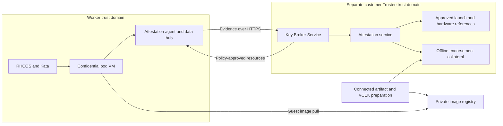
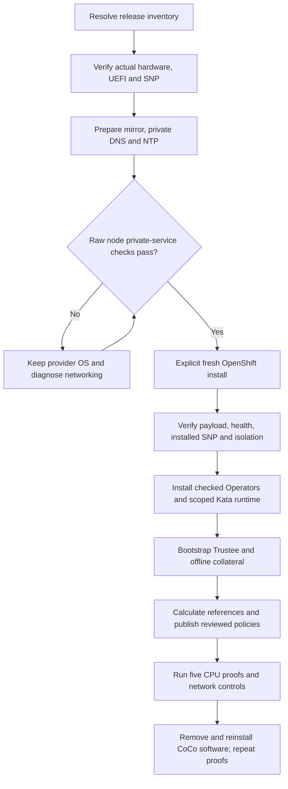
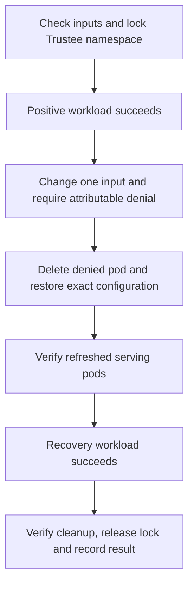

# Architecture

A confidential pod is a VM on the AMD worker. Kata's guest attestation agent
sends evidence to Trustee; approved evidence permits resource release to the
confidential data hub. The guest uses those resources for registry access and
the protected workload.

## Components

```mermaid
flowchart LR
  Sources[Connected artifact and VCEK preparation] --> Mirror[Private image registry]
  Sources --> Collateral[Offline endorsement collateral]
  subgraph Workers[Worker trust domain]
    Host[RHCOS and Kata] --> Guest[Confidential pod VM]
    Guest --> Agents[Attestation agent and data hub]
  end
  subgraph Trust[Separate customer Trustee trust domain]
    KBS[Key Broker Service] --> AS[Attestation service]
    AS --> Refs[Approved launch and hardware references]
    AS --> Collateral
  end
  Guest -->|Guest image pull| Mirror
  Agents -->|Evidence over HTTPS| KBS
  KBS -->|Policy-approved resources| Agents
```

`WORKER_CONTEXT` and `TRUSTEE_CONTEXT` select the domains independently.
`kata-cc` must resolve to handler `kata-snp`. The completed trial instead used
an explicitly selected co-located Permissive HTTP lab; the separate customer
boundary in this diagram remains unvalidated.

## Install sequence

```mermaid
flowchart TD
  Inventory[Resolve release inventory] --> Hardware[Verify actual hardware, UEFI and SNP]
  Hardware --> Helper[Prepare mirror, private DNS and NTP]
  Helper --> Link{Raw node private-service checks pass?}
  Link -->|No| Diagnose[Keep provider OS and diagnose networking]
  Diagnose --> Link
  Link -->|Yes| Install[Explicit fresh OpenShift install]
  Install --> Platform[Verify payload, health, installed SNP and isolation]
  Platform --> Operators[Install checked Operators and scoped Kata runtime]
  Operators --> Trustee[Bootstrap Trustee and offline collateral]
  Trustee --> Policy[Calculate references and publish reviewed policies]
  Policy --> Proof[Run five CPU proofs and network controls]
  Proof --> Repeat[Remove and reinstall CoCo software; repeat proofs]
```

Fresh install replaces the node OS; it is not a customer upgrade. Successful
installation closes temporary boot publication. The trial used public iPXE before
the private Agent OS. Its clean repeat retained OpenShift and physical allocations.
See [the results and limits](validation/README.md).

## Proof sequence

```mermaid
flowchart TD
  Gate[Check inputs and lock Trustee namespace] --> Allow[Positive workload succeeds]
  Allow --> Deny[Change one input and require attributable denial]
  Deny --> Restore[Delete denied pod and restore exact configuration]
  Restore --> Ready[Verify refreshed serving pods]
  Ready --> Recover[Recovery workload succeeds]
  Recover --> Cleanup[Verify cleanup, release lock and record result]
```

Unrelated errors or skipped controls cannot pass. Failed restoration retains
recovery material and the lock for inspection. [Capability tests](capability-status.md)
define each negative control; [customer planning](design/customer-scoping.md)
covers deployment and upgrade decisions.
