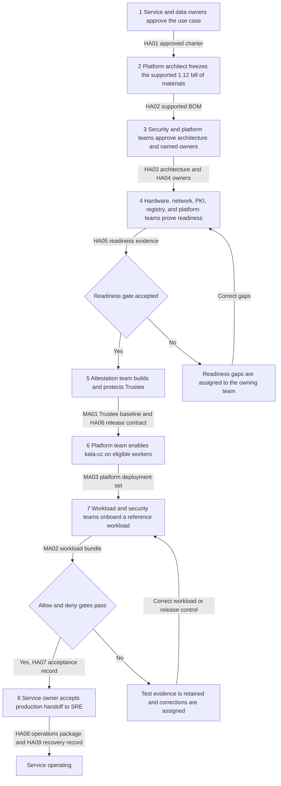
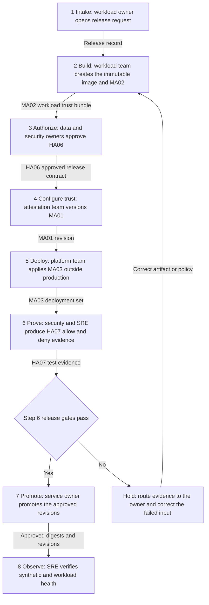
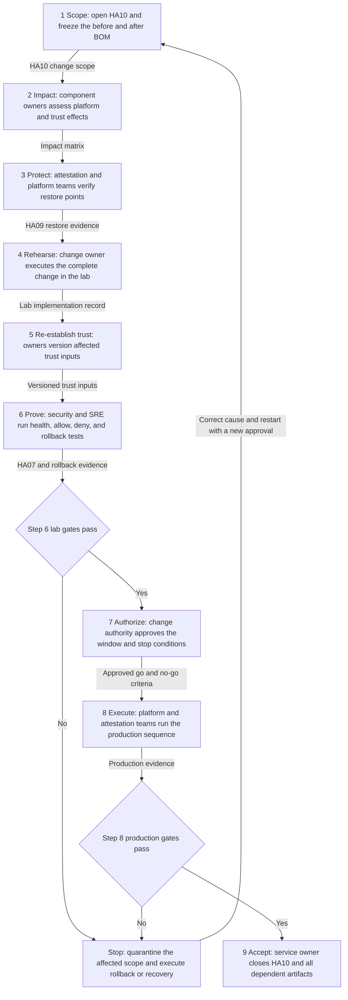

# OpenShift Confidential Containers 1.12: organizational operating playbook

| Field | Value |
|---|---|
| Status | Customer review draft |
| Last reviewed | 2026-08-26 |
| Product baseline | OpenShift sandboxed containers 1.12 and Red Hat build of Trustee 1.1 |
| Implementation scope | Bare-metal AMD SEV-SNP, `kata-cc`, disconnected production environment, and a separate trusted OpenShift cluster for Trustee |

This document describes **how work moves through the organization**. It is organized around three
repeatable workflows:

1. Establish the service for the first time.
2. Onboard or change a confidential workload and operate the service.
3. Upgrade or make a security-sensitive platform change.

Each workflow identifies the accountable team, required inputs, tangible output artifacts, and the
gate that permits the next team to proceed. Product concepts and source links are kept in appendices
so they do not obscure the operating flow.

> **Version boundary:** every product procedure, field name, and runtime statement in this playbook
> is based on OpenShift sandboxed containers 1.12 and Red Hat build of Trustee 1.1. Do not introduce
> 1.13 commands, examples, custom-resource fields, or images into this implementation. Before an
> installation or change, capture the live
> [1.12 compatibility matrix](https://docs.redhat.com/en/documentation/openshift_sandboxed_containers/1.12/html/deploying_confidential_containers_on_bare-metal_servers/cc-discover_metal-cc#cc-compatibility_metal-cc)
> and [1.12 release notes](https://docs.redhat.com/en/documentation/openshift_sandboxed_containers/1.12/html/release_notes/index)
> in the change record. Confirm the support arrangement for remaining on 1.12 with Red Hat.

> **Procedure boundary:** Red Hat documentation is authoritative for supported installation,
> configuration, update, troubleshooting, and removal procedures. Upstream documentation explains
> architecture and protocols. Repository runbooks record this project's tested implementation. An
> upstream capability or a repository example does not expand Red Hat product support.

## 1. Roles and decision rights

These are organizational roles, not necessarily separate teams. A small organization may combine
roles, but it must preserve the decision rights in the tables. The categories describe whether the
role approves business/governance outcomes or performs technical delivery and operations; they do
not describe the background of the person assigned to the role. In particular, platform access must
not silently grant authority to release every protected resource.

### Non-technical roles: business and governance decisions

| Role | Accountable for | Decisions only this role may approve | Required handoff |
|---|---|---|---|
| Service owner | End-to-end service, funding, SLO, production acceptance, and retirement | Start or stop the service; accept operational risk; declare production readiness | Approved charter, owners, SLO, and final acceptance record |
| Data or risk owner | Classification and permitted use of protected data | Which workload identity may receive which resource, for how long, and under which conditions | Signed resource-release contract and revocation instruction |
| Change authority | Maintenance approval and organizational change control | Production window, go/no-go, and accepted rollback conditions | Approved implementation and rollback record |

### Technical roles: delivery and operations

| Role | Accountable for | Decisions only this role may approve | Required handoff |
|---|---|---|---|
| Security and attestation team | Trustee, attestation appraisal, resource authorization, reference values, endorsement collateral, and security evidence | AS policy, KBS resource policy, RVPS values, Trustee administrative trust, and emergency denial | Versioned Trustee baseline and policy decision record |
| OpenShift platform team | Workload and Trustee clusters, Operators, NFD, `KataConfig`, node placement, capacity, and product support evidence | Cluster/runtime configuration, eligible nodes, maintenance sequence, and platform rollback | Healthy platform baseline, runtime evidence, and change record |
| Hardware and datacenter team | Supported servers, CPU, BIOS, firmware, BMC, replacement, and maintenance | Hardware baseline and when a node may return after hardware or firmware change | Hardware inventory, readiness result, and maintenance record |
| Workload and supply-chain team | Application, image build, SBOM, signature, optional encryption, initdata, Kata Agent policy, and workload manifests | Which immutable application artifact is proposed for release | Workload trust bundle and deployment manifest set |
| Network, PKI, time, and registry team | Guest and cluster DNS, NTP, routes, firewall, proxy, TLS, registry, mirror, and certificate lifecycle | Network exposure, trust-chain issuance, registry publication, and expiry handling | Flow matrix, CA bundle, certificate inventory, and reachability proof |
| SRE and service desk | Monitoring, synthetic tests, triage, incident evidence, backup coordination, and on-call handoff | Operational severity, escalation, and recovery execution within approved runbooks | Operations package, health evidence, incident timeline, and restore result |
| Red Hat support | Supported-product guidance and product diagnosis under subscription | Product support determination | Case guidance, official documentation, errata, and support response |

### Non-negotiable separation of duties

- The data owner approves the release intent; the attestation team implements it as policy.
- The workload team proposes an image identity; it does not unilaterally authorize access to data.
- The platform team can run the infrastructure; it does not own the protected-resource decision.
- The same change may not be considered accepted merely because its implementer reports success.
  The named gate approver must review retained allow and deny evidence.

## 2. Artifact register

Artifact IDs are used throughout the workflow charts and tables. `HA` identifies a human artifact;
`MA` identifies a machine artifact. The classification is based on the artifact's primary purpose. A
human artifact exists for review, judgment, approval, or accountability and may include attached
command output or logs. A machine artifact is applied, verified, or consumed directly by build,
GitOps, OpenShift, Trustee, or workload tooling.

### Human artifacts: decisions, approvals, and evidence

| ID | Tangible artifact | Accountable owner | Minimum contents |
|---|---|---|---|
| HA01 | [Service charter and protected-data flow](#ha01) | Service owner + data owner | Business outcome, data classification, plaintext entry/use/exit, threat statement, exclusions, SLO, RTO, RPO |
| HA02 | [Supported bill of materials snapshot](#ha02) | Platform architect | OCP z-stream, OSC 1.12 CSV/image, Trustee 1.1 CSV/image, RHCOS, TEE/CPU, guest assets, registry references, dated matrix and release-note links |
| HA03 | [Architecture and trust-boundary decision](#ha03) | Security architect | Workload and Trustee environments, administrator boundaries, network flows, registry path, TEE, failure domains, disconnected dependencies |
| HA04 | [Responsibility and escalation register](#ha04) | Service owner | Named primary and backup for every role, on-call route, Red Hat entitlement/case contacts, approval authorities |
| HA05 | [Infrastructure readiness evidence pack](#ha05) | Platform team | Hardware/BIOS/firmware checks, node inventory, DNS/NTP/TLS/route tests, mirror inventory, capacity, guest-path test plan |
| HA06 | [Resource-release contract](#ha06) | Data owner | Resource URI/ID, approved workload/image identity, guest/reference constraints, policy revisions, validity period, revocation owner, approvals |
| HA07 | [Acceptance evidence record](#ha07) | Independent gate approver | Correlated timestamps, pod UID, node, BOM, policy/reference revisions, positive release result, negative denial results, application result, exceptions |
| HA08 | [Operations and support package](#ha08) | SRE | SLO/dashboard, alerts, synthetic tests, failure routing, on-call contacts, version-matched must-gather references, redaction rules |
| HA09 | [Backup and recovery record](#ha09) | Attestation + platform teams | Inventory of recoverable state, encrypted backup locations, restore order, RTO/RPO, last restore result, post-restore allow/deny evidence |
| HA10 | [Change and upgrade impact record](#ha10) | Change owner | Before/after BOM, affected measurements/policies/certificates, dependencies, lab result, production plan, rollback trigger, approvals |
| HA11 | [Incident evidence packet](#ha11) | Incident lead | Timeline, affected workload/resource IDs, recent changes, pod/CR status, component logs, policy/reference revisions, containment and recovery decisions |
| HA12 | [Retirement and data-disposition record](#ha12) | Service + data owners | Workload/resource inventory, revocations, retained evidence, deleted material, removed endpoints, final verification |

### Machine artifacts: configuration and executable inputs

| ID | Tangible artifact | Accountable owner | Minimum contents |
|---|---|---|---|
| MA01 | [Trustee baseline bundle](#ma01) | Attestation team | Restricted `TrusteeConfig` and generated-state snapshot, or an approved advanced-configuration equivalent; TLS/admin trust references, AS policy, KBS policy, RVPS revision, resource metadata, VCEK cache inventory, backup references |
| MA02 | [Workload trust bundle](#ma02) | Workload team | Image digest, SBOM/provenance, signature evidence, encryption key reference when used, initdata source/digest, restrictive Kata Agent policy, dependency list |
| MA03 | [Platform deployment set](#ma03) | Platform + workload teams | Namespace, service account, `runtimeClassName: kata-cc`, resource requests/limits, immutable image, initdata annotation, placement, storage/network configuration |

## 3. Workflow one: establish a net-new service

### Organizational flow

### Execution and handoff table

| Step | Accountable / responsible | Work performed | Required output and what it accomplishes | Exit gate |
|---:|---|---|---|---|
| 1 | Service owner accountable; data owner responsible for classification | Define the business use case, protected-data journey, administrator threat, exclusions, SLO, and recovery objectives | **HA01** makes the requested protection and remaining risk explicit | Service and data owners sign HA01 |
| 2 | Platform architect accountable; Red Hat consulted | Check the live 1.12 matrix and release notes; record exact OCP, OSC, Trustee, RHCOS, TEE, guest, and image versions | **HA02** prevents unsupported or mixed-version implementation | Platform and security approve the dated BOM |
| 3 | Security architect accountable; every service team responsible for its section | Draw workload/Trustee separation and flows; assign owners and backups; define failure domains and approval boundaries | **HA03/HA04** remove architectural and ownership ambiguity | Security and service owners approve design and contacts |
| 4 | Platform team accountable; hardware/network/PKI/registry teams responsible | Prove TEE host readiness, node capacity, internal DNS/NTP, certificates, routes, registry/mirror, and disconnected content availability | **HA05** proves dependencies before Operator installation | Platform and security jointly accept readiness |
| 5 | Attestation team accountable; platform and PKI responsible for cluster/service support | Install Trustee on the trusted cluster using Red Hat 1.12 procedures; configure Restricted profile, TLS/admin trust, endorsements, reference values, policies, resources, monitoring, and backup | **MA01/HA06/HA09** create a controlled release authority with recoverable state | Known-good evidence is accepted and known-bad evidence is denied |
| 6 | Platform team accountable and responsible | Install NFD and OSC Operator; configure eligible nodes; create `KataConfig`; complete node changes/reboots; verify `kata-cc` | **MA03 platform baseline** creates the supported confidential runtime on named workers | Operators, CRs, pools, nodes, labels, and runtime class are healthy |
| 7 | Workload team accountable for artifact; security accountable for release control | Build/sign the reference image; create measured initdata and restrictive Kata policy; deploy an immutable manifest; request a non-production protected resource | **MA02/MA03** bind a specific workload and guest configuration to the proposed release | Inputs match HA06 and no secret value is present in Git or initdata |
| 8 | Security test owner responsible; service owner accountable | Run one allow path and relevant deny paths, correlate guest, Trustee, registry, platform, and application evidence | **HA07** demonstrates fail-closed behavior instead of only successful startup | Independent approver signs HA07 with no unexplained exception |
| 9 | SRE responsible; service owner accountable | Activate dashboards, alerts, synthetic transactions, support collection, contacts, backups, and restore exercise | **HA08/HA09** turn the build into an operable, recoverable service | On-call operator performs a forced-failure triage and restore drill |

### Net-new readiness checklist for HA05

Do not install the Operators until every row has evidence and an owner.

| Readiness area | Evidence to attach | Owner |
|---|---|---|
| Product support | Dated compatibility matrix, release notes, BOM, and Red Hat support position for the 1.12 constraint | Platform architect |
| Hardware | Model/serial, CPU/socket inventory, BIOS/UEFI settings, firmware/TCB, SEV-SNP readiness result for every eligible worker | Hardware team |
| Capacity | Per-PodVM CPU/memory/storage model, node reservations, failure capacity, maintenance capacity | Platform + workload teams |
| Trustee environment | Separate trusted cluster, administrator boundary, HA/SLO decision, backup destination, recovery access | Attestation + platform teams |
| Guest network path | DNS, route, proxy, TLS CA, registry, and Trustee reachability plan from inside a CVM | Network/PKI/registry teams |
| Disconnected content | OCP payload, catalogs, Operator and operand images, guest/app images, signatures, VCEK collateral, and refresh procedure | Registry + attestation teams |
| Time and certificates | Internal NTP, certificate chain/SAN, expiry inventory, renewal owner, alert threshold | PKI + network teams |
| Protected material | KMS/HSM/secret backend, recovery ownership, key/reference naming, rotation and revocation process | Data + attestation teams |

## 4. Workflow two: onboard or change a workload and operate it

The regular release workflow is used for a new workload, a new application image, changed initdata,
changed Kata Agent policy, changed resource access, or changed reference values. A simple application
deployment must not bypass it when the change affects attested identity or protected-resource release.

### Organizational flow

### Release workflow and responsibilities

| Step | Accountable / responsible | Required work | Output and handoff gate |
|---:|---|---|---|
| 1. Intake | Workload owner accountable | Name data, namespace, image, resource URI, runtime needs, expected release conditions, and requested date | Release record links current HA02 and identifies which artifacts will change |
| 2. Build | Workload/supply-chain team responsible | Build, scan, produce SBOM/provenance, digest-pin, sign, optionally encrypt, and publish the image; generate initdata and restrictive Kata policy | MA02 is reproducible, immutable, reviewable, and contains no plaintext protected material |
| 3. Authorize | Data owner accountable; security responsible | Map the approved workload identity and guest/reference state to the resource and expiry/review date | HA06 signed by data and security owners |
| 4. Configure trust | Attestation team accountable | Version AS policy, KBS policy, RVPS values, endorsement inputs, verification keys, and resource metadata; preserve rollback revision | MA01 revision reviewed by a second security operator and applied first outside production |
| 5. Deploy | Platform team responsible; workload owner accountable for manifest | Deploy MA03 with `kata-cc`, immutable image, correct initdata, PodVM resources, placement, network, and storage | Pod schedules only to eligible workers and starts with expected revisions |
| 6. Prove | Security test owner accountable; SRE responsible for capture | Run an allowed retrieval and applicable denials such as wrong image identity, wrong initdata/reference, forbidden resource, missing key, or unavailable collateral | HA07 correlates the KBS/AS decision, guest receipt/denial, platform events, and application result |
| 7. Promote | Service owner accountable; change authority approves window when required | Promote the exact tested digests and policy revisions; do not rebuild between test and production | Production record names the immutable inputs and rollback point |
| 8. Observe | SRE accountable | Confirm startup, attestation decisions, resource release, registry access, capacity, latency, and application health | Release closes only after the defined observation window and no unexplained denial |

### Definition of done for a workload release

- The image is referenced by digest and has retained build, scan, SBOM/provenance, and signature
  evidence.
- MA02 contains the exact initdata source and digest and a restrictive Kata Agent policy. Initdata
  contains configuration and trust material, not secrets.
- HA06 names the resource, permitted identity, policy/reference revisions, approval, and review or
  expiry date.
- MA03 uses `runtimeClassName: kata-cc` and records PodVM-sized CPU and memory.
- HA07 proves one allowed release and each denial relevant to the change.
- The operations view can correlate pod UID, node, image digest, policy revision, reference revision,
  Trustee decision, and application outcome.
- Rollback restores both the workload revision and the matching release-control revision.

### Regular operating cadence

These frequencies are starting points. The service owner must adapt them to SLOs, certificate and
collateral lifetimes, risk, and change rate.

| Frequency or trigger | Responsible role | Activity | Tangible evidence retained |
|---|---|---|---|
| Continuous | SRE | Monitor both clusters, Trustee endpoints/workloads, confidential workload startup, registry, DNS/NTP/TLS, node capacity, and abnormal latency | Dashboard history and routed alerts |
| Daily | SRE + attestation | Review failed and denied attestations by reason, workload, and recent change | Triage record for unexplained denials |
| Weekly | SRE + security | Run a safe synthetic allowed resource request and one denial | Synthetic HA07 record with correlated timestamps |
| Weekly | PKI + attestation | Review expiry horizon for certificates, tokens, signing roots, and endorsement collateral | Expiry report and assigned renewal actions |
| Monthly | Data + attestation | Reconcile HA06 contracts against policies, reference values, protected resources, owners, and expiry | Signed access and resource reconciliation |
| Monthly | Platform + workload | Review supported versions, errata, node capacity, PodVM sizing, queue/start latency, and maintenance headroom | Capacity/support review linked to HA02 |
| Quarterly or material change | Platform + attestation + SRE | Restore Trustee and required state into an isolated replacement environment, then run allow and deny tests | Updated HA09 with measured RTO/RPO and HA07 results |
| Before/after hardware or firmware work | Hardware + attestation | Capture the baseline, predict TCB/certificate impact, refresh collateral/reference inputs, quarantine until testing passes | HA10 plus pre/post evidence and node return approval |

## 5. Workflow three: upgrade or security-sensitive platform change

This workflow applies to OCP z-stream work, an OSC 1.12 update, a Trustee 1.1 update, RHCOS/Kata
change, guest asset change, BIOS/firmware/CPU work, certificate or key rotation, and attestation-policy
or reference-value change. Moving beyond the declared 1.12/1.1 baseline is a separately approved
migration project and is outside this workflow.

### Organizational flow

### Upgrade execution and decision rights

| Step | Accountable / responsible | Required output | Gate |
|---:|---|---|---|
| 1. Scope | Change owner accountable; platform responsible for BOM | HA10 names reason, before/after HA02, affected environments, maintenance window, dependencies, and rollback triggers | Service owner accepts scope; Red Hat support position is attached when relevant |
| 2. Impact | Security accountable for trust impact; each component owner responsible | Impact matrix identifies guest measurements, RVPS values, AS/KBS policy, image signatures/keys, TLS/admin trust, VCEK/collateral, node reboots, and capacity effects | Every affected artifact has a named owner and preparation action |
| 3. Protect | Attestation + platform teams accountable | Verified backup/restore point for desired state, policies, references, resource sources, credentials, certificates, and cluster configuration | Restore is demonstrated or the service owner explicitly rejects the change |
| 4. Rehearse | Change owner accountable; all affected teams responsible | Full lab record using the production sequence, mirrored content, restrictive network conditions, and representative workload | Technical implementers sign completion; independent tester receives immutable revisions |
| 5. Re-establish trust | Attestation accountable; hardware/workload/platform provide inputs | Versioned replacement references, policies, collateral, trust chains, and image evidence | Second-person policy review and retained old revision for rollback |
| 6. Prove | Security test owner accountable; SRE captures evidence | Platform health, allow/deny HA07, application behavior, monitoring, backup, and rollback result | All predefined gates pass without weakening policy |
| 7. Authorize | Change authority accountable | Approved production sequence, communication, stop conditions, rollback authority, and observation window | Formal go decision |
| 8. Execute | Platform accountable for cluster/runtime sequence; attestation accountable for Trustee/trust sequence | Timestamped implementation log and live health evidence | Stop immediately at a defined no-go condition |
| 9. Accept | Service owner accountable; security and SRE responsible for evidence review | Updated HA02/MA01/HA07/HA08/HA09/HA10 with old revision retirement decision | Close only after the observation window and an accepted allow/deny result |

### Required impact questions by change type

| Change type | Mandatory questions | Primary owner |
|---|---|---|
| OCP z-stream or RHCOS | Does the live 1.12 matrix support it? Does RHCOS change the Kata runtime or measured guest inputs? Which pools reboot and what capacity remains? | Platform |
| OSC 1.12 Operator/runtime | Does Red Hat require OCP first? Which runtime/guest assets and `KataConfig` behavior change? Which must-gather image matches? | Platform |
| Trustee 1.1 | Are CR fields, generated workloads, storage, token trust, policies, RVPS values, resources, or administrator credentials affected? | Attestation |
| Guest kernel/initrd/firmware | Which measurements and reference values change? Are signatures and provenance retained? | Platform + attestation |
| BIOS/CPU/firmware | Does TCB or VCEK material change? Must nodes remain quarantined until new evidence is accepted? | Hardware + attestation |
| AS/KBS policy or RVPS | Which HA06 contracts are affected? Can the old revision be restored? Does a new value accidentally broaden access? | Data + attestation |
| TLS, token, signing, encryption, or secret rotation | Can old and new trust overlap safely? What is the revocation test? Where is emergency recovery material held? | PKI/security/supply chain |
| Registry or disconnected mirror | Are all Operator, operand, guest, app, signature, and collateral inputs present internally and reachable from inside a CVM? | Registry + network |

### Product-required ordering note

For the 1.12 bare-metal product path, Red Hat's update documentation directs the team to update OCP
first and then update the OpenShift sandboxed containers Operator. Treat the OCP change as a runtime
change because the RHCOS update carries Kata runtime dependencies. Follow the live
[1.12 update procedure](https://docs.redhat.com/en/documentation/openshift_sandboxed_containers/1.12/html/deploying_confidential_containers_on_bare-metal_servers/update-osc-cc-overview_metal-cc)
and the matching
[Trustee update procedure](https://docs.redhat.com/en/documentation/openshift_sandboxed_containers/1.12/html/deploying_red_hat_build_of_trustee_for_workloads_running_on_bare-metal_servers/update-trustee-overview_metal-trustee)
rather than relying only on this organizational workflow.

## 6. Acceptance, rollback, and incident rules

### Minimum acceptance record

HA07 must answer all of the following:

- What exact OCP, OSC, Trustee, RHCOS, hardware/firmware, guest, image, initdata, policy, reference,
  and certificate revisions were tested?
- Which pod UID ran on which node, and what timestamps correlate platform, guest, registry, Trustee,
  and application evidence?
- Which protected test resource was requested and which HA06 contract authorized it?
- Did the expected workload receive the resource and demonstrate the protected operation?
- Did each relevant wrong identity, wrong reference/initdata, forbidden resource, missing key,
  unavailable collateral, and untrusted TLS case remain denied?
- Were test changes reverted, and did monitoring detect the forced failure?
- Who independently accepted the result and any exception?

### Rollback is a matched set

Never roll back only the application or only Trustee policy when the identities were changed
together. A rollback point must name the matching set of:

- workload image digest and deployment manifest;
- initdata and Kata Agent policy digest;
- guest/reference-value revision;
- AS and KBS policy revision;
- protected-resource metadata and key reference;
- TLS, token-verification, and signing trust revision; and
- OCP/OSC/Trustee/RHCOS bill of materials where applicable.

### Failure ownership and first evidence

| Symptom | First owner | First evidence to collect |
|---|---|---|
| Pod never schedules | Platform | Runtime class, node labels/resources/taints, scheduler events, machine config pool state |
| Pod schedules but CVM does not start | Platform + hardware | `KataConfig`, OSC/runtime logs, node TEE readiness, firmware state, PodVM resource request |
| Guest cannot reach registry or Trustee | Network + registry + platform | Guest-path DNS/route/proxy/TLS evidence, initdata source/digest, endpoint certificate |
| Image pull or verification is denied | Workload + registry + security | Image digest, signature evidence, verification policy/key revision, registry log, guest image-rs log |
| Evidence validation fails | Attestation + hardware | AS decision, VCEK/certificate chain, TCB/reference values, initdata/guest measurements, recent firmware change |
| Evidence is accepted but resource is denied | Attestation + data owner | HA06 contract, resource URI, KBS policy revision, attestation token/claims, resource existence/backend health |
| Resource is delivered but application fails | Workload | Guest/application logs, resource format/path, app configuration, readiness result, image digest |
| Broad outage after change | Change owner + incident lead | HA10 sequence/timestamps, old/new BOM, affected scope, gate results, rollback trigger and restore state |

Before opening a Red Hat case, HA11 should include exact versions, timestamps/timezone, one failing
pod UID/name/namespace, Operator and CR status, failure stage, matching component logs, recent changes,
a known-good comparison, and version-matched OSC/Trustee must-gather material. Redact all protected
values, private keys, and administrator credentials.

## 7. Backup, recovery, and retirement

### Recovery order

1. Declare the recovery event and freeze policy/resource changes.
2. Restore or rebuild the trusted OpenShift environment and normal cluster dependencies.
3. Restore the Trustee Operator and intended `TrusteeConfig`.
4. Restore TLS identity, administrator trust, token verification, endorsement/VCEK cache, AS policy,
   RVPS values, KBS policy, protected-resource sources, and verification keys from authoritative
   systems.
5. Restore routes, services, DNS, firewall, monitoring, and registry dependencies.
6. Run the known-good allow test and all required denial tests.
7. Return service only after the security and service owners accept a new HA07 and HA09.

The backup design must distinguish desired-state manifests from protected values. Git is not a
backup destination for plaintext protected resources, private keys, or recovery credentials.

### Retirement flow

1. Service owner freezes onboarding and inventories every workload and resource consumer.
2. Data owner revokes HA06 contracts and orders rotation where material was shared.
3. Workload/platform teams remove all `kata-cc` consumers and verify absence.
4. Attestation team preserves required evidence, removes resources and policies, and proves
   revocation.
5. Platform team removes `KataConfig` and the Operator in Red Hat's documented order, then removes
   Trustee only after every dependency is gone.
6. Network/PKI/registry/SRE teams remove certificates, DNS, firewall, mirror, and monitoring entries.
7. Service and data owners sign HA12 after recovery credentials and retained data are dispositioned.

Use Red Hat's
[1.12 uninstall procedure](https://docs.redhat.com/en/documentation/openshift_sandboxed_containers/1.12/html/deploying_confidential_containers_on_bare-metal_servers/uninstall-overview_metal-cc),
which requires removing confidential workloads before `KataConfig` and Operator resources.

## 8. Minimal technical reference

### What each major component accomplishes

| Component | Plain responsibility | Customer owner |
|---|---|---|
| TEE-capable server, BIOS, and firmware | Protects and reports the hardware/firmware state of the CVM | Hardware team |
| OpenShift workload cluster | Schedules the pod and operates the worker; remains outside the confidentiality boundary | Platform team |
| NFD and TEE rules | Label nodes that appear eligible; this is scheduling input, not attestation | Platform + hardware teams |
| OSC Operator and `KataConfig` | Install and reconcile the supported Kata confidential runtime | Platform team |
| Kata runtime, hypervisor, and guest | Create the local PodVM, boot measured guest assets, and run the application | Platform team; Red Hat supplies supported product assets |
| Kata Agent policy | Restricts what the untrusted host may ask the guest to do | Workload + security teams |
| Attestation Agent and CDH/image components | Obtain evidence, request protected resources, and perform guest-side protected operations | Runtime product; integrated by workload team |
| Trustee KBS | Brokers attestation and releases only policy-authorized resources | Attestation team |
| Attestation Service | Validates evidence and evaluates attestation policy | Attestation team |
| RVPS | Stores approved reference values used during appraisal | Attestation team with platform/workload inputs |
| Protected-resource backend | Holds keys, secrets, tokens, or other protected values | Data/secrets team |
| Registry and supply chain | Build, sign, optionally encrypt, publish, and retain immutable images | Workload/supply-chain team |

### Plain-language terms

| Term | Meaning in this playbook |
|---|---|
| Confidential pod or PodVM | A pod sandbox implemented as a small hardware-protected VM |
| TEE | CPU/platform technology that isolates and measures the PodVM |
| Attestation | Validation of hardware-signed evidence and measured guest state |
| Reference value | Expected-good measurement or TCB input used by the appraisal policy |
| Trustee | Red Hat's trusted-side attestation and protected-resource release stack |
| AS policy | Rules that determine whether evidence and claims are acceptable |
| KBS resource policy | Rules that determine whether an accepted identity may receive a resource |
| RVPS | Service holding reference values used in appraisal |
| Initdata | Integrity-protected launch configuration such as Trustee URL, CA, and Kata Agent policy; it is not confidential |
| VCEK | AMD certificate used to validate SEV-SNP evidence; disconnected and multi-socket environments need an explicit lifecycle |

Confidential Containers does not replace application security, supply-chain security, TLS, storage
controls, availability engineering, or data governance. A running pod is not proof that the intended
attestation-gated release occurred. Acceptance must request a real non-production resource and retain
both the release and denial decisions.

## 9. Artifact appendix

The human-artifact descriptions below are **suggested customer governance structures**, not Red Hat,
Kubernetes, Confidential Containers, or Trustee standard schemas. Adapt them to existing customer
approval and evidence processes. The machine-artifact entries identify product procedures, upstream
specifications, and repository examples; for custom resources, the installed 1.12 CRD and matching
Red Hat 1.12 documentation remain authoritative. No artifact should expose plaintext protected data,
private keys, or administrator credentials.

### HA01 — Service charter and protected-data flow

- **Purpose:** establish why the service exists, which data needs protection while in use, who is
  outside the intended trust boundary, and what success and failure mean.
- **Accountable owner:** service owner with data-owner approval.
- **Inputs:** business use case, data classification, regulatory obligations, application data flow,
  administrator threat statement, SLO, RTO, and RPO.
- **Required detail:** plaintext entry/use/exit/storage/logging points; trusted and untrusted actors;
  exclusions such as availability, application bugs, and side channels; accepted residual risks.
- **Complete when:** the service and data owners approve the use case, boundaries, exclusions, and
  recovery objectives.
- **Handoff:** constrains HA03 architecture and every HA06 resource-release decision.
- **References:** [upstream trust model](https://confidentialcontainers.org/docs/architecture/trust-model/trust-model/)
  and [customer scoping questions](design/customer-scoping.md).

### HA02 — Supported bill of materials snapshot

- **Purpose:** freeze the exact supported and tested product/hardware combination used by a build or
  change.
- **Accountable owner:** platform architect.
- **Inputs:** installed cluster inventory, target versions, image registry metadata, live 1.12 support
  matrix, release notes, and applicable Red Hat case guidance.
- **Required detail:** OCP z-stream, RHCOS, OSC CSV and image digest, Trustee CSV and image digest,
  guest assets, TEE/CPU/firmware baseline, registry references, and date checked.
- **Complete when:** all components are exact rather than floating, the 1.12 matrix is attached, and
  platform/security approve any stated support exception.
- **Handoff:** every HA07 acceptance record and HA10 change record names the HA02 revision tested.
- **References:** [1.12 compatibility](https://docs.redhat.com/en/documentation/openshift_sandboxed_containers/1.12/html/deploying_confidential_containers_on_bare-metal_servers/cc-discover_metal-cc#cc-compatibility_metal-cc)
  and [1.12 release notes](https://docs.redhat.com/en/documentation/openshift_sandboxed_containers/1.12/html/release_notes/index).

### HA03 — Architecture and trust-boundary decision

- **Purpose:** show where each component runs, who administers it, which paths cross the protected
  boundary, and which failures or compromises the design tolerates.
- **Accountable owner:** security architect.
- **Inputs:** HA01, HA02, customer topology, network zones, registry/mirror design, PKI, identity,
  storage, and disconnected requirements.
- **Required detail:** separate workload and Trustee environments, administrative boundaries, guest
  flows to Trustee and registry, DNS/NTP/TLS/proxy paths, failure domains, capacity, and recovery.
- **Complete when:** security, platform, network, hardware, workload, and service owners agree that
  every component and flow has an owner and stated trust posture.
- **Handoff:** drives HA05 readiness checks, MA01 Trustee configuration, and MA03 placement/networking.
- **References:** [CoCo design overview](https://confidentialcontainers.org/docs/architecture/design-overview/)
  and [Red Hat Trustee topology](https://docs.redhat.com/en/documentation/openshift_sandboxed_containers/1.12/html/deploying_red_hat_build_of_trustee_for_workloads_running_on_bare-metal_servers/index).

### HA04 — Responsibility and escalation register

- **Purpose:** assign a primary, backup, decision right, on-call route, and escalation path for every
  role and gate in this playbook.
- **Accountable owner:** service owner.
- **Inputs:** customer organization chart, support entitlements, incident process, and the roles in
  Section 1.
- **Required detail:** named people or teams, primary/backup contact, approval authority, service hours,
  incident route, Red Hat case contacts, and temporary delegation process.
- **Complete when:** no critical component, artifact, test, rotation, recovery task, or gate is ownerless.
- **Handoff:** accompanies every net-new, release, change, incident, and recovery record.
- **References:** [upstream personas](https://confidentialcontainers.org/docs/architecture/trust-model/cloud-native-personas/)
  and [Red Hat support scope](https://access.redhat.com/support/offerings/production/soc).

### HA05 — Infrastructure readiness evidence pack

- **Purpose:** prove that prerequisites work before Operator or production workload changes begin.
- **Accountable owner:** OpenShift platform team; hardware, network, PKI, registry, and attestation
  teams contribute evidence.
- **Inputs:** HA02, HA03, hardware inventory, mirror bill of materials, certificates, capacity model,
  and readiness test plan.
- **Required detail:** SEV-SNP/BIOS/firmware result for every eligible worker; node and capacity
  inventory; DNS/NTP/TLS/route/proxy results; internal content inventory; guest-path test plan.
- **Complete when:** every prerequisite is passing or an explicit owner, due date, and go/no-go effect
  is recorded for the gap.
- **Handoff:** readiness approval permits MA01 and MA03 installation work to begin.
- **References:** [Red Hat 1.12 installation prerequisites](https://docs.redhat.com/en/documentation/openshift_sandboxed_containers/1.12/html/deploying_confidential_containers_on_bare-metal_servers/install-cc-overview_metal-cc),
  [host verification script](../scripts/verify-snp-host.sh), and
  [baseline validation script](../scripts/validate-sno-baseline.sh).

### HA06 — Resource-release contract

- **Purpose:** record the data owner's human authorization for a specific protected resource to be
  released to a defined workload identity under stated attestation conditions.
- **Accountable owner:** data owner; security/attestation translates the approved intent into MA01.
- **Inputs:** HA01 data scope, HA03 boundary, MA02 image/initdata identities, requested resource URI,
  proposed reference set, policy revisions, validity period, and revocation owner.
- **Required detail:** approval ID, resource identifier, workload owner and immutable identity,
  enforceable guest/reference constraints, review/expiry, revocation route, data-owner approval, and
  security approval. An image digest is a valid condition only when the technical path verifies it.
- **Complete when:** each approved condition maps to an enforceable MA01 or MA02 control and the deny
  test is defined. HA06 contains authorization metadata, never the protected value.
- **Handoff:** attestation implements MA01; HA07 later proves that the approved and denied cases behave
  as intended.
- **References:** [Trustee policies](https://confidentialcontainers.org/docs/attestation/policies/)
  and [Trustee protected resources](https://confidentialcontainers.org/docs/attestation/resources/).

### HA07 — Acceptance evidence record

- **Purpose:** demonstrate that one exact artifact set allows the intended operation and fails closed
  for relevant negative cases.
- **Accountable owner:** independent gate approver; security and SRE capture evidence.
- **Inputs:** HA02, HA06, MA01, MA02, MA03, test cases, synchronized timestamps, and expected results.
- **Required detail:** pod UID/node, immutable digests/revisions, correlated platform/guest/registry/
  Trustee/application evidence, positive result, each negative result, exceptions, and cleanup.
- **Complete when:** the approver can trace the request through the KBS/AS decision to guest and
  application outcome, and no unexplained allow or denial remains.
- **Handoff:** permits production promotion, upgrade closure, restoration, or node return to service.
- **References:** [Red Hat observability](https://docs.redhat.com/en/documentation/openshift_sandboxed_containers/1.12/html/deploying_confidential_containers_on_bare-metal_servers/observe_metal-cc)
  and [test rung script](../scripts/test-rung.sh).

### HA08 — Operations and support package

- **Purpose:** give on-call staff the health views, alerts, synthetic checks, triage routes, and safe
  support-collection procedure needed to operate the service.
- **Accountable owner:** SRE and service desk.
- **Inputs:** SLO, HA04 contacts, HA07 signals, topology, component log/metric locations, certificate
  lifetimes, and version-matched must-gather references.
- **Required detail:** dashboards, actionable alert thresholds, allowed/denied synthetic probes,
  symptom-to-owner routing, evidence/redaction rules, escalation, and maintenance checks.
- **Complete when:** an operator unfamiliar with the build detects and routes a forced failure without
  exposing protected material.
- **Handoff:** used continuously and updated after releases, upgrades, incidents, and recovery tests.
- **References:** [Red Hat troubleshooting](https://docs.redhat.com/en/documentation/openshift_sandboxed_containers/1.12/html/deploying_confidential_containers_on_bare-metal_servers/troubleshoot_metal-cc),
  [debug surface](runbooks/debug-surface.md), and [failure-mode playbook](runbooks/failure-modes.md).

### HA09 — Backup and recovery record

- **Purpose:** prove that the decision system and protected-resource sources can be restored within
  approved recovery objectives.
- **Accountable owner:** attestation and platform teams; service owner approves RTO/RPO.
- **Inputs:** authoritative configuration inventory, protected-value inventory, certificates/keys,
  HA01 recovery objectives, topology dependencies, and recovery access.
- **Required detail:** what is backed up, exclusions, encrypted locations, ownership, restore order,
  dependency sequence, RTO/RPO measurement, last exercise result, and post-restore HA07.
- **Complete when:** an isolated restore produces the intended allow and deny outcomes, not merely
  healthy Kubernetes objects.
- **Handoff:** prerequisite for production acceptance and every HA10 upgrade approval.
- **References:** [Red Hat Trustee 1.12 guide](https://docs.redhat.com/en/documentation/openshift_sandboxed_containers/1.12/html/deploying_red_hat_build_of_trustee_for_workloads_running_on_bare-metal_servers/index)
  and the recovery order in Section 7 of this playbook.

### HA10 — Change and upgrade impact record

- **Purpose:** join the before/after BOM, trust-impact analysis, implementation sequence, test plan,
  stop conditions, and matched rollback set for a security-sensitive change.
- **Accountable owner:** named change owner.
- **Inputs:** current and target HA02, affected HA06 contracts, MA01/MA02/MA03 revisions, release notes,
  maintenance capacity, HA09 restore point, and lab results.
- **Required detail:** scope, dependencies, measurement/reference/certificate impact, owners, lab
  evidence, production steps, observation window, rollback trigger/authority, and approvals.
- **Complete when:** all affected artifacts have owners, lab allow/deny and rollback tests pass, and
  change authority records go/no-go criteria.
- **Handoff:** authorizes production execution and is closed only with updated HA02, HA07, HA08, and HA09.
- **References:** [OSC 1.12 update procedure](https://docs.redhat.com/en/documentation/openshift_sandboxed_containers/1.12/html/deploying_confidential_containers_on_bare-metal_servers/update-osc-cc-overview_metal-cc)
  and [Trustee update procedure](https://docs.redhat.com/en/documentation/openshift_sandboxed_containers/1.12/html/deploying_red_hat_build_of_trustee_for_workloads_running_on_bare-metal_servers/update-trustee-overview_metal-trustee).

### HA11 — Incident evidence packet

- **Purpose:** preserve the minimum correlated, redacted evidence needed for internal response and a
  productive Red Hat support case.
- **Accountable owner:** incident lead.
- **Inputs:** HA02, HA04, HA07 baseline, recent HA10 changes, alert timeline, failing pod identity,
  component status/logs, and comparison with a known-good workload.
- **Required detail:** timestamps/timezone, affected scope and resource IDs, failure stage, CR/Operator
  status, relevant logs, policy/reference revisions, containment, revocations, and recovery decisions.
- **Complete when:** the timeline can distinguish scheduling, VM launch, guest, registry, evidence,
  appraisal, resource authorization, and application failure without including credentials or secrets.
- **Handoff:** internal responders use it for containment; Red Hat receives the supported-product subset.
- **References:** [Red Hat 1.12 troubleshooting](https://docs.redhat.com/en/documentation/openshift_sandboxed_containers/1.12/html/deploying_confidential_containers_on_bare-metal_servers/troubleshoot_metal-cc)
  and [guest-side KBS debugging](runbooks/rung-kbs-guest-debug.md).

### HA12 — Retirement and data-disposition record

- **Purpose:** prove that consumers, authorizations, protected material, runtime resources, endpoints,
  and operational dependencies were removed or retained under explicit instruction.
- **Accountable owner:** service owner with data-owner approval.
- **Inputs:** workload/resource inventory, HA06 contracts, retention requirements, shared-material
  analysis, uninstall plan, and final verification plan.
- **Required detail:** stopped onboarding, migrated/removed workloads, revoked access, rotations,
  retained audit evidence, deleted values/keys/certificates, removed cluster/network/monitoring objects,
  and approvers.
- **Complete when:** no confidential workload or resource consumer remains, endpoints and credentials
  are closed, data disposition is verified, and both owners sign.
- **Handoff:** closes the service lifecycle and supplies audit evidence.
- **References:** [Red Hat 1.12 uninstall procedure](https://docs.redhat.com/en/documentation/openshift_sandboxed_containers/1.12/html/deploying_confidential_containers_on_bare-metal_servers/uninstall-overview_metal-cc).

### MA01 — Trustee baseline bundle

- **Purpose:** provide the versioned machine configuration that deploys Trustee and enforces evidence
  appraisal and protected-resource release.
- **Accountable owner:** security and attestation team.
- **Inputs:** HA02, HA03, approved HA06 contracts, PKI/admin trust references, endorsement/VCEK inputs,
  reference values, protected-resource metadata, and backup design.
- **Machine resources:** a Restricted `TrusteeConfig` plus the observed resources it generates. If the
  advanced `KbsConfig` path is required, include the approved exception, installed CRD, complete
  `KbsConfig`, every referenced object, and evidence that equivalent restrictive controls are enforced.
  In both cases retain KBS/AS configuration, complete AS and KBS policies, RVPS values, certificate/
  cache mounts, services/routes, installed CSV/CRD identity, content hashes, and secret/resource
  references. Secret values remain outside version control.
- **Complete when:** schemas validate against the installed Trustee 1.1 Operator CRDs; the desired
  source and observed generated state are retained; Trustee is healthy; a known-good request succeeds;
  a known-bad request fails; and rollback is retained. An empty reference set or an allow-all policy is
  test scaffolding, never a production MA01.
- **Product and upstream specifications:** [Red Hat Trustee 1.12 connected guide](https://docs.redhat.com/en/documentation/openshift_sandboxed_containers/1.12/html/deploying_red_hat_build_of_trustee_for_workloads_running_on_bare-metal_servers/index),
  [disconnected configuration](https://docs.redhat.com/en/documentation/openshift_sandboxed_containers/1.12/html/deploying_red_hat_build_of_trustee_for_workloads_running_on_bare-metal_servers_in_a_disconnected_environment/configure-trustee-overview_metal-trustee-disconnected),
  point-in-time upstream [`TrusteeConfig` CRD](https://github.com/confidential-containers/trustee-operator/blob/v0.19.0/config/crd/bases/confidentialcontainers.org_trusteeconfigs.yaml)
  and [`KbsConfig` CRD](https://github.com/confidential-containers/trustee-operator/blob/v0.19.0/config/crd/bases/confidentialcontainers.org_kbsconfigs.yaml),
  [Trustee policies](https://confidentialcontainers.org/docs/attestation/policies/),
  [reference values](https://confidentialcontainers.org/docs/attestation/reference-values/), and
  [protected resources](https://confidentialcontainers.org/docs/attestation/resources/). The upstream
  CRDs are comparison aids; the CRDs installed by Red Hat Trustee 1.1 are authoritative.
- **Repository examples:** [advanced `KbsConfig`](../gitops/base/trustee/kbsconfig.yaml),
  [policy and RVPS ConfigMaps](../gitops/base/trustee/kbs-configmaps.yaml),
  [secret stubs](../gitops/base/trustee/secret-stubs.example.yaml), and
  [multi-socket VCEK runbook](runbooks/multi-socket-vcek.md). The local base uses the advanced path and
  permissive evaluation scaffolding; it is not a production Restricted profile. These rig examples do
  not replace the Red Hat 1.12 product schema or the required allow/deny evidence.

### MA02 — Workload trust bundle

- **Purpose:** identify and protect the exact application and guest launch configuration proposed for
  an HA06 authorization decision.
- **Accountable owner:** workload and supply-chain team; security approves policy-relevant content.
- **Inputs:** final application source/build, dependency inventory, target registry, HA06 requirements,
  Trustee endpoint/CA, image verification and encryption design, and final workload manifest.
- **Machine resources:** digest-pinned OCI image identity; SBOM and provenance bound to that digest;
  signature evidence and verification-key reference; encryption key ID/reference when used; initdata
  source, encoded value, and digest; image-security policy; dependency list; and either the complete
  applied restrictive Kata Agent policy and digest or the exact vendor guest-asset/default-policy
  identity and extracted policy digest.
- **Complete when:** the build is reproducible; every trust artifact names the same immutable image;
  configured signature checks pass; initdata source, annotation, and attestation claim match; the exact
  applied Kata policy is identifiable; required operations succeed; and tampered, unsigned, wrong-key,
  disallowed guest-operation, and mismatched-initdata cases fail as designed.
- **Specifications:** [OCI descriptor and digest rules 1.1.1](https://github.com/opencontainers/image-spec/blob/v1.1.1/descriptor.md),
  [OCI manifest rules 1.1.1](https://github.com/opencontainers/image-spec/blob/v1.1.1/manifest.md),
  [OCI image encryption specification](https://github.com/containers/ocicrypt/blob/main/docs/encodings.md),
  [CoCo initdata](https://confidentialcontainers.org/docs/features/initdata/),
  [signed images](https://confidentialcontainers.org/docs/features/signed-images/),
  [encrypted images](https://confidentialcontainers.org/docs/features/encrypted-images/), and
  [Kata Agent policy](https://github.com/kata-containers/kata-containers/blob/main/docs/how-to/how-to-use-the-kata-agent-policy.md).
- **Repository examples:** [initdata source](../gitops/base/workloads/initdata.example.toml),
  [initdata encoder](../scripts/encode-initdata.sh),
  [signed-image build](../scripts/build-rung-images.sh), and
  [signature verification](../scripts/verify-rung-signed-signature.sh). The example initdata omits a
  custom policy and relies on the guest's built-in policy; production evidence must identify and test
  that exact default, or supply and test a complete replacement. The example build also needs an
  approved SBOM and provenance artifact before it satisfies MA02.

### MA03 — Platform deployment set

- **Purpose:** provide the versioned OpenShift resources that enable the supported confidential runtime
  and deploy an immutable workload to eligible workers.
- **Accountable owner:** OpenShift platform team for cluster resources; workload team for its Pod spec.
- **Inputs:** HA02, HA03 placement/network decisions, HA05 readiness, MA02 identities, namespace/service
  account, PodVM capacity, storage, and workload network requirements.
- **Machine resources:** OSC feature-gate configuration, NFD and TEE discovery rules, `KataConfig`, a
  dedicated `Namespace` and `ServiceAccount`, RBAC and network/storage policy objects, explicit
  placement and capacity controls, and Pod/workload specs using `runtimeClassName: kata-cc`, an
  immutable image, initdata, and PodVM-sized resources. Capture the live, product-created
  `RuntimeClass/kata-cc` as observed reconciliation evidence; do not hand-author it.
- **Complete when:** resources validate against the installed APIs, eligible nodes are labeled,
  Operator/`KataConfig`/machine config pools are healthy, the generated `kata-cc` runtime matches the
  intended scheduling boundary, and the representative Pod uses the dedicated identity and schedules
  only to eligible workers with the approved resource, network, and storage controls.
- **Product and API specifications:** [Red Hat 1.12 installation](https://docs.redhat.com/en/documentation/openshift_sandboxed_containers/1.12/html/deploying_confidential_containers_on_bare-metal_servers/install-cc-overview_metal-cc),
  [Red Hat 1.12 configuration](https://docs.redhat.com/en/documentation/openshift_sandboxed_containers/1.12/html/deploying_confidential_containers_on_bare-metal_servers/configure-cc-overview_metal-cc),
  [OSC 1.12.1 `KataConfig` CRD](https://github.com/openshift/sandboxed-containers-operator/blob/v1.12.1/config/crd/bases/kataconfiguration.openshift.io_kataconfigs.yaml),
  [Kubernetes Pod v1 API](https://kubernetes.io/docs/reference/kubernetes-api/workload-resources/pod-v1/),
  [RuntimeClass v1 API](https://kubernetes.io/docs/reference/kubernetes-api/node/runtime-class-v1/), and
  [Node Feature Discovery API](https://kubernetes-sigs.github.io/node-feature-discovery/master/reference/generated-nfd-api-reference.html).
- **Repository examples:** [`KataConfig`](../gitops/base/kataconfig/kataconfig.yaml),
  [OSC feature gates](../gitops/base/kataconfig/feature-gates.yaml),
  [AMD SEV-SNP node rule](../gitops/base/nfd/amd-snp-rule.yaml), and
  [digest-ready signed workload](../gitops/base/workloads/rung-signed-pod.yaml). The rung workload is a
  partial test example: it does not provide the required dedicated namespace, service account, or
  production placement controls.

## 10. Source library

### Red Hat product documentation for the 1.12 baseline

- [OpenShift sandboxed containers 1.12 documentation home](https://docs.redhat.com/en/documentation/openshift_sandboxed_containers/1.12)
- [OpenShift sandboxed containers 1.12 release notes](https://docs.redhat.com/en/documentation/openshift_sandboxed_containers/1.12/html/release_notes/index)
- [Bare-metal confidential containers: compatibility and terms](https://docs.redhat.com/en/documentation/openshift_sandboxed_containers/1.12/html/deploying_confidential_containers_on_bare-metal_servers/cc-discover_metal-cc)
- [Bare-metal confidential containers: installation](https://docs.redhat.com/en/documentation/openshift_sandboxed_containers/1.12/html/deploying_confidential_containers_on_bare-metal_servers/install-cc-overview_metal-cc)
- [Bare-metal confidential containers: configuration](https://docs.redhat.com/en/documentation/openshift_sandboxed_containers/1.12/html/deploying_confidential_containers_on_bare-metal_servers/configure-cc-overview_metal-cc)
- [Bare-metal confidential containers: update](https://docs.redhat.com/en/documentation/openshift_sandboxed_containers/1.12/html/deploying_confidential_containers_on_bare-metal_servers/update-osc-cc-overview_metal-cc)
- [Bare-metal confidential containers: observe](https://docs.redhat.com/en/documentation/openshift_sandboxed_containers/1.12/html/deploying_confidential_containers_on_bare-metal_servers/observe_metal-cc)
- [Bare-metal confidential containers: troubleshoot](https://docs.redhat.com/en/documentation/openshift_sandboxed_containers/1.12/html/deploying_confidential_containers_on_bare-metal_servers/troubleshoot_metal-cc)
- [Bare-metal confidential containers: uninstall](https://docs.redhat.com/en/documentation/openshift_sandboxed_containers/1.12/html/deploying_confidential_containers_on_bare-metal_servers/uninstall-overview_metal-cc)
- [Red Hat build of Trustee for bare-metal workloads](https://docs.redhat.com/en/documentation/openshift_sandboxed_containers/1.12/html/deploying_red_hat_build_of_trustee_for_workloads_running_on_bare-metal_servers/index)
- [Red Hat build of Trustee for disconnected bare-metal workloads](https://docs.redhat.com/en/documentation/openshift_sandboxed_containers/1.12/html/deploying_red_hat_build_of_trustee_for_workloads_running_on_bare-metal_servers_in_a_disconnected_environment/index)
- [OpenShift Container Platform life-cycle policy](https://access.redhat.com/support/policy/updates/openshift)
- [OpenShift Operator life-cycle policy](https://access.redhat.com/support/policy/updates/openshift_operators)
- [Red Hat production support scope](https://access.redhat.com/support/offerings/production/soc)

### Upstream architecture and protocol references

- [Confidential Containers documentation home](https://confidentialcontainers.org/docs/)
- [Confidential Containers design overview](https://confidentialcontainers.org/docs/architecture/design-overview/)
- [Confidential Containers trust model](https://confidentialcontainers.org/docs/architecture/trust-model/trust-model/)
- [Cloud-native personas](https://confidentialcontainers.org/docs/architecture/trust-model/cloud-native-personas/)
- [Attestation with Trustee](https://confidentialcontainers.org/docs/attestation/)
- [Trustee architecture](https://confidentialcontainers.org/docs/attestation/architecture/)
- [Connect Confidential Containers to Trustee](https://confidentialcontainers.org/docs/attestation/coco-setup/)
- [Trustee resources](https://confidentialcontainers.org/docs/attestation/resources/)
- [Trustee policies](https://confidentialcontainers.org/docs/attestation/policies/)
- [Trustee reference values](https://confidentialcontainers.org/docs/attestation/reference-values/)
- [Initdata](https://confidentialcontainers.org/docs/features/initdata/)
- [Signed images](https://confidentialcontainers.org/docs/features/signed-images/)
- [Encrypted images](https://confidentialcontainers.org/docs/features/encrypted-images/)
- [Authenticated registries](https://confidentialcontainers.org/docs/features/authenticated-registries/)
- [Protected storage](https://confidentialcontainers.org/docs/features/protected-storage/)
- [KBS attestation protocol](https://github.com/confidential-containers/trustee/blob/main/kbs/docs/kbs_attestation_protocol.md)
- [Kata Containers architecture](https://github.com/kata-containers/kata-containers/tree/main/docs/design/architecture)

Use upstream references for concepts and implementation detail, not as substitutes for the Red Hat
1.12 product procedures.

### Repository implementation and research material

- [Primary-source research and versioned source catalog](research/confidential-containers-reference-material.md)
- [MA01-MA03 field-level specification and source map](research/artifact-spec-links.md)
- [Repository architecture and tested topology](architecture.md)
- [Customer scoping questions](design/customer-scoping.md)
- [Design rationale and security gates](design/engagement-design.md)
- [Disconnected SEV-SNP installation guide](install-guide.md)
- [Install execution plan](runbooks/install-execution-plan.md)
- [Debug surface by component and vantage point](runbooks/debug-surface.md)
- [Failure-mode playbook](runbooks/failure-modes.md)
- [Multi-socket AMD VCEK runbook](runbooks/multi-socket-vcek.md)
- [Guest-side KBS debugging](runbooks/rung-kbs-guest-debug.md)

## 11. Customer workshop output

Use a working session to fill the playbook rather than merely review slides. The workshop is complete
only when it produces:

1. HA01 with an approved data flow and explicit threat statement.
2. HA02 with the dated 1.12 support snapshot and exact BOM.
3. HA03 showing the workload cluster, trusted Trustee cluster, guest network paths, and administrators.
4. HA04 with a primary and backup for every role and gate.
5. One completed HA06 for the reference workload.
6. Named owners and dates for every missing HA05 readiness item.
7. Agreed allow, deny, restore, rollback, and monitoring acceptance tests.
8. A decision on what is required for production acceptance and who signs HA07.

If any critical artifact or gate has no owner, the output is a documented blocker rather than an
implicit platform-team responsibility.
