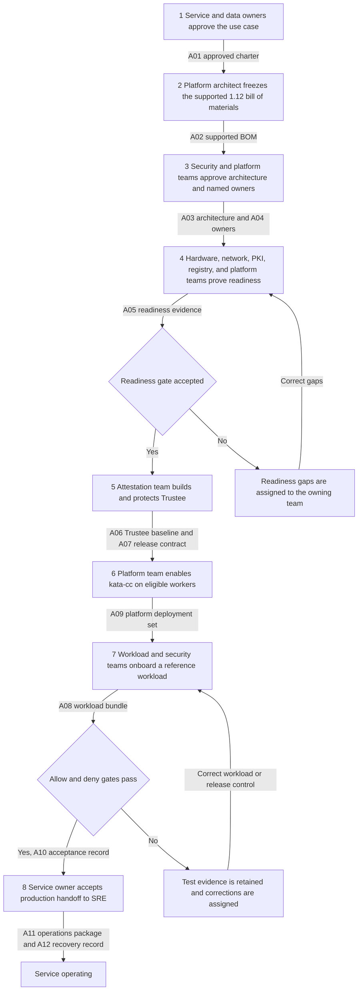
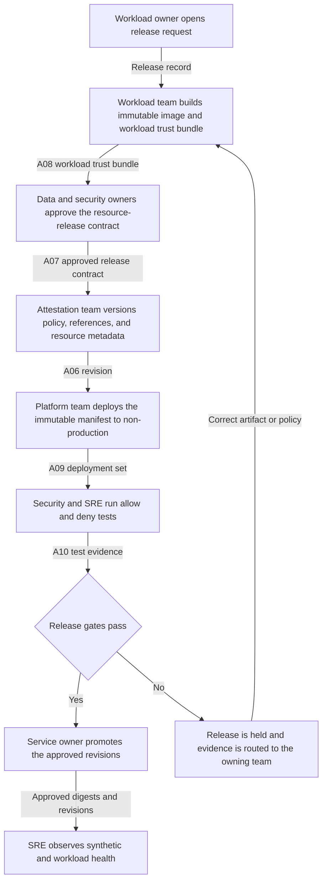
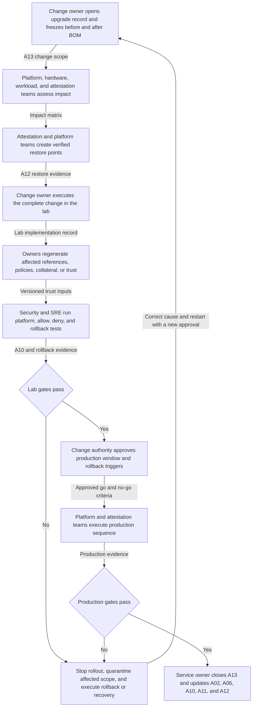

# OpenShift Confidential Containers 1.12: organizational operating playbook

| Field | Value |
|---|---|
| Status | Customer review draft |
| Last reviewed | 2026-08-26 |
| Product baseline | OpenShift sandboxed containers 1.12 and Red Hat build of Trustee 1.1 |
| Implementation scope | Bare-metal AMD SEV-SNP, `kata-cc`, disconnected production environment, and a separate trusted OpenShift cluster for Trustee |

This document describes **how work moves through the organization**. It is organized around three
repeatable workflows:

1. Establish the service for the first time.
2. Onboard or change a confidential workload and operate the service.
3. Upgrade or make a security-sensitive platform change.

Each workflow identifies the accountable team, required inputs, tangible output artifacts, and the
gate that permits the next team to proceed. Product concepts and source links are kept in appendices
so they do not obscure the operating flow.

> **Version boundary:** every product procedure, field name, and runtime statement in this playbook
> is based on OpenShift sandboxed containers 1.12 and Red Hat build of Trustee 1.1. Do not introduce
> 1.13 commands, examples, custom-resource fields, or images into this implementation. Before an
> installation or change, capture the live
> [1.12 compatibility matrix](https://docs.redhat.com/en/documentation/openshift_sandboxed_containers/1.12/html/deploying_confidential_containers_on_bare-metal_servers/cc-discover_metal-cc#cc-compatibility_metal-cc)
> and [1.12 release notes](https://docs.redhat.com/en/documentation/openshift_sandboxed_containers/1.12/html/release_notes/index)
> in the change record. Confirm the support arrangement for remaining on 1.12 with Red Hat.

> **Procedure boundary:** Red Hat documentation is authoritative for supported installation,
> configuration, update, troubleshooting, and removal procedures. Upstream documentation explains
> architecture and protocols. Repository runbooks record this project's tested implementation. An
> upstream capability or a repository example does not expand Red Hat product support.

## 1. How to use this playbook

Before work starts, the service owner must replace every `TBD` below with a customer team, named
primary contact, backup, and system of record.

For every workflow:

1. Open one work or change record and name its accountable owner.
2. Link the required input artifacts from the artifact register.
3. Perform the work in order. Parallel work is allowed only when the handoff dependencies remain
   explicit.
4. Attach the output artifacts to the work record. Do not attach plaintext protected data, private
   keys, Trustee administrator credentials, or unredacted support bundles.
5. Obtain the named gate approval before the next team proceeds.
6. Close the record only after the allow test, deny test, monitoring, and rollback evidence are
   retained.

### The four systems of record

The customer may use different tools, but these four record types must have an authoritative home.

| Record type | What belongs there | Customer system |
|---|---|---|
| Governance and change record | Business approval, risk acceptance, support snapshot, named owners, gates, maintenance window, rollback decision | TBD |
| Version-controlled desired state | Non-secret manifests, policies, initdata source, build definitions, image digests, configuration revisions | TBD |
| Protected-material system | Secret values, private keys, recovery credentials, signing keys, encrypted backups | TBD |
| Evidence and operations record | Test results, logs, hashes, approvals, dashboards, alerts, restore results, incident evidence | TBD |

## 2. Roles and decision rights

These are organizational roles, not necessarily separate teams. A small organization may combine
roles, but it must preserve the decision rights in the table. In particular, platform access must not
silently grant authority to release every protected resource.

| Role | Accountable for | Decisions only this role may approve | Required handoff |
|---|---|---|---|
| Service owner | End-to-end service, funding, SLO, production acceptance, and retirement | Start or stop the service; accept operational risk; declare production readiness | Approved charter, owners, SLO, and final acceptance record |
| Data or risk owner | Classification and permitted use of protected data | Which workload identity may receive which resource, for how long, and under which conditions | Signed resource-release contract and revocation instruction |
| Security and attestation team | Trustee, attestation appraisal, resource authorization, reference values, endorsement collateral, and security evidence | AS policy, KBS resource policy, RVPS values, Trustee administrative trust, and emergency denial | Versioned Trustee baseline and policy decision record |
| OpenShift platform team | Workload and Trustee clusters, Operators, NFD, `KataConfig`, node placement, capacity, and product support evidence | Cluster/runtime configuration, eligible nodes, maintenance sequence, and platform rollback | Healthy platform baseline, runtime evidence, and change record |
| Hardware and datacenter team | Supported servers, CPU, BIOS, firmware, BMC, replacement, and maintenance | Hardware baseline and when a node may return after hardware or firmware change | Hardware inventory, readiness result, and maintenance record |
| Workload and supply-chain team | Application, image build, SBOM, signature, optional encryption, initdata, Kata Agent policy, and workload manifests | Which immutable application artifact is proposed for release | Workload trust bundle and deployment manifest set |
| Network, PKI, time, and registry team | Guest and cluster DNS, NTP, routes, firewall, proxy, TLS, registry, mirror, and certificate lifecycle | Network exposure, trust-chain issuance, registry publication, and expiry handling | Flow matrix, CA bundle, certificate inventory, and reachability proof |
| SRE and service desk | Monitoring, synthetic tests, triage, incident evidence, backup coordination, and on-call handoff | Operational severity, escalation, and recovery execution within approved runbooks | Operations package, health evidence, incident timeline, and restore result |
| Change authority | Maintenance approval and organizational change control | Production window, go/no-go, and accepted rollback conditions | Approved implementation and rollback record |
| Red Hat support | Supported-product guidance and product diagnosis under subscription | Product support determination | Case guidance, official documentation, errata, and support response |

### Non-negotiable separation of duties

- The data owner approves the release intent; the attestation team implements it as policy.
- The workload team proposes an image identity; it does not unilaterally authorize access to data.
- The platform team can run the infrastructure; it does not own the protected-resource decision.
- The same change may not be considered accepted merely because its implementer reports success.
  The named gate approver must review retained allow and deny evidence.

## 3. Artifact register

Artifact IDs are used throughout the workflow charts and tables. A document may be implemented as a
ticket, Git revision, signed report, dashboard, or controlled record. The contents and owner matter
more than the file format.

| ID | Tangible artifact | Accountable owner | Minimum contents | Authoritative home |
|---|---|---|---|---|
| A01 | Service charter and protected-data flow | Service owner + data owner | Business outcome, data classification, plaintext entry/use/exit, threat statement, exclusions, SLO, RTO, RPO | Governance record |
| A02 | Supported bill of materials snapshot | Platform architect | OCP z-stream, OSC 1.12 CSV/image, Trustee 1.1 CSV/image, RHCOS, TEE/CPU, guest assets, registry references, dated matrix and release-note links | Change record + Git |
| A03 | Architecture and trust-boundary decision | Security architect | Workload and Trustee environments, administrator boundaries, network flows, registry path, TEE, failure domains, disconnected dependencies | Governance record + diagram source |
| A04 | Responsibility and escalation register | Service owner | Named primary and backup for every role, on-call route, Red Hat entitlement/case contacts, approval authorities | Service record |
| A05 | Infrastructure readiness evidence pack | Platform team | Hardware/BIOS/firmware checks, node inventory, DNS/NTP/TLS/route tests, mirror inventory, capacity, guest-path test plan | Evidence record |
| A06 | Trustee baseline bundle | Attestation team | `TrusteeConfig`, Restricted profile, TLS/admin trust, AS policy, KBS policy, RVPS revision, resource metadata, VCEK cache inventory, backup references | Git + protected-material system + evidence record |
| A07 | Resource-release contract | Data owner | Resource URI/ID, approved workload/image identity, guest/reference constraints, policy revisions, validity period, revocation owner, approvals | Governance record + Git policy metadata |
| A08 | Workload trust bundle | Workload team | Image digest, SBOM/provenance, signature evidence, encryption key reference when used, initdata source/digest, restrictive Kata Agent policy, dependency list | Git + artifact registry |
| A09 | Platform deployment set | Platform + workload teams | Namespace, service account, `runtimeClassName: kata-cc`, resource requests/limits, immutable image, initdata annotation, placement, storage/network configuration | Git |
| A10 | Acceptance evidence record | Independent gate approver | Correlated timestamps, pod UID, node, BOM, policy/reference revisions, positive release result, negative denial results, application result, exceptions | Evidence record |
| A11 | Operations and support package | SRE | SLO/dashboard, alerts, synthetic tests, failure routing, on-call contacts, version-matched must-gather references, redaction rules | Operations record + Git runbooks |
| A12 | Backup and recovery record | Attestation + platform teams | Inventory of recoverable state, encrypted backup locations, restore order, RTO/RPO, last restore result, post-restore allow/deny evidence | Protected-material system + evidence record |
| A13 | Change and upgrade impact record | Change owner | Before/after BOM, affected measurements/policies/certificates, dependencies, lab result, production plan, rollback trigger, approvals | Change record |
| A14 | Incident evidence packet | Incident lead | Timeline, affected workload/resource IDs, recent changes, pod/CR status, component logs, policy/reference revisions, containment and recovery decisions | Incident record |
| A15 | Retirement and data-disposition record | Service + data owners | Workload/resource inventory, revocations, retained evidence, deleted material, removed endpoints, final verification | Governance record |

### A07 resource-release contract template

Keep secret values out of this record. It describes **authorization**, not the protected value.

```yaml
release_id: TBD
data_owner: TBD
resource_uri: TBD
workload_owner: TBD
workload_image_digest: sha256:TBD
runtime_class: kata-cc
initdata_digest: sha256:TBD
guest_reference_set: TBD
attestation_policy_revision: TBD
resource_policy_revision: TBD
valid_from: TBD
expires_or_review_by: TBD
revocation_owner: TBD
approvers:
  data_owner: TBD
  security_owner: TBD
```

## 4. Workflow one: establish a net-new service

### Organizational flow



### Execution and handoff table

| Step | Accountable / responsible | Work performed | Required output and what it accomplishes | Exit gate |
|---:|---|---|---|---|
| 1 | Service owner accountable; data owner responsible for classification | Define the business use case, protected-data journey, administrator threat, exclusions, SLO, and recovery objectives | **A01** makes the requested protection and remaining risk explicit | Service and data owners sign A01 |
| 2 | Platform architect accountable; Red Hat consulted | Check the live 1.12 matrix and release notes; record exact OCP, OSC, Trustee, RHCOS, TEE, guest, and image versions | **A02** prevents unsupported or mixed-version implementation | Platform and security approve the dated BOM |
| 3 | Security architect accountable; every service team responsible for its section | Draw workload/Trustee separation and flows; assign owners and backups; define failure domains and approval boundaries | **A03/A04** remove architectural and ownership ambiguity | Security and service owners approve design and contacts |
| 4 | Platform team accountable; hardware/network/PKI/registry teams responsible | Prove TEE host readiness, node capacity, internal DNS/NTP, certificates, routes, registry/mirror, and disconnected content availability | **A05** proves dependencies before Operator installation | Platform and security jointly accept readiness |
| 5 | Attestation team accountable; platform and PKI responsible for cluster/service support | Install Trustee on the trusted cluster using Red Hat 1.12 procedures; configure Restricted profile, TLS/admin trust, endorsements, reference values, policies, resources, monitoring, and backup | **A06/A07/A12** create a controlled release authority with recoverable state | Known-good evidence is accepted and known-bad evidence is denied |
| 6 | Platform team accountable and responsible | Install NFD and OSC Operator; configure eligible nodes; create `KataConfig`; complete node changes/reboots; verify `kata-cc` | **A09 platform baseline** creates the supported confidential runtime on named workers | Operators, CRs, pools, nodes, labels, and runtime class are healthy |
| 7 | Workload team accountable for artifact; security accountable for release control | Build/sign the reference image; create measured initdata and restrictive Kata policy; deploy an immutable manifest; request a non-production protected resource | **A08/A09** bind a specific workload and guest configuration to the proposed release | Inputs match A07 and no secret value is present in Git or initdata |
| 8 | Security test owner responsible; service owner accountable | Run one allow path and relevant deny paths, correlate guest, Trustee, registry, platform, and application evidence | **A10** demonstrates fail-closed behavior instead of only successful startup | Independent approver signs A10 with no unexplained exception |
| 9 | SRE responsible; service owner accountable | Activate dashboards, alerts, synthetic transactions, support collection, contacts, backups, and restore exercise | **A11/A12** turn the build into an operable, recoverable service | On-call operator performs a forced-failure triage and restore drill |

### Net-new readiness checklist for A05

Do not install the Operators until every row has evidence and an owner.

| Readiness area | Evidence to attach | Owner |
|---|---|---|
| Product support | Dated compatibility matrix, release notes, BOM, and Red Hat support position for the 1.12 constraint | Platform architect |
| Hardware | Model/serial, CPU/socket inventory, BIOS/UEFI settings, firmware/TCB, SEV-SNP readiness result for every eligible worker | Hardware team |
| Capacity | Per-PodVM CPU/memory/storage model, node reservations, failure capacity, maintenance capacity | Platform + workload teams |
| Trustee environment | Separate trusted cluster, administrator boundary, HA/SLO decision, backup destination, recovery access | Attestation + platform teams |
| Guest network path | DNS, route, proxy, TLS CA, registry, and Trustee reachability plan from inside a CVM | Network/PKI/registry teams |
| Disconnected content | OCP payload, catalogs, Operator and operand images, guest/app images, signatures, VCEK collateral, and refresh procedure | Registry + attestation teams |
| Time and certificates | Internal NTP, certificate chain/SAN, expiry inventory, renewal owner, alert threshold | PKI + network teams |
| Protected material | KMS/HSM/secret backend, recovery ownership, key/reference naming, rotation and revocation process | Data + attestation teams |

## 5. Workflow two: onboard or change a workload and operate it

The regular release workflow is used for a new workload, a new application image, changed initdata,
changed Kata Agent policy, changed resource access, or changed reference values. A simple application
deployment must not bypass it when the change affects attested identity or protected-resource release.

### Organizational flow



### Release workflow and responsibilities

| Step | Accountable / responsible | Required work | Output and handoff gate |
|---:|---|---|---|
| 1. Intake | Workload owner accountable | Name data, namespace, image, resource URI, runtime needs, expected release conditions, and requested date | Release record links current A02 and identifies which artifacts will change |
| 2. Build | Workload/supply-chain team responsible | Build, scan, produce SBOM/provenance, digest-pin, sign, optionally encrypt, and publish the image; generate initdata and restrictive Kata policy | A08 is reproducible, immutable, reviewable, and contains no plaintext protected material |
| 3. Authorize | Data owner accountable; security responsible | Map the approved workload identity and guest/reference state to the resource and expiry/review date | A07 signed by data and security owners |
| 4. Configure trust | Attestation team accountable | Version AS policy, KBS policy, RVPS values, endorsement inputs, verification keys, and resource metadata; preserve rollback revision | A06 revision reviewed by a second security operator and applied first outside production |
| 5. Deploy | Platform team responsible; workload owner accountable for manifest | Deploy A09 with `kata-cc`, immutable image, correct initdata, PodVM resources, placement, network, and storage | Pod schedules only to eligible workers and starts with expected revisions |
| 6. Prove | Security test owner accountable; SRE responsible for capture | Run an allowed retrieval and applicable denials such as wrong image identity, wrong initdata/reference, forbidden resource, missing key, or unavailable collateral | A10 correlates the KBS/AS decision, guest receipt/denial, platform events, and application result |
| 7. Promote | Service owner accountable; change authority approves window when required | Promote the exact tested digests and policy revisions; do not rebuild between test and production | Production record names the immutable inputs and rollback point |
| 8. Observe | SRE accountable | Confirm startup, attestation decisions, resource release, registry access, capacity, latency, and application health | Release closes only after the defined observation window and no unexplained denial |

### Definition of done for a workload release

- The image is referenced by digest and has retained build, scan, SBOM/provenance, and signature
  evidence.
- A08 contains the exact initdata source and digest and a restrictive Kata Agent policy. Initdata
  contains configuration and trust material, not secrets.
- A07 names the resource, permitted identity, policy/reference revisions, approval, and review or
  expiry date.
- A09 uses `runtimeClassName: kata-cc` and records PodVM-sized CPU and memory.
- A10 proves one allowed release and each denial relevant to the change.
- The operations view can correlate pod UID, node, image digest, policy revision, reference revision,
  Trustee decision, and application outcome.
- Rollback restores both the workload revision and the matching release-control revision.

### Regular operating cadence

These frequencies are starting points. The service owner must adapt them to SLOs, certificate and
collateral lifetimes, risk, and change rate.

| Frequency or trigger | Responsible role | Activity | Tangible evidence retained |
|---|---|---|---|
| Continuous | SRE | Monitor both clusters, Trustee endpoints/workloads, confidential workload startup, registry, DNS/NTP/TLS, node capacity, and abnormal latency | Dashboard history and routed alerts |
| Daily | SRE + attestation | Review failed and denied attestations by reason, workload, and recent change | Triage record for unexplained denials |
| Weekly | SRE + security | Run a safe synthetic allowed resource request and one denial | Synthetic A10 record with correlated timestamps |
| Weekly | PKI + attestation | Review expiry horizon for certificates, tokens, signing roots, and endorsement collateral | Expiry report and assigned renewal actions |
| Monthly | Data + attestation | Reconcile A07 contracts against policies, reference values, protected resources, owners, and expiry | Signed access and resource reconciliation |
| Monthly | Platform + workload | Review supported versions, errata, node capacity, PodVM sizing, queue/start latency, and maintenance headroom | Capacity/support review linked to A02 |
| Quarterly or material change | Platform + attestation + SRE | Restore Trustee and required state into an isolated replacement environment, then run allow and deny tests | Updated A12 with measured RTO/RPO and A10 results |
| Before/after hardware or firmware work | Hardware + attestation | Capture the baseline, predict TCB/certificate impact, refresh collateral/reference inputs, quarantine until testing passes | A13 plus pre/post evidence and node return approval |

## 6. Workflow three: upgrade or security-sensitive platform change

This workflow applies to OCP z-stream work, an OSC 1.12 update, a Trustee 1.1 update, RHCOS/Kata
change, guest asset change, BIOS/firmware/CPU work, certificate or key rotation, and attestation-policy
or reference-value change. Moving beyond the declared 1.12/1.1 baseline is a separately approved
migration project and is outside this workflow.

### Organizational flow



### Upgrade execution and decision rights

| Step | Accountable / responsible | Required output | Gate |
|---:|---|---|---|
| 1. Scope | Change owner accountable; platform responsible for BOM | A13 names reason, before/after A02, affected environments, maintenance window, dependencies, and rollback triggers | Service owner accepts scope; Red Hat support position is attached when relevant |
| 2. Impact | Security accountable for trust impact; each component owner responsible | Impact matrix identifies guest measurements, RVPS values, AS/KBS policy, image signatures/keys, TLS/admin trust, VCEK/collateral, node reboots, and capacity effects | Every affected artifact has a named owner and preparation action |
| 3. Protect | Attestation + platform teams accountable | Verified backup/restore point for desired state, policies, references, resource sources, credentials, certificates, and cluster configuration | Restore is demonstrated or the service owner explicitly rejects the change |
| 4. Rehearse | Change owner accountable; all affected teams responsible | Full lab record using the production sequence, mirrored content, restrictive network conditions, and representative workload | Technical implementers sign completion; independent tester receives immutable revisions |
| 5. Re-establish trust | Attestation accountable; hardware/workload/platform provide inputs | Versioned replacement references, policies, collateral, trust chains, and image evidence | Second-person policy review and retained old revision for rollback |
| 6. Prove | Security test owner accountable; SRE captures evidence | Platform health, allow/deny A10, application behavior, monitoring, backup, and rollback result | All predefined gates pass without weakening policy |
| 7. Authorize | Change authority accountable | Approved production sequence, communication, stop conditions, rollback authority, and observation window | Formal go decision |
| 8. Execute | Platform accountable for cluster/runtime sequence; attestation accountable for Trustee/trust sequence | Timestamped implementation log and live health evidence | Stop immediately at a defined no-go condition |
| 9. Accept | Service owner accountable; security and SRE responsible for evidence review | Updated A02/A06/A10/A11/A12/A13 with old revision retirement decision | Close only after the observation window and an accepted allow/deny result |

### Required impact questions by change type

| Change type | Mandatory questions | Primary owner |
|---|---|---|
| OCP z-stream or RHCOS | Does the live 1.12 matrix support it? Does RHCOS change the Kata runtime or measured guest inputs? Which pools reboot and what capacity remains? | Platform |
| OSC 1.12 Operator/runtime | Does Red Hat require OCP first? Which runtime/guest assets and `KataConfig` behavior change? Which must-gather image matches? | Platform |
| Trustee 1.1 | Are CR fields, generated workloads, storage, token trust, policies, RVPS values, resources, or administrator credentials affected? | Attestation |
| Guest kernel/initrd/firmware | Which measurements and reference values change? Are signatures and provenance retained? | Platform + attestation |
| BIOS/CPU/firmware | Does TCB or VCEK material change? Must nodes remain quarantined until new evidence is accepted? | Hardware + attestation |
| AS/KBS policy or RVPS | Which A07 contracts are affected? Can the old revision be restored? Does a new value accidentally broaden access? | Data + attestation |
| TLS, token, signing, encryption, or secret rotation | Can old and new trust overlap safely? What is the revocation test? Where is emergency recovery material held? | PKI/security/supply chain |
| Registry or disconnected mirror | Are all Operator, operand, guest, app, signature, and collateral inputs present internally and reachable from inside a CVM? | Registry + network |

### Product-required ordering note

For the 1.12 bare-metal product path, Red Hat's update documentation directs the team to update OCP
first and then update the OpenShift sandboxed containers Operator. Treat the OCP change as a runtime
change because the RHCOS update carries Kata runtime dependencies. Follow the live
[1.12 update procedure](https://docs.redhat.com/en/documentation/openshift_sandboxed_containers/1.12/html/deploying_confidential_containers_on_bare-metal_servers/update-osc-cc-overview_metal-cc)
and the matching
[Trustee update procedure](https://docs.redhat.com/en/documentation/openshift_sandboxed_containers/1.12/html/deploying_red_hat_build_of_trustee_for_workloads_running_on_bare-metal_servers/update-trustee-overview_metal-trustee)
rather than relying only on this organizational workflow.

## 7. Acceptance, rollback, and incident rules

### Minimum acceptance record

A10 must answer all of the following:

- What exact OCP, OSC, Trustee, RHCOS, hardware/firmware, guest, image, initdata, policy, reference,
  and certificate revisions were tested?
- Which pod UID ran on which node, and what timestamps correlate platform, guest, registry, Trustee,
  and application evidence?
- Which protected test resource was requested and which A07 contract authorized it?
- Did the expected workload receive the resource and demonstrate the protected operation?
- Did each relevant wrong identity, wrong reference/initdata, forbidden resource, missing key,
  unavailable collateral, and untrusted TLS case remain denied?
- Were test changes reverted, and did monitoring detect the forced failure?
- Who independently accepted the result and any exception?

### Rollback is a matched set

Never roll back only the application or only Trustee policy when the identities were changed
together. A rollback point must name the matching set of:

- workload image digest and deployment manifest;
- initdata and Kata Agent policy digest;
- guest/reference-value revision;
- AS and KBS policy revision;
- protected-resource metadata and key reference;
- TLS, token-verification, and signing trust revision; and
- OCP/OSC/Trustee/RHCOS bill of materials where applicable.

### Failure ownership and first evidence

| Symptom | First owner | First evidence to collect |
|---|---|---|
| Pod never schedules | Platform | Runtime class, node labels/resources/taints, scheduler events, machine config pool state |
| Pod schedules but CVM does not start | Platform + hardware | `KataConfig`, OSC/runtime logs, node TEE readiness, firmware state, PodVM resource request |
| Guest cannot reach registry or Trustee | Network + registry + platform | Guest-path DNS/route/proxy/TLS evidence, initdata source/digest, endpoint certificate |
| Image pull or verification is denied | Workload + registry + security | Image digest, signature evidence, verification policy/key revision, registry log, guest image-rs log |
| Evidence validation fails | Attestation + hardware | AS decision, VCEK/certificate chain, TCB/reference values, initdata/guest measurements, recent firmware change |
| Evidence is accepted but resource is denied | Attestation + data owner | A07 contract, resource URI, KBS policy revision, attestation token/claims, resource existence/backend health |
| Resource is delivered but application fails | Workload | Guest/application logs, resource format/path, app configuration, readiness result, image digest |
| Broad outage after change | Change owner + incident lead | A13 sequence/timestamps, old/new BOM, affected scope, gate results, rollback trigger and restore state |

Before opening a Red Hat case, A14 should include exact versions, timestamps/timezone, one failing
pod UID/name/namespace, Operator and CR status, failure stage, matching component logs, recent changes,
a known-good comparison, and version-matched OSC/Trustee must-gather material. Redact all protected
values, private keys, and administrator credentials.

## 8. Backup, recovery, and retirement

### Recovery order

1. Declare the recovery event and freeze policy/resource changes.
2. Restore or rebuild the trusted OpenShift environment and normal cluster dependencies.
3. Restore the Trustee Operator and intended `TrusteeConfig`.
4. Restore TLS identity, administrator trust, token verification, endorsement/VCEK cache, AS policy,
   RVPS values, KBS policy, protected-resource sources, and verification keys from authoritative
   systems.
5. Restore routes, services, DNS, firewall, monitoring, and registry dependencies.
6. Run the known-good allow test and all required denial tests.
7. Return service only after the security and service owners accept a new A10 and A12.

The backup design must distinguish desired-state manifests from protected values. Git is not a
backup destination for plaintext protected resources, private keys, or recovery credentials.

### Retirement flow

1. Service owner freezes onboarding and inventories every workload and resource consumer.
2. Data owner revokes A07 contracts and orders rotation where material was shared.
3. Workload/platform teams remove all `kata-cc` consumers and verify absence.
4. Attestation team preserves required evidence, removes resources and policies, and proves
   revocation.
5. Platform team removes `KataConfig` and the Operator in Red Hat's documented order, then removes
   Trustee only after every dependency is gone.
6. Network/PKI/registry/SRE teams remove certificates, DNS, firewall, mirror, and monitoring entries.
7. Service and data owners sign A15 after recovery credentials and retained data are dispositioned.

Use Red Hat's
[1.12 uninstall procedure](https://docs.redhat.com/en/documentation/openshift_sandboxed_containers/1.12/html/deploying_confidential_containers_on_bare-metal_servers/uninstall-overview_metal-cc),
which requires removing confidential workloads before `KataConfig` and Operator resources.

## 9. Minimal technical reference

### What each major component accomplishes

| Component | Plain responsibility | Customer owner |
|---|---|---|
| TEE-capable server, BIOS, and firmware | Protects and reports the hardware/firmware state of the CVM | Hardware team |
| OpenShift workload cluster | Schedules the pod and operates the worker; remains outside the confidentiality boundary | Platform team |
| NFD and TEE rules | Label nodes that appear eligible; this is scheduling input, not attestation | Platform + hardware teams |
| OSC Operator and `KataConfig` | Install and reconcile the supported Kata confidential runtime | Platform team |
| Kata runtime, hypervisor, and guest | Create the local PodVM, boot measured guest assets, and run the application | Platform team; Red Hat supplies supported product assets |
| Kata Agent policy | Restricts what the untrusted host may ask the guest to do | Workload + security teams |
| Attestation Agent and CDH/image components | Obtain evidence, request protected resources, and perform guest-side protected operations | Runtime product; integrated by workload team |
| Trustee KBS | Brokers attestation and releases only policy-authorized resources | Attestation team |
| Attestation Service | Validates evidence and evaluates attestation policy | Attestation team |
| RVPS | Stores approved reference values used during appraisal | Attestation team with platform/workload inputs |
| Protected-resource backend | Holds keys, secrets, tokens, or other protected values | Data/secrets team |
| Registry and supply chain | Build, sign, optionally encrypt, publish, and retain immutable images | Workload/supply-chain team |

### Plain-language terms

| Term | Meaning in this playbook |
|---|---|
| Confidential pod or PodVM | A pod sandbox implemented as a small hardware-protected VM |
| TEE | CPU/platform technology that isolates and measures the PodVM |
| Attestation | Validation of hardware-signed evidence and measured guest state |
| Reference value | Expected-good measurement or TCB input used by the appraisal policy |
| Trustee | Red Hat's trusted-side attestation and protected-resource release stack |
| AS policy | Rules that determine whether evidence and claims are acceptable |
| KBS resource policy | Rules that determine whether an accepted identity may receive a resource |
| RVPS | Service holding reference values used in appraisal |
| Initdata | Integrity-protected launch configuration such as Trustee URL, CA, and Kata Agent policy; it is not confidential |
| VCEK | AMD certificate used to validate SEV-SNP evidence; disconnected and multi-socket environments need an explicit lifecycle |

Confidential Containers does not replace application security, supply-chain security, TLS, storage
controls, availability engineering, or data governance. A running pod is not proof that the intended
attestation-gated release occurred. Acceptance must request a real non-production resource and retain
both the release and denial decisions.

## 10. Source library

### Red Hat product documentation for the 1.12 baseline

- [OpenShift sandboxed containers 1.12 documentation home](https://docs.redhat.com/en/documentation/openshift_sandboxed_containers/1.12)
- [OpenShift sandboxed containers 1.12 release notes](https://docs.redhat.com/en/documentation/openshift_sandboxed_containers/1.12/html/release_notes/index)
- [Bare-metal confidential containers: compatibility and terms](https://docs.redhat.com/en/documentation/openshift_sandboxed_containers/1.12/html/deploying_confidential_containers_on_bare-metal_servers/cc-discover_metal-cc)
- [Bare-metal confidential containers: installation](https://docs.redhat.com/en/documentation/openshift_sandboxed_containers/1.12/html/deploying_confidential_containers_on_bare-metal_servers/install-cc-overview_metal-cc)
- [Bare-metal confidential containers: configuration](https://docs.redhat.com/en/documentation/openshift_sandboxed_containers/1.12/html/deploying_confidential_containers_on_bare-metal_servers/configure-cc-overview_metal-cc)
- [Bare-metal confidential containers: update](https://docs.redhat.com/en/documentation/openshift_sandboxed_containers/1.12/html/deploying_confidential_containers_on_bare-metal_servers/update-osc-cc-overview_metal-cc)
- [Bare-metal confidential containers: observe](https://docs.redhat.com/en/documentation/openshift_sandboxed_containers/1.12/html/deploying_confidential_containers_on_bare-metal_servers/observe_metal-cc)
- [Bare-metal confidential containers: troubleshoot](https://docs.redhat.com/en/documentation/openshift_sandboxed_containers/1.12/html/deploying_confidential_containers_on_bare-metal_servers/troubleshoot_metal-cc)
- [Bare-metal confidential containers: uninstall](https://docs.redhat.com/en/documentation/openshift_sandboxed_containers/1.12/html/deploying_confidential_containers_on_bare-metal_servers/uninstall-overview_metal-cc)
- [Red Hat build of Trustee for bare-metal workloads](https://docs.redhat.com/en/documentation/openshift_sandboxed_containers/1.12/html/deploying_red_hat_build_of_trustee_for_workloads_running_on_bare-metal_servers/index)
- [Red Hat build of Trustee for disconnected bare-metal workloads](https://docs.redhat.com/en/documentation/openshift_sandboxed_containers/1.12/html/deploying_red_hat_build_of_trustee_for_workloads_running_on_bare-metal_servers_in_a_disconnected_environment/index)
- [OpenShift Container Platform life-cycle policy](https://access.redhat.com/support/policy/updates/openshift)
- [OpenShift Operator life-cycle policy](https://access.redhat.com/support/policy/updates/openshift_operators)
- [Red Hat production support scope](https://access.redhat.com/support/offerings/production/soc)

### Upstream architecture and protocol references

- [Confidential Containers documentation home](https://confidentialcontainers.org/docs/)
- [Confidential Containers design overview](https://confidentialcontainers.org/docs/architecture/design-overview/)
- [Confidential Containers trust model](https://confidentialcontainers.org/docs/architecture/trust-model/trust-model/)
- [Cloud-native personas](https://confidentialcontainers.org/docs/architecture/trust-model/cloud-native-personas/)
- [Attestation with Trustee](https://confidentialcontainers.org/docs/attestation/)
- [Trustee architecture](https://confidentialcontainers.org/docs/attestation/architecture/)
- [Connect Confidential Containers to Trustee](https://confidentialcontainers.org/docs/attestation/coco-setup/)
- [Trustee resources](https://confidentialcontainers.org/docs/attestation/resources/)
- [Trustee policies](https://confidentialcontainers.org/docs/attestation/policies/)
- [Trustee reference values](https://confidentialcontainers.org/docs/attestation/reference-values/)
- [Initdata](https://confidentialcontainers.org/docs/features/initdata/)
- [Signed images](https://confidentialcontainers.org/docs/features/signed-images/)
- [Encrypted images](https://confidentialcontainers.org/docs/features/encrypted-images/)
- [Authenticated registries](https://confidentialcontainers.org/docs/features/authenticated-registries/)
- [Protected storage](https://confidentialcontainers.org/docs/features/protected-storage/)
- [KBS attestation protocol](https://github.com/confidential-containers/trustee/blob/main/kbs/docs/kbs_attestation_protocol.md)
- [Kata Containers architecture](https://github.com/kata-containers/kata-containers/tree/main/docs/design/architecture)

Use upstream references for concepts and implementation detail, not as substitutes for the Red Hat
1.12 product procedures.

### Repository implementation and research material

- [Primary-source research and versioned source catalog](research/confidential-containers-reference-material.md)
- [Repository architecture and tested topology](architecture.md)
- [Customer scoping questions](design/customer-scoping.md)
- [Design rationale and security gates](design/engagement-design.md)
- [Disconnected SEV-SNP installation guide](install-guide.md)
- [Install execution plan](runbooks/install-execution-plan.md)
- [Debug surface by component and vantage point](runbooks/debug-surface.md)
- [Failure-mode playbook](runbooks/failure-modes.md)
- [Multi-socket AMD VCEK runbook](runbooks/multi-socket-vcek.md)
- [Guest-side KBS debugging](runbooks/rung-kbs-guest-debug.md)

## 11. Customer workshop output

Use a working session to fill the playbook rather than merely review slides. The workshop is complete
only when it produces:

1. A01 with an approved data flow and explicit threat statement.
2. A02 with the dated 1.12 support snapshot and exact BOM.
3. A03 showing the workload cluster, trusted Trustee cluster, guest network paths, and administrators.
4. A04 with a primary and backup for every role and gate.
5. The customer systems of record for governance, Git desired state, protected material, and evidence.
6. One completed A07 for the reference workload.
7. Named owners and dates for every missing A05 readiness item.
8. Agreed allow, deny, restore, rollback, and monitoring acceptance tests.
9. A decision on what is required for production acceptance and who signs A10.

If any critical artifact or gate has no owner, the output is a documented blocker rather than an
implicit platform-team responsibility.
