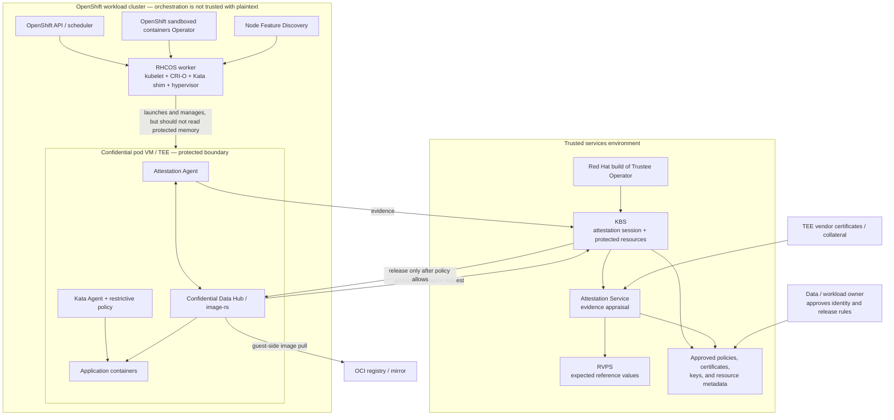

# OpenShift Confidential Containers: a beginner's guide and operations handbook

Status: customer-facing foundation · Last reviewed: 2026-08-26
Customer execution and product-documentation baseline: OpenShift sandboxed containers 1.12 and
Red Hat build of Trustee 1.1
Repository implementation baseline: the same 1.12/1.1 stack on the tested disconnected AMD
SEV-SNP rig

This guide explains Confidential Containers (CoCo) without assuming prior confidential-computing
knowledge. It answers four practical questions:

1. What problem does the solution solve?
2. What runs where, and how does a workload start?
3. Who owns each component and operational activity?
4. What must be designed, installed, tested, monitored, changed, recovered, and retired?

Use this page as the front door. Follow its links to Red Hat documentation for supported product
procedures, to upstream documentation for design detail, and to this repository's runbooks for the
tested, disconnected AMD SEV-SNP implementation.

> **Version gate — do this before using any command.** Red Hat updates compatibility requirements
> within product documentation. Verify the current
> [OpenShift sandboxed containers compatibility matrix](https://docs.redhat.com/en/documentation/openshift_sandboxed_containers/1.12/html/deploying_confidential_containers_on_bare-metal_servers/cc-discover_metal-cc#cc-compatibility_metal-cc)
> and release notes against the exact OCP, OpenShift sandboxed containers, Trustee, platform, TEE,
> and GPU combination. A version proven in a lab is not automatically a currently supported
> production combination. In particular, this repository's historical rig pin predates the higher
> OCP z-stream minimums now shown in Red Hat's 1.12 documentation.

> **Deliberate 1.12 pin.** Every product procedure, field name, image, and runtime statement in this
> handbook is based on the 1.12 documentation set. OpenShift sandboxed containers is a Rolling Stream
> Operator, so confirm the support arrangement for a pinned 1.12 deployment with Red Hat. If the
> customer cannot move, record that constraint and its support impact; do **not** mix 1.13 examples
> into the 1.12 installation. Check the
> [1.12 release notes](https://docs.redhat.com/en/documentation/openshift_sandboxed_containers/1.12/html/release_notes/index)
> and [OpenShift Operator life-cycle policy](https://access.redhat.com/support/policy/updates/openshift_operators).

> **Source and support boundary.** Red Hat documentation is the source of truth for Red Hat product
> support and product procedures. Upstream Confidential Containers, Trustee, Kata Containers, and
> Cloud API Adaptor documentation explain the design and emerging features, but upstream behavior
> is not by itself a statement of Red Hat support. Repository runbooks describe what this project
> tested; they do not widen the product support boundary.

> **OpenShift installation boundary.** Do not use upstream CoCo Helm installation instructions on
> OpenShift. Upstream currently assumes containerd for its bare-metal chart path, says CRI-O is not
> tested there, and requires SELinux to be disabled. Those assumptions conflict with OpenShift's
> supported architecture. Use upstream for concepts and use the matching Red Hat Operator procedure
> for installation, runtime classes, upgrades, and troubleshooting.

## How to read this guide

| If you are... | Read first | What you will get |
|---|---|---|
| A decision maker or data owner | Sections 1, 2, 4, and 6 | The business outcome, limits, and decisions you own |
| New to CoCo | Sections 1–5 | A plain-language mental model and end-to-end flow |
| An architect | Sections 3–9 | Topology, trust boundaries, ownership, and design gates |
| A platform or security engineer | Sections 5–13 | Installation order, acceptance evidence, and operating model |
| A workload owner | Sections 4, 7, 10, and 11 | Application changes, image and policy work, and onboarding tests |
| An operator or incident responder | Sections 12–15 | Routine checks, change control, recovery, and troubleshooting |

## 1. The solution in plain language

### The problem

Ordinary container isolation protects one workload from another, but a sufficiently privileged
host or infrastructure administrator can still be inside the workload's trust boundary. The host
normally participates in starting containers and handling their images and data.

Confidential Containers changes that boundary. Each protected pod runs inside a small confidential
virtual machine (CVM) backed by a hardware Trusted Execution Environment (TEE), such as AMD
SEV-SNP or Intel TDX. Hardware produces evidence describing the CVM. A separate trusted service,
Red Hat build of Trustee, checks that evidence and releases a secret, key, or other protected
resource only when the evidence and policy are acceptable. Red Hat describes a sandboxed pod as a
VM that can contain one or more containers; upstream CoCo explains the additional
[guest image pulling and attestation components](https://confidentialcontainers.org/docs/architecture/design-overview/).

### The simplest useful mental model

- **OpenShift decides when and where to try to run the pod.**
- **Kata creates a VM-shaped sandbox for that pod.**
- **TEE hardware protects and measures the sandbox.**
- **Trustee independently decides whether it is safe to release protected material.**
- **The workload runs with the material only after the configured checks pass.**

> **What this accomplishes:** a cluster, host, hypervisor, or cloud administrator can still stop or
> delay the workload, but the design reduces their ability to read protected guest memory or obtain
> attestation-gated secrets. The exact guarantee is inherited from the selected TEE and the policy
> actually enforced.

### What CoCo does not automatically do

Confidential computing is one control in a larger system. Upstream's
[trust model](https://confidentialcontainers.org/docs/architecture/trust-model/trust-model/)
explicitly leaves several risks outside the boundary.

| It does not automatically... | What the customer still needs |
|---|---|
| Guarantee availability | Normal HA, capacity, disruption, and disaster-recovery engineering |
| Make application code safe | Secure SDLC, scanning, patching, authentication, and authorization |
| Protect every network connection | TLS/mTLS and normal network controls |
| Prove an application image merely because the CVM is genuine | Image signatures or another measured/verified supply-chain control |
| Make a permissive Kata Agent policy safe | A restrictive, tested policy; Red Hat says production policy should at least prevent `oc exec` access |
| Hide Kubernetes metadata or every observable side effect | A data-flow and metadata review for the application |
| Protect secrets after a compromised application legitimately receives them | Application hardening, least privilege, rotation, and short lifetimes |
| Protect against denial of service or all hardware side channels | TEE-specific risk review and compensating controls |
| Turn every upstream feature into a Red Hat-supported feature | A release-specific support-matrix check |

## 2. The words, translated

| Term | Plain-language meaning | Why an operator cares |
|---|---|---|
| Confidential container | A container workload running inside a hardware-protected pod VM | The workload has a different trust boundary from an ordinary pod |
| CVM or PodVM | The small VM used as a pod sandbox | It consumes VM memory and takes longer to start than a normal pod |
| TEE | CPU/platform technology that isolates and measures a VM | Hardware, BIOS, firmware, and platform support become prerequisites |
| AMD SEV-SNP / Intel TDX | Two x86 TEE implementations | Evidence, certificates, firmware workflow, and reference values differ |
| Attestation | Checking signed hardware evidence and software measurements | It answers, "Should this specific guest receive protected material?" |
| Evidence | Hardware-signed facts about a guest and its measured state | Trustee validates it; do not treat a Running pod alone as proof |
| Measurement | A cryptographic digest of selected boot/configuration inputs | Expected values must be generated, approved, and updated with change |
| Reference value | An expected-good value used during appraisal | A stale or wrong value should cause fail-closed denial |
| Trustee | Red Hat's trusted-side attestation and secret-delivery stack | It belongs in a trusted environment separate from the workload cluster |
| KBS | Key Broker Service; the front door for attestation and protected resources | Its availability, TLS identity, auth, and policy are critical |
| AS | Attestation Service; validates evidence and evaluates TEE claims | Its policy decides what hardware/software state is acceptable |
| RVPS | Reference Value Provider Service; holds expected measurements | It must track approved guest artifacts and changes |
| AA | Attestation Agent inside the CVM | It obtains hardware evidence and talks to Trustee |
| CDH | Confidential Data Hub inside the CVM | It handles protected resources and image/secret operations in the guest |
| Kata Agent | Guest-side process that carries out container lifecycle requests | Its policy limits what the untrusted host may ask the guest to do |
| Initdata | Measured, per-pod startup configuration | It carries non-secret configuration such as Trustee URLs, CA certificates, and Kata Agent policy without rebuilding the guest image; it provides integrity, not confidentiality |
| `KataConfig` | Cluster custom resource that installs/configures the Kata runtime | Creating or deleting it can change and reboot eligible nodes |
| `TrusteeConfig` | Custom resource that configures Red Hat build of Trustee | It declares the trusted-side service and generated resources |
| Runtime class | The pod field that selects a runtime | `kata-cc` is the bare-metal confidential runtime; `kata-remote` is used for peer pods |
| Peer pod | A pod whose CVM is created remotely through a cloud/hypervisor API | It adds cloud credentials, PodVM images, networking, quotas, and cost ownership |
| VCEK | AMD certificate used to validate SEV-SNP evidence | Disconnected and multi-socket environments need a deliberate certificate lifecycle |

Red Hat's own definitions are in the
[bare-metal "Common terms" section](https://docs.redhat.com/en/documentation/openshift_sandboxed_containers/1.12/html/deploying_confidential_containers_on_bare-metal_servers/cc-discover_metal-cc#cc-about_metal-cc).
The upstream [attestation overview](https://confidentialcontainers.org/docs/attestation/)
maps KBS, AS, RVPS, AA, and CDH.

## 3. Pick the deployment path before designing the platform

There are two broad runtime shapes. They share the workload idea but create and operate the pod VM
in different places.

| Question | Bare-metal confidential containers | Peer pods |
|---|---|---|
| Where is the CVM created? | Locally on a TEE-capable RHCOS worker | Remotely through a supported cloud or hypervisor API |
| Runtime class | `kata-cc` | `kata-remote` |
| Why choose it? | Direct control of hardware and local VM launch | Avoid nested-virtualization limits on virtual workers; use cloud CVM offerings |
| Extra infrastructure | TEE-capable metal, BIOS/firmware process, node capacity | Cloud API credentials, PodVM image, instance types, quotas, networking, cleanup controller, billing controls |
| Primary infrastructure owner | Hardware/datacenter plus OpenShift platform teams | Cloud/platform team plus OpenShift platform team |
| Failure/cost concern | Node reboot and local VM capacity | Orphaned cloud resources, API/quota failures, tunnel/network failures, and per-PodVM cost |

Always select the platform from the current
[Red Hat 1.12 feature-availability matrix](https://docs.redhat.com/en/documentation/openshift_sandboxed_containers/1.12/html/deploying_confidential_containers_on_bare-metal_servers/cc-discover_metal-cc#cc-compatibility_metal-cc),
then open the matching platform guide from the
[OpenShift sandboxed containers 1.12 documentation landing page](https://docs.redhat.com/en/documentation/openshift_sandboxed_containers/1.12).
Upstream explains why peer pods exist in the
[CoCo design overview](https://confidentialcontainers.org/docs/architecture/design-overview/#clouds-and-nesting)
and the [Cloud API Adaptor architecture](https://github.com/confidential-containers/cloud-api-adaptor/blob/main/docs/architecture.md).

> **Repository scope:** this repository implements the **bare-metal**, AMD SEV-SNP, disconnected
> path. Its Latitude.sh SNO rig is a proof environment, not the target production topology. Do not
> apply its provider-specific or SNO-specific choices to a peer-pods deployment.

## 4. Understand the trust boundary before the component diagram

The most important design decision is not where a pod is scheduled; it is who is trusted with data
and who is trusted to approve release.

### Trusted for confidentiality decisions

- The selected TEE hardware and its vendor root of trust.
- The measured guest firmware, kernel, command line, and root filesystem.
- Guest components inside the CVM.
- The application and any code or image identity allowed by policy.
- Trustee, its policies, reference values, keys, resources, and administrators.
- The data owner or workload owner approving those inputs.

### Deliberately outside the guest trust boundary

- The OpenShift control plane and scheduler.
- The worker host OS, kubelet, CRI-O, Kata shim, and local hypervisor.
- A cloud or infrastructure administrator.
- Host-side storage and networking unless protected by an additional control.

The host still controls whether the CVM runs and what external devices, packets, and availability it
sees. The guest decides—through measured code and a restrictive Kata Agent policy—what host requests
it will honor. The upstream
[CoCo trust model](https://confidentialcontainers.org/docs/architecture/trust-model/trust-model/)
is the authoritative conceptual reference.

> **What attestation accomplishes:** it gives Trustee cryptographic evidence about a specific guest
> so policy can decide whether to release a resource. It does **not** make the untrusted host trusted.

> **Why Trustee must be separate:** placing the verifier and secrets in the same administrative
> failure domain as the untrusted workload hosts weakens the intended boundary. Red Hat directs
> customers to deploy Trustee on a separate OpenShift cluster in a trusted environment in its
> [Trustee discovery guide](https://docs.redhat.com/en/documentation/openshift_sandboxed_containers/1.12/html/deploying_red_hat_build_of_trustee_for_workloads_running_on_bare-metal_servers/trustee-discover_metal-trustee).

## 5. What runs where



The diagram shows a logical separation. Exact pods, services, and deployment shapes depend on the
product release and `TrusteeConfig`. The upstream
[component list](https://confidentialcontainers.org/docs/architecture/design-overview/#components)
is helpful when translating a log line to a component.

### The start-and-release flow

```mermaid
sequenceDiagram
  autonumber
  participant User as Workload owner
  participant OCP as OpenShift + Kata host
  participant Guest as Confidential pod VM
  participant TEE as TEE hardware
  participant Trustee as Trustee KBS / AS / RVPS
  participant Reg as Registry

  User->>OCP: Create pod with confidential runtime and measured initdata
  OCP->>TEE: Ask platform to launch a confidential VM
  TEE->>Guest: Start measured guest
  Guest->>Reg: Begin guest-side image pull when required
  Guest->>TEE: Request hardware evidence
  TEE-->>Guest: Signed evidence and measured claims
  Guest->>Trustee: Attest and request protected resource
  Trustee->>Trustee: Verify certificate chain, evidence, references, and policy
  alt acceptable guest and request
    Trustee-->>Guest: Release encrypted secret/key/resource
    Guest->>Guest: Verify/decrypt image or deliver approved resource
    Guest-->>User: Protected operation becomes ready
  else mismatch, stale collateral, or denied request
    Trustee-->>Guest: Withhold resource
    Guest-->>User: Workload fails closed; evidence remains for triage
  end
```

The exact ordering is workload-dependent: an encrypted image needs attestation and a key during
image pull, while an application can request another resource after its container starts. Attestation
is demand-driven, so a pod that never requests an attestation-gated operation might run without
proving the intended release policy. Acceptance testing must therefore request a real test resource
and prove both allow and deny outcomes.

## 6. Who is responsible for what

This is a recommended operating model, not a contractual support statement. Map each role to named
teams and named backups during design. Combining roles is possible, but the data owner should not
lose independent control over the rules that release its data.

### Role-level responsibility map

| Role | Primary responsibilities | Deliverables / evidence |
|---|---|---|
| Business or data owner | Classify data; state what must remain confidential; approve who/what may receive it; accept residual risk | Approved use case, data flows, release criteria, retention and recovery objectives |
| Workload owner | Build and patch the app; size the PodVM; select `runtimeClassName`; create initdata; request resource URIs; prove positive and negative behavior | Immutable workload manifest, image digest/signature, restrictive agent policy, test record |
| Software supply-chain team | Build trusted guest/app artifacts; sign and optionally encrypt images; protect signing keys; publish provenance | Signed artifacts, public trust material, reproducible build record, revocation/rotation plan |
| OpenShift platform team | Maintain workload and Trustee clusters; install Operators; configure NFD, `KataConfig`, runtime classes, placement, capacity, updates, metrics, and must-gather access | Healthy Operators/CRs, node labels, runtime classes, capacity plan, update and rollback records |
| Attestation / security platform team | Operate Trustee; protect admin credentials and TLS keys; manage AS and resource policies, RVPS values, protected resources, certificate collateral, backup and audit | Approved `TrusteeConfig`, policies, reference values, resource inventory, rotation and restore evidence |
| Hardware / datacenter team | Supply supported TEE hardware; configure BIOS; own BMC, firmware, CPU replacement, maintenance, and vendor certificate access | Hardware inventory, BIOS baseline, firmware/TCB record, pre/post-maintenance attestation test |
| Cloud platform team (peer pods only) | Own supported CVM types, API credentials, PodVM images, quotas, networks, cleanup, tags, and spend controls | Cloud configuration, least-privilege identity, quota/cost alerts, orphan-resource check |
| Network, PKI, and registry team | Provide DNS, NTP, routes, firewall rules, proxies, registry/mirror, CA chains, certificates, and network monitoring | Flow matrix, certificate inventory, mirrored-content report, reachability and expiry alerts |
| SRE / service desk | Monitor end-to-end service; triage events across OpenShift, Trustee, registry, host, and guest; manage incidents | Dashboards, alerts, runbooks, evidence bundles, incident timeline and postmortem |
| Red Hat | Publish product bits, compatibility/support documentation, and product support under the customer's subscription | Official docs, release notes, errata, support case guidance |
| Upstream projects | Define community architecture, protocols, features, and implementation detail | Community docs, source, issues, releases; not a substitute for a Red Hat support check |

### Component ownership map

| Component or data | Primary owner | Partners | What a bad change can do |
|---|---|---|---|
| TEE hardware and BIOS | Hardware team | Platform, security | Prevent confidential launch or change the attested TCB |
| Firmware and TCB level | Hardware team | Security, platform | Invalidate certificate/reference assumptions or introduce security exposure |
| Workload OpenShift cluster | Platform team | Network, SRE | Stop scheduling, change hosts, or disrupt runtime installation |
| Trusted Trustee cluster | Platform + attestation teams | PKI, SRE | Prevent new attestation/resource release or expose the verifier if mis-administered |
| NFD rules and node labels | Platform team | Hardware | Schedule to an ineligible node or hide eligible capacity |
| OSC Operator and `KataConfig` | Platform team | Change management | Reconfigure runtime and reboot nodes |
| Trustee Operator and `TrusteeConfig` | Attestation team | Platform, PKI | Change endpoints, pods, policy/resource mounts, or service availability |
| KBS route and TLS identity | PKI/network + attestation | Workload team | Break guest trust or expose traffic to the wrong endpoint |
| TEE endorsement collateral (for example VCEK) | Attestation team | Hardware/vendor, network | Cause evidence verification failures or accidental online dependency |
| RVPS reference values | Attestation team | Artifact builder, workload owner | Deny approved guests or admit an unintended measured state |
| Attestation Service policy | Security/attestation team | TEE specialist | Change which evidence is acceptable |
| KBS resource policy | Data owner + attestation team | Workload owner | Release a resource too broadly or block the correct workload |
| Kata Agent policy | Workload owner | Security, platform | Allow a hostile host request or block required lifecycle/probe operations |
| Initdata | Workload owner | Attestation, PKI | Point to the wrong KBS, trust the wrong CA, or present a different measured policy |
| Signing/encryption keys | Supply chain or enterprise key-management team | Attestation, workload owner | Admit a malicious image, prevent rollout, or disclose image contents |
| Protected resource plaintext | Data owner / secret-management team | Attestation | Expose customer data; make backup and rotation a security event |
| Registry and signatures | Registry + supply-chain teams | Network, workload | Prevent guest pull, lose signature transport, or serve unexpected content |
| Application manifest | Workload owner | Platform, security | Select the wrong runtime, image, policy, secret, placement, or resource size |
| Logs, metrics, and evidence | SRE | All owners | Lose incident proof or leak sensitive metadata through over-collection |

> **Separation-of-duties goal:** the team that controls untrusted workload hosts should not be able
> to silently change both the expected measurements/policies and the protected resources. Require
> review for release-policy, reference-value, signing-root, and Trustee trust-anchor changes.

Red Hat's published
[Production Support Scope of Coverage](https://access.redhat.com/support/offerings/production/soc)
should be used for the contractual boundary. It covers diagnosis and supported product use but does
not make Red Hat the author of the customer's network design, security rules, third-party software,
or uncertified infrastructure. Technology Preview features have a different
[scope of support](https://access.redhat.com/support/offerings/techpreview) and should not be treated
as production GA merely because an upstream implementation exists.

## 7. Security policy is three different controls

The word "policy" is overloaded. Treat these as separate change-controlled assets. Upstream
documents their relationship in
[Policies](https://confidentialcontainers.org/docs/attestation/policies/).

| Policy | Enforced by | Question it answers | Typical owner |
|---|---|---|---|
| Kata Agent policy | Kata Agent inside the TEE | What may the untrusted host ask this guest to do? | Workload owner + security |
| Attestation Service policy | Trustee AS | Is this hardware evidence and TCB state trustworthy? | Attestation / TEE security team |
| KBS resource policy | Trustee KBS | May this attested identity request this resource URI? | Data owner + attestation team |

Red Hat's bare-metal guide warns not to use the default permissive Kata Agent policy in production
and states that, at minimum, `ExecProcessRequest` must be disabled to stop a cluster administrator
using `oc exec` to access sensitive data. See
[Configure confidential containers](https://docs.redhat.com/en/documentation/openshift_sandboxed_containers/1.12/html/deploying_confidential_containers_on_bare-metal_servers/configure-cc-overview_metal-cc).

> **What a restrictive agent policy accomplishes:** attestation can prove which policy was measured,
> while the policy limits host-to-guest operations. Both pieces are required; merely embedding a
> policy without checking its measured identity does not prove Trustee approved it.

### Trustee product profile is also a security decision

Red Hat 1.12 Trustee documentation recommends starting with `TrusteeConfig`. It generates the
lower-level KBS configuration, reference-value, policy, secret, service, and route resources for the
selected profile.

| Choice | Intended use | Operating rule |
|---|---|---|
| `Restricted` profile | Production | Use HTTPS, attestation-token verification, and restrictive resource policy; replace example trust material with customer-controlled material |
| `Permissive` profile | Development and evaluation | Do not promote it unchanged to production merely because a demo succeeds |
| Manual `KbsConfig` | Advanced customization or migration | Use only when the team accepts ownership of the lower-level lifecycle and has a tested reason not to use `TrusteeConfig` |

See the matching 1.12
[Red Hat build of Trustee guide](https://docs.redhat.com/en/documentation/openshift_sandboxed_containers/1.12/html/deploying_red_hat_build_of_trustee_for_workloads_running_on_bare-metal_servers/index)
for the exact fields and supported customization points.

## 8. Day 0 — design and readiness activities

Complete these before installing Operators. The "evidence" column is the handoff artifact, not just
an assertion that someone looked at the topic.

| Activity | Primary owner | What it accomplishes | Required evidence |
|---|---|---|---|
| 1. Define the protected-data journey | Data + workload owners | Identifies plaintext entry, use, exit, storage, logs, and deletion | Data-flow diagram and classification |
| 2. Write the threat statement | Security architect | States which admins/providers are outside the trust boundary and which risks remain | Approved threat model and residual-risk list |
| 3. Verify current product support | Platform architect | Prevents building on an unsupported OCP/OSC/Trustee/TEE/platform combination | Dated link or capture of matrix and release notes |
| 4. Choose bare metal or peer pods | Platform + infrastructure | Fixes where CVMs run and which team owns the infrastructure | Architecture decision record |
| 5. Select hardware/instance type and firmware baseline | Hardware/cloud team | Ensures the required TEE can launch and be attested | Model, CPU, sockets, BIOS, firmware, CVM size, quota |
| 6. Define the trusted Trustee environment | Security + platform | Keeps verifier, keys, and policies outside the untrusted workload failure domain | Cluster/topology and admin-boundary diagram |
| 7. Assign every owner and backup | Service owner | Eliminates gaps during incidents and rotations | Completed responsibility table and contacts |
| 8. Design network, DNS, NTP, TLS, proxy, and registry flows | Network/PKI/registry | Lets guests reach Trustee and registries without hidden public dependencies | Approved source/destination/port matrix and CA inventory |
| 9. Design disconnected inputs if required | Registry + attestation | Makes releases, Operators, images, signatures, and TEE collateral available offline | Mirroring bill of materials and refresh procedure |
| 10. Define attestation and resource policy | Data + attestation teams | Converts business approval into explicit, deny-by-default checks | Reviewed AS/KBS policy and resource-to-owner map |
| 11. Define artifact identity and reference-value pipeline | Supply chain + attestation | Makes expected guest/app state reproducible and reviewable | Build provenance, image digest/signature, RVPS generation process |
| 12. Set capacity, availability, RTO, and RPO | Service owner + SRE | Sizes PodVM overhead and Trustee dependency, including maintenance | Capacity model, SLOs, disruption budget, recovery objectives |
| 13. Write positive and negative acceptance tests | Security + workload + SRE | Proves both intended release and fail-closed denial | Test cases, expected signals, evidence-retention location |
| 14. Define upgrade and emergency-revocation authority | Change board + security | Makes high-risk changes actionable without improvisation | Approval path, rollback plan, emergency contacts |
| 15. Define support evidence and privacy handling | SRE + security | Makes support bundles useful without leaking secrets | Collection/redaction/retention procedure |

Use this repository's [customer scoping checklist](design/customer-scoping.md) for the additional
AMD SEV-SNP, multi-socket, air-gap, Trustee, and secret-specific questions.

## 9. Day 1 — build the platform in dependency order

The exact manifests differ by platform. Follow the matching Red Hat guide, but keep the dependency
order and outcome gates below.

| Order | Activity | Primary owner | What it accomplishes | Do not advance until... |
|---:|---|---|---|---|
| 1 | Record exact versions and support state | Platform | Freezes a reviewable baseline | The matrix and release notes match the intended topology |
| 2 | Configure and verify TEE hardware | Hardware/cloud | Makes confidential VM launch possible | Vendor-specific host/CVM checks pass on every eligible target |
| 3 | Establish workload and trusted clusters | Platform | Creates the separate orchestration and verification environments | Both clusters meet ordinary production health and access standards |
| 4 | Establish DNS, time, TLS, routes, registry, and proxy paths | Network/PKI/registry | Provides identity and reachability for guest pull and attestation | Tests run from the relevant network zones, including inside a CVM when available |
| 5 | Install and configure Red Hat build of Trustee with the production `Restricted` profile | Attestation + platform | Creates the trusted verifier and protected-resource endpoint | Operator, `TrusteeConfig`, generated workloads, service, route, TLS, and token verification are healthy |
| 6 | Provision endorsement collateral | Attestation + hardware/vendor | Lets AS validate the TEE certificate chain | Known-good evidence validates without unintended fallback |
| 7 | Provision AS policy and RVPS values | Attestation + artifact builder | Defines acceptable hardware/guest state | Approved positive evidence appraises as intended and a wrong value is denied |
| 8 | Provision KBS resource policy and a non-production test resource | Data + attestation | Gives acceptance tests a safe protected object | Only the intended attested identity can fetch it |
| 9 | Install/configure NFD and TEE node rules | Platform + hardware | Labels eligible runtime nodes from discovered features | Every intended node has the correct labels; ineligible nodes do not |
| 10 | Install OpenShift sandboxed containers Operator | Platform | Adds lifecycle management for Kata and confidential runtime resources | Subscription/CSV and operator pods are healthy |
| 11 | Enable the confidential feature and create `KataConfig` | Platform | Installs/configures Kata on eligible nodes and creates runtime classes | Node rollout/reboots finish; pools are stable; runtime class exists |
| 12 | Create measured initdata and restrictive Kata Agent policy | Workload + security | Binds guest behavior and Trustee identity to approved per-workload configuration | Encoded bytes, source TOML, hash/measurement, and review are retained together |
| 13 | Publish immutable, signed, and—if required—encrypted app images | Supply chain | Protects application integrity and optionally image confidentiality | Digest, signature verification, registry path, and key reference are proven |
| 14 | Deploy a representative confidential workload | Workload + platform | Exercises scheduling, CVM launch, guest image pull, and application start | Pod is Ready and the expected runtime/TEE is evidenced—not inferred from name alone |
| 15 | Run positive attestation/resource test | Security + SRE | Proves approved evidence releases the intended test resource | KBS/AS decision, guest receipt, and app result correlate in one timeline |
| 16 | Run one negative per control | Security + SRE | Proves the platform fails closed for the right reasons | Wrong measurement, denied resource identity, unsigned image, and offline-collateral cases relevant to scope are denied and reverted |
| 17 | Enable dashboards, alerts, evidence collection, and on-call handoff | SRE | Turns a project into an operable service | An operator unfamiliar with the build can detect and triage a forced failure |

### Red Hat procedure sets

- [Deploying confidential containers on bare-metal servers](https://docs.redhat.com/en/documentation/openshift_sandboxed_containers/1.12/html/deploying_confidential_containers_on_bare-metal_servers/index)
- [Deploying Red Hat build of Trustee for bare-metal workloads](https://docs.redhat.com/en/documentation/openshift_sandboxed_containers/1.12/html/deploying_red_hat_build_of_trustee_for_workloads_running_on_bare-metal_servers/index)
- [Deploying Red Hat build of Trustee for disconnected bare-metal workloads](https://docs.redhat.com/en/documentation/openshift_sandboxed_containers/1.12/html/deploying_red_hat_build_of_trustee_for_workloads_running_on_bare-metal_servers_in_a_disconnected_environment/index)
- [Deploying confidential containers on Microsoft Azure](https://docs.redhat.com/en/documentation/openshift_sandboxed_containers/1.12/html/deploying_confidential_containers_on_microsoft_azure/index)
- [Deploying Red Hat build of Trustee for Microsoft Azure](https://docs.redhat.com/en/documentation/openshift_sandboxed_containers/1.12/html/deploying_red_hat_build_of_trustee_for_workloads_running_on_microsoft_azure/index)
- [Deploying confidential containers on Azure Red Hat OpenShift](https://docs.redhat.com/en/documentation/openshift_sandboxed_containers/1.12/html/deploying_confidential_containers_on_microsoft_azure_red_hat_openshift/index)
- [Deploying confidential containers on IBM Z and LinuxONE bare metal](https://docs.redhat.com/en/documentation/openshift_sandboxed_containers/1.12/html/deploying_confidential_containers_on_ibm_z_and_ibm_linuxone_bare-metal_servers/index)
- [Deploying confidential containers on IBM Z and LinuxONE with peer pods](https://docs.redhat.com/en/documentation/openshift_sandboxed_containers/1.12/html/deploying_confidential_containers_on_ibm_z_and_ibm_linuxone_with_peer_pods/index)

### Disconnected-environment overlay

A disconnected deployment is not just an OpenShift image mirror. Inventory every external
dependency needed by the host, guest, verifier, and operator.

| Input or service | Owner | What the disconnected design must provide |
|---|---|---|
| OCP release and Operators | Registry/platform | Version-matched mirrored payload, catalogs, signatures, CA, auth, and IDMS/ITMS behavior |
| Guest workload images | Registry/workload | Guest-reachable internal registry, immutable digests, auth, CA, and signature transport |
| Trustee and helper images | Registry/attestation | All operand/tool images used by the selected `TrusteeConfig` and maintenance procedures |
| TEE endorsement collateral | Attestation/hardware | Offline certificate/collateral store with a refresh trigger tied to hardware/firmware change |
| RVPS reference values | Attestation/supply chain | Offline generation/import, approval, versioning, and rollback |
| DNS and NTP | Network | Internal authoritative resolution and reliable time in both clusters and guests |
| TLS trust | PKI | Internal CA chains embedded or referenced where guest and Trustee actually consume them |
| Documentation/tools | Operations | Offline copies of required procedures and pinned CLIs, without relying on public `curl` commands |

> **What the negative air-gap test accomplishes:** deliberately replacing required offline
> collateral with valid-but-wrong collateral and observing denial demonstrates that success did not
> silently depend on a public vendor endpoint. First lock down egress; otherwise the test is invalid.

This repository's [manual install guide](install-guide.md) and
[execution plan](runbooks/install-execution-plan.md) implement this overlay for disconnected SNO and
AMD SEV-SNP. Regenerate production hardware-bound inputs rather than copying rig values.

## 10. Workload onboarding — the application team's path

### A. Decide whether the workload fits

- Identify exactly which data is protected while in use and when it enters/leaves the CVM.
- Confirm the application tolerates PodVM startup time and memory overhead.
- Confirm probes, sidecars, storage drivers, service mesh, observability agents, and lifecycle hooks
  work under the restrictive Kata Agent policy.
- Decide whether operators require `exec`. For a confidential production pod, design diagnostics
  that do not reopen unrestricted host-to-guest execution.
- Identify host devices, GPUs, persistent storage, or privileged behavior and verify current support.
- Confirm logs, crash dumps, metrics labels, and traces do not export protected data.

### B. Establish workload identity

- Use immutable image digests.
- Sign images when the threat model requires proof of application identity. Upstream provides a
  [signed images guide](https://confidentialcontainers.org/docs/features/signed-images/).
- Encrypt images when image confidentiality is required **and the exact product/runtime/registry
  path is supported and tested**. See upstream
  [encrypted images](https://confidentialcontainers.org/docs/features/encrypted-images/).
- Store verification roots and decryption keys under separate, audited ownership from the image
  publisher where the organizational model permits.

Feature cautions from current upstream documentation:

- Image encryption protects confidentiality but does not prove authenticity; use signing when image
  identity/integrity is required.
- Signature verification is configuration-dependent. If no image security policy is configured,
  the mere presence of a signature does not make the guest verify it.
- Current upstream authenticated-private-registry design can expose registry credentials to the
  host; assess encrypted images and the exact Red Hat-supported path as compensating controls.
- Ordinary external storage can cross the TEE boundary without confidentiality protection.
  Select only a currently supported protected-storage design and document its integrity, replay,
  persistence, and recovery properties.

### C. Establish runtime and secret policy

- Select the correct runtime class for the chosen deployment path.
- Generate a least-privilege Kata Agent policy for the exact pod definition.
- Put the Trustee/KBS URL and trust material in measured initdata rather than an unmeasured ad-hoc
  path. Red Hat documents
  [initdata configuration](https://docs.redhat.com/en/documentation/openshift_sandboxed_containers/1.12/html/deploying_confidential_containers_on_bare-metal_servers/configure-cc-overview_metal-cc#cc-initializing-pods-using-initdata_metal-cc),
  and upstream explains its
  [integrity binding](https://confidentialcontainers.org/docs/features/initdata/#integrity-and-attestation).
- Treat initdata as visible to the untrusted host. Do not put a plaintext application secret or
  private key in it; fetch confidential material through an attestation-gated resource path.
- Give each protected resource a clear owner, purpose, requesting workload identity, lifetime,
  rotation trigger, and revoke procedure.
- Prefer deny-by-default resource policy scoped to the intended evidence and resource path.

### D. Test before production data

1. Start the exact pod shape with a synthetic resource.
2. Prove the guest is using the intended confidential runtime and TEE.
3. Correlate pod event, guest request, Trustee appraisal, release decision, and application result.
4. Tamper one expected input at a time and prove denial.
5. Restore the input and prove recovery.
6. Restart/reschedule the pod so the test covers a fresh CVM, not cached state.
7. Save hashes, versions, policy revisions, timestamps, and relevant redacted logs.

> **Definition of done:** "the pod is Running" is not enough. The application must receive the test
> resource on the approved path, the corresponding negative must be denied, and both outcomes must
> be explainable from retained evidence.

## 11. Acceptance and handoff package

### Platform gates

- [ ] Exact OCP/OSC/Trustee/platform/TEE combination is currently supported for the required feature.
- [ ] Every eligible node/instance matches the hardware, BIOS, firmware, and node-label baseline.
- [ ] OpenShift and Trustee Operators and custom resources report healthy state.
- [ ] Runtime classes exist and confidential workloads land only on intended capacity.
- [ ] Node rollout/reboots completed with sufficient remaining service capacity.
- [ ] Trustee is in the approved trusted environment with TLS and least-privilege administration.
- [ ] Guest-to-Trustee and guest-to-registry paths work with the intended DNS, CA, auth, and proxy.
- [ ] Disconnected environments have no undeclared public dependency.

### Security gates

- [ ] Guest artifacts, initdata, policies, and reference values are versioned and independently reviewed.
- [ ] Kata Agent policy blocks unneeded host requests, including production `exec` access.
- [ ] AS policy and RVPS values accept the approved TCB and reject a deliberately wrong one.
- [ ] KBS resource policy releases only the requested test resource to the intended attested identity.
- [ ] Signing roots, encryption keys, Trustee admin credentials, and TLS keys have named custodians and rotation plans.
- [ ] Positive and negative tests were run after the final configuration change.
- [ ] Collected logs/evidence were reviewed for sensitive content and stored with retention controls.

### Operational gates

- [ ] Dashboard and alerts cover workload cluster, Trustee, registry/network, and certificate expiry.
- [ ] On-call can identify the first failing layer from a forced test failure.
- [ ] Backup includes the authoritative configuration and protected inputs required to rebuild Trustee.
- [ ] Restore was tested in an isolated environment and followed by positive and negative attestation.
- [ ] Update, firmware, policy, certificate, key, and emergency-revocation runbooks have owners.
- [ ] Service desk knows what evidence to collect before opening a Red Hat support case.

### Evidence packet

Retain a redacted, access-controlled packet containing:

- architecture and responsibility records;
- the dated support-matrix decision;
- hardware/instance, BIOS, firmware, and TCB inventory;
- cluster, Operator, and custom-resource versions/status;
- hashes or immutable references for guest artifacts, app images, initdata, and policies;
- RVPS/reference-value revision and endorsement-collateral inventory;
- positive and negative test timelines and results;
- network/TLS/registry checks;
- backup/restore test result; and
- known limitations, exceptions, and remediation owners.

Never put plaintext customer secrets, private signing keys, Trustee admin credentials, or
unredacted attestation data into a broadly readable evidence bundle.

## 12. Day 2 — routine operations

Frequencies below are starting points; convert them to the service's SLOs, certificate lifetimes,
firmware cadence, risk rating, and automation.

| Frequency / trigger | Activity | Owner | What it accomplishes |
|---|---|---|---|
| Continuous | Alert on workload-cluster and Trustee-cluster health | SRE/platform | Detects loss of orchestration or verifier availability |
| Continuous | Alert on Trustee endpoint errors/latency and pod restarts | SRE/attestation | Detects resource-release and appraisal failures before broad rollout |
| Continuous | Alert on confidential pod startup failures and abnormal latency | SRE/workload | Detects capacity, runtime, image-pull, policy, or attestation regressions |
| Continuous | Monitor registry, DNS, NTP, route, and TLS health from relevant zones | Network/registry | Detects dependencies that generic cluster health misses |
| Continuous | Monitor cloud PodVM inventory, quota, and cost (peer pods) | Cloud team | Finds orphaned resources, API exhaustion, and unexpected spend |
| Daily | Review failed/denied attestations by reason, workload, and change window | Attestation/SRE | Separates expected denials and attacks from configuration drift |
| Daily | Review Operator/CR status, degraded pools, node readiness, and capacity | Platform | Finds partial rollout and loss of TEE capacity |
| Weekly | Run a synthetic positive resource-release probe | SRE/security | Proves the end-to-end allow path, not just component liveness |
| Weekly or after change | Run a safe negative synthetic test | Security/SRE | Proves deny-by-default behavior remains load-bearing |
| Weekly | Check certificate, token, key, and collateral expiry horizon | PKI/attestation | Prevents avoidable expiry outages |
| Monthly | Reconcile resources, policies, reference values, signing roots, and owners | Data/attestation | Removes orphaned access and catches configuration drift |
| Monthly | Reconcile supported versions, errata, CVEs, and upstream/product caveats | Platform/security | Identifies required updates without confusing upstream availability with support |
| Monthly | Review PodVM sizing, queue/start latency, node capacity, and peer-pod cost | Platform/cloud/workload | Keeps performance and spend within service objectives |
| Per backup policy | Back up authoritative configuration and protected sources | Platform/attestation/secret team | Makes Trustee and platform rebuild possible |
| Quarterly or material change | Exercise restore and complete positive/negative tests | All service owners | Proves the backup restores security behavior, not only Kubernetes objects |
| Before firmware/hardware change | Capture baseline and stage replacement collateral/references | Hardware/attestation | Prevents an unexplained fleet-wide attestation outage |
| After any security-sensitive change | Re-run workload-specific positive and negative tests | Change owner + security | Proves the changed control still allows and denies correctly |

### Minimum health views

The current Red Hat bare-metal guide covers
[metrics and viewing metrics](https://docs.redhat.com/en/documentation/openshift_sandboxed_containers/1.12/html/deploying_confidential_containers_on_bare-metal_servers/observe_metal-cc)
and [must-gather and KataConfig status troubleshooting](https://docs.redhat.com/en/documentation/openshift_sandboxed_containers/1.12/html/deploying_confidential_containers_on_bare-metal_servers/troubleshoot_metal-cc).
At minimum, operators need views for:

- OpenShift cluster Operators, machine config pools, nodes, NFD labels, OSC CSV/pods, `KataConfig`,
  runtime classes, confidential workload events, and PodVM resource consumption;
- Trustee Operator/CSV, `TrusteeConfig`, KBS/AS/RVPS workloads, route/service/TLS, decision errors,
  policy/reference revision, and protected-resource backend health;
- registry requests from the guest path, image/signature availability, DNS/NTP, proxy, and CA expiry;
- hardware/firmware inventory and endorsement-collateral age; and
- peer-pod cloud APIs, instances, cleanup, quota, tunnels, and spend when applicable.

Use the **product-specific** OSC and Trustee must-gather images that match the installed release.
Red Hat's product guides note that generic must-gather does not include all Kata/guest or Trustee
evidence needed for diagnosis. Store the exact supported image references in the local incident
runbook instead of copying a floating or older example into a long-lived procedure.

## 13. Change management

### OpenShift and OpenShift sandboxed containers update

Red Hat's [1.12 update procedure](https://docs.redhat.com/en/documentation/openshift_sandboxed_containers/1.12/html/deploying_confidential_containers_on_bare-metal_servers/update-osc-cc-overview_metal-cc)
states that the OCP cluster is updated first—updating the RHCOS Kata runtime and dependencies—and
then the OpenShift sandboxed containers Operator is updated.

1. Confirm the target version combination and feature support.
2. Rehearse on representative hardware/topology with production-shaped policy.
3. Record current guest artifact, policy, RVPS, collateral, runtime, and Operator revisions.
4. Preserve workload and Trustee capacity during node and Operator rollout.
5. Update OCP and wait for cluster/node pools to stabilize.
6. Update the OSC Operator and wait for its custom resources/runtime rollout.
7. Verify node labels, runtime classes, a fresh CVM launch, guest image pull, positive release, and
   negative denial.
8. Promote in controlled waves and retain rollback decision points.

> **What post-update negative testing accomplishes:** a successful pod proves only that some path
> works. Denial testing proves that updated guest artifacts, policies, and references did not make
> the trust decision accidentally permissive.

### Trustee update

Use the matching Red Hat Trustee guide's Update chapter. Before the change, export the authoritative
declarations and inventory policy, resource, RVPS, admin-auth, TLS, and collateral inputs. After the
change, verify generated resources and route identity, then run both fresh positive and negative
attestation. Do not infer Trustee correctness solely from healthy pods.

The 1.12 disconnected bare-metal Trustee guide requires regenerating and reapplying
RVPS reference values after updating OCP or OpenShift sandboxed containers. Treat that regeneration
as a required, reviewed artifact-pipeline step, not as optional post-upgrade cleanup. See
[Trustee update for disconnected bare metal](https://docs.redhat.com/en/documentation/openshift_sandboxed_containers/1.12/html/deploying_red_hat_build_of_trustee_for_workloads_running_on_bare-metal_servers_in_a_disconnected_environment/update-trustee-overview_metal-trustee-disconnected).

### Hardware, BIOS, firmware, CPU, or TEE collateral change

1. Identify which evidence claims, TCB fields, certificates, or measurements can change.
2. Stage approved collateral and reference values without broadening policy to "make it pass."
3. Drain/maintain a canary node or use a non-production equivalent.
4. Capture pre/post hardware, firmware, TCB, and evidence records.
5. Run host eligibility, confidential launch, positive appraisal/release, and negative denial.
6. Promote by failure domain; keep enough old capacity until the new state is approved.
7. Retire superseded references/collateral only after rollback and mixed-fleet windows close.

### Policy or reference-value change

- Link every change to an approved artifact or business access change.
- Review AS policy, KBS resource policy, and Kata Agent policy independently.
- Use an exact test vector and expected allow/deny result.
- Prefer canary resources/workloads and a versioned, reversible update.
- Record who approved, who applied, the hash/revision, and the evidence produced.
- Never solve unexplained denial by switching to allow-all or dropping measurement checks.

### Key, certificate, and secret rotation

- Inventory consumer paths before issuing the new material.
- Where supported and safe, use a bounded overlap period so old and new identities can be tested.
- Test new CVMs and cold starts; a long-running workload can hide a broken retrieval path.
- Revoke/retire old material on schedule and prove it is denied.
- Treat signing-key or Trustee-admin-key compromise as a security incident, not a routine rotation.

## 14. Backup and recovery

Kubernetes object health is not a backup strategy. Back up the authoritative sources needed to
recreate both the service and its security decisions, using the organization's approved encrypted
backup and secret-management systems.

| Protect | Why it matters | Caution |
|---|---|---|
| GitOps/manifests and version pins | Recreates Operators, custom resources, routes, and workload declarations | Exclude generated credentials and local secret files from Git |
| Trustee configuration and customizations | Recreates the verifier shape | Generated resources may not be the authoritative source |
| AS and KBS policies | Recreates allow/deny logic | Version and review them as security code |
| RVPS/reference-value source and approved outputs | Recreates expected-good identity | Preserve linkage to exact guest/artifact build |
| Endorsement collateral and acquisition metadata | Restores offline evidence verification | Track hardware/socket/TCB binding and refresh triggers |
| TLS and admin-auth material | Restores trusted access and endpoint identity | Store in enterprise secret/PKI systems, not a documentation archive |
| Protected-resource source of truth | Restores data the KBS is meant to release | Minimize plaintext copies; preserve ACLs and audit history |
| Signing/encryption public trust and key references | Restores image verification/decryption configuration | Private keys need dedicated key-management backup/escrow policy |
| Registry content and signature artifacts | Lets guests start without external dependency | Verify digest and signature transport after restore |
| Architecture, ownership, and test evidence | Makes the recovered system reviewable | Redact and control access |

### Recovery acceptance sequence

1. Restore the trusted environment and confirm administrative and TLS identity.
2. Restore policy, references, collateral, and a synthetic resource from authoritative sources.
3. Restore/reconcile workload runtime configuration and required registry content.
4. Launch a **fresh** confidential pod.
5. Prove the positive synthetic release.
6. Prove the corresponding negative denial.
7. Confirm old/revoked identities remain denied.
8. Record achieved RTO/RPO, gaps, and remediation owners.

> **What this accomplishes:** the exercise proves that the restored system makes the same security
> decision as the approved system. A restored KBS that is reachable but uses the wrong policy or
> reference values is not a successful recovery.

## 15. Troubleshooting by layer

Start at the two observable ends—OpenShift pod events and Trustee decisions—then inspect the layer
between them. A confidential pod often fails before normal application logs exist.

| Symptom | First owner | First questions | Next evidence |
|---|---|---|---|
| Pod never schedules | Platform | Runtime class present? Eligible labeled node? Capacity/taints? | Scheduler events, runtime classes, node labels/resources |
| Scheduled but CVM never starts | Platform + hardware/cloud | Kata/runtime healthy? TEE launch available? Cloud API/quota? | `KataConfig`, node/runtime logs, cloud events, hardware state |
| CVM starts but registry sees nothing | Platform + network | Guest DNS/route/proxy/CA configured in measured initdata? | Guest/host network trace, initdata source/hash, image-rs logs |
| Registry returns 401/403 | Registry + workload | Guest auth present? Correct host/path? Signature endpoint available? | Registry access log, auth config, image reference |
| TLS failure | PKI/network | Correct endpoint name, route type, trust chain, time? | Presented chain, SAN, guest CA/config, clock |
| Trustee sees no request | Network + workload | Correct KBS URL? Reachable from guest? AA/CDH configured? | Pod annotation/initdata, guest connection, route/service logs |
| Attestation 401 / evidence failure | Attestation + hardware | Correct collateral, TCB, TEE type, time, verifier config? | AS/KBS logs, evidence claims, collateral inventory |
| Attestation succeeds but resource is 403 | Attestation + data owner | Resource URI correct? KBS policy and token claims match? | Resource policy input/decision, token claims, resource inventory |
| Resource released but pod still fails | Workload owner | Image, agent policy, mount, app config, probe, storage? | Guest component/app logs and exact pod manifest |
| Failure begins after change | Change owner | Which artifact/policy/reference/cert/runtime/firmware changed? | Pre/post hashes, versions, test evidence, rollout timeline |
| Only one socket/node fails | Hardware + attestation | Per-socket collateral/reference coverage complete? | Socket/CHIP_ID mapping, VCEK/collateral and node inventory |

Use Red Hat's
[troubleshooting chapter](https://docs.redhat.com/en/documentation/openshift_sandboxed_containers/1.12/html/deploying_confidential_containers_on_bare-metal_servers/troubleshoot_metal-cc)
for supported collection procedures. For this repository's disconnected SEV-SNP environment, the
[debug surface](runbooks/debug-surface.md) maps every host, guest, Trustee, registry, and control-plane
vantage point, and the [failure-mode playbook](runbooks/failure-modes.md) orders the most likely faults.

### Support-case starter packet

Before opening a case, collect and redact:

- exact OCP, OSC, Trustee, hardware/platform, TEE, runtime class, and topology;
- timestamps with timezone and one failing pod UID/name/namespace;
- pod events and custom-resource/Operator status;
- whether failure occurs before launch, image pull, attestation, resource release, or app start;
- relevant must-gather and component logs from the same time window;
- recent changes and whether a known-good workload still works;
- positive/negative test outcome; and
- confirmation that no private key, admin credential, or plaintext protected resource is attached.

## 16. Retirement and uninstall

Retirement is both a dependency teardown and a data-destruction activity.

1. Stop new onboarding and inventory every confidential workload/resource consumer.
2. Remove or migrate workloads and verify no pod uses the confidential runtime.
3. Revoke workload access to protected resources; rotate shared material if necessary.
4. Preserve required audit/evidence under retention policy, then securely delete temporary bundles.
5. Remove `KataConfig` and the OSC Operator in Red Hat's documented order.
6. Remove Trustee only after no workload depends on it and required resources/policy records are
   backed up or destroyed according to owner instruction.
7. Delete peer-pod cloud resources, images, identities, routes, and quotas; check the provider
   inventory for orphans and residual spend.
8. Remove mirror content, collateral, keys, certificates, DNS, firewall, and monitoring entries only
   after their consumers are gone.
9. Verify nodes/pools recover, runtime resources are absent, endpoints are closed, credentials are
   revoked, and data-disposition evidence is complete.

Red Hat's bare-metal
[uninstall chapter](https://docs.redhat.com/en/documentation/openshift_sandboxed_containers/1.12/html/deploying_confidential_containers_on_bare-metal_servers/uninstall-overview_metal-cc)
requires deleting `kata-cc` workloads before the `KataConfig`, then uninstalling the Operator and
deleting its CRD. Follow the matching platform and Trustee guides rather than assuming all paths use
identical resources.

## 17. Reference library

### Red Hat product documentation

- [OpenShift sandboxed containers 1.12 documentation home](https://docs.redhat.com/en/documentation/openshift_sandboxed_containers/1.12)
- [OpenShift sandboxed containers 1.12 release notes](https://docs.redhat.com/en/documentation/openshift_sandboxed_containers/1.12/html/release_notes/index)
- [Bare-metal confidential containers: discover, compatibility, and terms](https://docs.redhat.com/en/documentation/openshift_sandboxed_containers/1.12/html/deploying_confidential_containers_on_bare-metal_servers/cc-discover_metal-cc)
- [Bare-metal confidential containers: install](https://docs.redhat.com/en/documentation/openshift_sandboxed_containers/1.12/html/deploying_confidential_containers_on_bare-metal_servers/install-cc-overview_metal-cc)
- [Bare-metal confidential containers: configure](https://docs.redhat.com/en/documentation/openshift_sandboxed_containers/1.12/html/deploying_confidential_containers_on_bare-metal_servers/configure-cc-overview_metal-cc)
- [Bare-metal confidential containers: update](https://docs.redhat.com/en/documentation/openshift_sandboxed_containers/1.12/html/deploying_confidential_containers_on_bare-metal_servers/update-osc-cc-overview_metal-cc)
- [Bare-metal confidential containers: observe](https://docs.redhat.com/en/documentation/openshift_sandboxed_containers/1.12/html/deploying_confidential_containers_on_bare-metal_servers/observe_metal-cc)
- [Bare-metal confidential containers: troubleshoot](https://docs.redhat.com/en/documentation/openshift_sandboxed_containers/1.12/html/deploying_confidential_containers_on_bare-metal_servers/troubleshoot_metal-cc)
- [Bare-metal confidential containers: uninstall](https://docs.redhat.com/en/documentation/openshift_sandboxed_containers/1.12/html/deploying_confidential_containers_on_bare-metal_servers/uninstall-overview_metal-cc)
- [Red Hat build of Trustee for bare-metal workloads](https://docs.redhat.com/en/documentation/openshift_sandboxed_containers/1.12/html/deploying_red_hat_build_of_trustee_for_workloads_running_on_bare-metal_servers/index)
- [Red Hat build of Trustee for disconnected bare-metal workloads](https://docs.redhat.com/en/documentation/openshift_sandboxed_containers/1.12/html/deploying_red_hat_build_of_trustee_for_workloads_running_on_bare-metal_servers_in_a_disconnected_environment/index)
- [Confidential containers on Microsoft Azure](https://docs.redhat.com/en/documentation/openshift_sandboxed_containers/1.12/html/deploying_confidential_containers_on_microsoft_azure/index)
- [Red Hat build of Trustee for Microsoft Azure](https://docs.redhat.com/en/documentation/openshift_sandboxed_containers/1.12/html/deploying_red_hat_build_of_trustee_for_workloads_running_on_microsoft_azure/index)
- [Confidential containers on Azure Red Hat OpenShift](https://docs.redhat.com/en/documentation/openshift_sandboxed_containers/1.12/html/deploying_confidential_containers_on_microsoft_azure_red_hat_openshift/index)
- [Confidential containers on IBM Z and LinuxONE bare metal](https://docs.redhat.com/en/documentation/openshift_sandboxed_containers/1.12/html/deploying_confidential_containers_on_ibm_z_and_ibm_linuxone_bare-metal_servers/index)
- [Confidential containers on IBM Z and LinuxONE with peer pods](https://docs.redhat.com/en/documentation/openshift_sandboxed_containers/1.12/html/deploying_confidential_containers_on_ibm_z_and_ibm_linuxone_with_peer_pods/index)

### Upstream Confidential Containers and Trustee

- [Confidential Containers documentation home](https://confidentialcontainers.org/docs/)
- [CoCo design overview and component map](https://confidentialcontainers.org/docs/architecture/design-overview/)
- [CoCo trust model](https://confidentialcontainers.org/docs/architecture/trust-model/trust-model/)
- [Cloud-native personas](https://confidentialcontainers.org/docs/architecture/trust-model/cloud-native-personas/)
- [Attestation with Trustee](https://confidentialcontainers.org/docs/attestation/)
- [Trustee design principles](https://confidentialcontainers.org/docs/attestation/architecture/)
- [Connect CoCo to Trustee](https://confidentialcontainers.org/docs/attestation/coco-setup/)
- [Trustee protected resources](https://confidentialcontainers.org/docs/attestation/resources/)
- [Trustee policies](https://confidentialcontainers.org/docs/attestation/policies/)
- [Trustee reference values](https://confidentialcontainers.org/docs/attestation/reference-values/)
- [CoCo feature index](https://confidentialcontainers.org/docs/features/)
- [Initdata](https://confidentialcontainers.org/docs/features/initdata/)
- [Signed images](https://confidentialcontainers.org/docs/features/signed-images/)
- [Encrypted images](https://confidentialcontainers.org/docs/features/encrypted-images/)
- [Authenticated registries](https://confidentialcontainers.org/docs/features/authenticated-registries/)
- [Sealed secrets](https://confidentialcontainers.org/docs/features/sealed-secrets/)
- [Protected storage](https://confidentialcontainers.org/docs/features/protected-storage/)
- [Runtime attestation](https://confidentialcontainers.org/docs/features/runtime-attestation/)
- [Trustee source and component documentation](https://github.com/confidential-containers/trustee)
- [KBS attestation protocol specification](https://github.com/confidential-containers/trustee/blob/main/kbs/docs/kbs_attestation_protocol.md)
- [Guest components source](https://github.com/confidential-containers/guest-components)
- [Cloud API Adaptor source](https://github.com/confidential-containers/cloud-api-adaptor)
- [Cloud API Adaptor architecture](https://github.com/confidential-containers/cloud-api-adaptor/blob/main/docs/architecture.md)
- [Kata Containers architecture](https://github.com/kata-containers/kata-containers/tree/main/docs/design/architecture)

### This repository's implementation material

- [Primary-source research and versioned source catalog](research/confidential-containers-reference-material.md)
- [Architecture and tested topology](architecture.md)
- [Customer scoping questions](design/customer-scoping.md)
- [Design rationale and security gates](design/engagement-design.md)
- [Full manual disconnected SEV-SNP install](install-guide.md)
- [Automated bring-up execution plan](runbooks/install-execution-plan.md)
- [Debug surface by component and vantage point](runbooks/debug-surface.md)
- [Failure-mode playbook](runbooks/failure-modes.md)
- [Multi-socket AMD VCEK runbook](runbooks/multi-socket-vcek.md)
- [Rung/KBS guest debugging](runbooks/rung-kbs-guest-debug.md)
- [Air-gap guest image-pull notes](notes/airgap-coco-guest-pull.md)

## 18. A one-page customer workshop agenda

Use this sequence to turn the handbook into an actionable customer plan.

1. **Outcome (15 min):** Which data and administrator/provider threat are we addressing?
2. **Boundary (20 min):** Who is trusted, what remains untrusted, and what is explicitly out of scope?
3. **Support gate (15 min):** Which OCP/OSC/Trustee/platform/TEE combination is required today?
4. **Topology (20 min):** Bare metal or peer pods; where do workload and Trustee clusters live?
5. **Ownership (30 min):** Put team names and backups against every row in Section 6.
6. **Flows (30 min):** Draw guest-to-Trustee, guest-to-registry, collateral, DNS/NTP, PKI, and admin paths.
7. **Identity (30 min):** Agree on guest/image identity, reference values, and the three policy owners.
8. **Lifecycle (30 min):** Assign Day 0, Day 1, Day 2, update, recovery, and retirement activities.
9. **Proof (20 min):** Name the exact positive and negative tests and evidence required for sign-off.
10. **Gaps (10 min):** Record owner, due date, and go/no-go effect for every unresolved item.

The workshop is complete only when every critical component and activity has a named customer owner,
an expected outcome, an acceptance check, and a recovery path.
