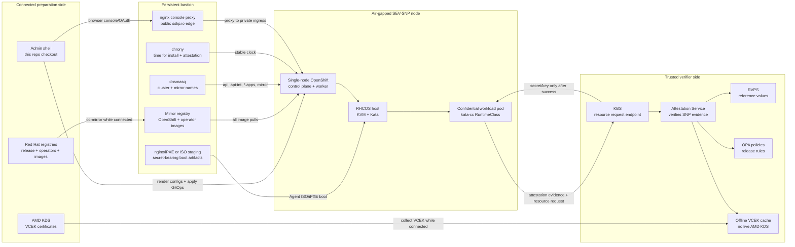
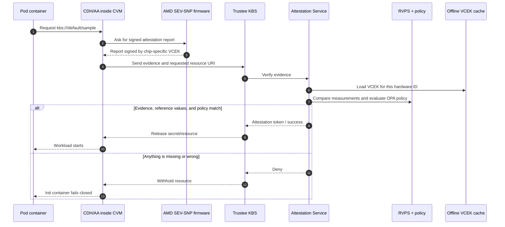
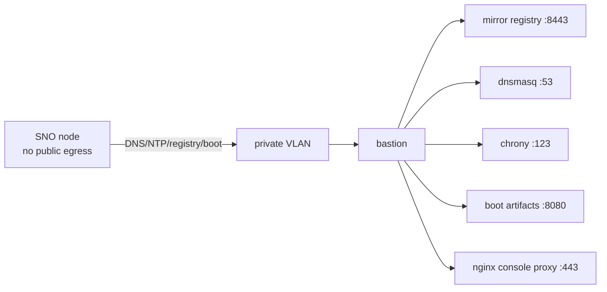
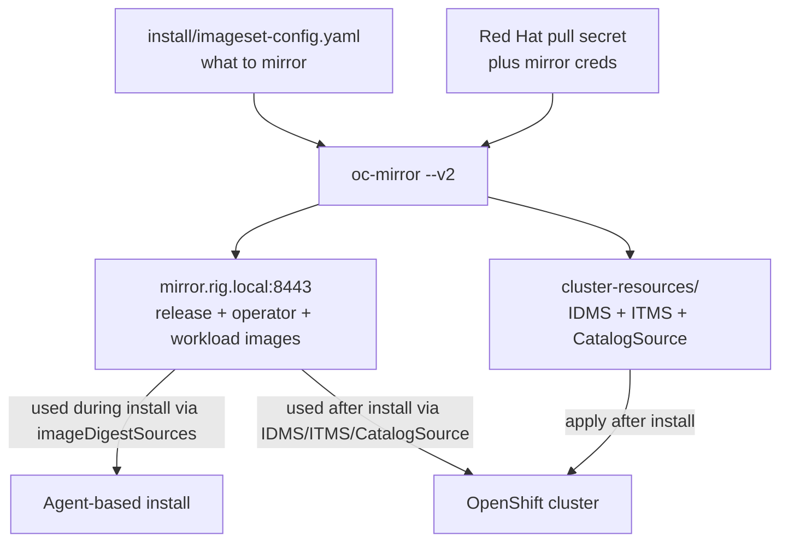
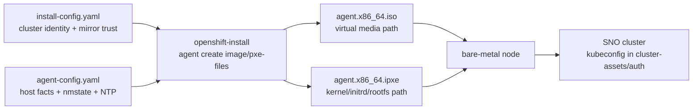

# Manual Install Guide — OpenShift Confidential Containers (SEV-SNP, air-gapped)

A fully **manual**, provider-neutral procedure for standing up the air-gapped
single-node OpenShift (SNO) Confidential Containers (CoCo) verification environment **by
hand** — every step done without Terraform, Ansible, or the `Makefile`.

This guide exists alongside the automation, not instead of it. If you want the hands-off
path, use:

- **Infrastructure** — `infra/` (Terraform: node, bastion, private VLAN, firewall, netboot).
- **Bastion + install** — `ansible/` (roles for egress hardening, mirror, DNS/NTP, render,
  PXE serve, install) driven by `make up`.
- **Per-phase shortcuts** — the `Makefile` targets (`make tools`, `make mirror`,
  `make verify-snp-host`, `make apply-sno`, `make apply-trustee`, …).

Everything below is what those automate, rewritten as the commands a human runs by hand. It
is deliberately **provider-neutral**: where a step needs the metal provisioned a certain way
(create a node, attach an L2 network, set BIOS over IPMI, netboot), it states the *outcome*
you must achieve and leaves the provider's API/console up to you. The committed Terraform/
Ansible target [Latitude.sh](https://www.latitude.sh) as one worked example.

> Conventions: **STOP-gate** = do not proceed until it is green. `# FILL` = an
> environment-specific value you resolve on the metal — never invent it. Example IP plan used
> throughout: node L2 subnet on the node's public NIC, plus a private VLAN `192.168.66.0/24`
> shared by the bastion (`.10`) and the node (`.11`). Substitute your own.

**Targets:** OCP **4.20.18** (alt 4.19.28) · OSC **1.12** · Trustee **1.1** · TEE = **AMD
SEV-SNP** (EPYC Genoa / 9004 or newer).

---

## First-time reader orientation

This guide assumes you know Linux, Kubernetes, and OpenShift operations, but **not**
Confidential Computing. The important mental model is:

1. A normal container shares the node kernel.
2. A Kata container runs the pod inside a lightweight VM.
3. A **Confidential Container** runs that VM as a hardware-protected confidential VM (CVM).
4. The workload gets secrets only after an external verifier agrees that the CVM was launched
   with the expected hardware, firmware, guest image, runtime configuration, and policy.

In this repo the hardware protection is **AMD SEV-SNP**. SEV-SNP encrypts and integrity-protects
guest memory so the host/hypervisor can run the VM but cannot freely inspect or tamper with the
guest's private memory. The proof mechanism is **remote attestation**: the guest asks the AMD
Secure Processor for a signed attestation report, Trustee verifies that report, and Trustee
releases secrets only when policy and reference values match.

Useful background:

- [AMD SEV overview](https://www.amd.com/en/developer/sev.html) — AMD's overview of SEV,
  SEV-ES, and SEV-SNP.
- [AMD SEV-SNP attestation slides](https://www.amd.com/content/dam/amd/en/documents/developer/lss-snp-attestation.pdf)
  — how SNP reports, VCEK certificates, and KDS fit together.
- [Confidential Containers attestation](https://confidentialcontainers.org/docs/attestation/)
  — the upstream CoCo attestation model.
- [Trustee architecture](https://confidentialcontainers.org/docs/attestation/architecture/) —
  KBS, Attestation Service, RVPS, policies, and resource release.
- [OpenShift Agent-based Installer 4.20](https://docs.redhat.com/en/documentation/openshift_container_platform/4.20/html/installing_an_on-premise_cluster_with_the_agent-based_installer/preparing-to-install-with-agent-based-installer)
  — the installer flow used for disconnected SNO.
- [OpenShift oc-mirror v2](https://docs.redhat.com/en/documentation/openshift_container_platform/4.20/html/disconnected_environments/about-installing-oc-mirror-v2)
  — mirroring release payloads, operators, and generated IDMS/ITMS/CatalogSource resources.
- [OpenShift sandboxed containers 1.12 on bare metal](https://docs.redhat.com/en/documentation/openshift_sandboxed_containers/1.12/html/deploying_confidential_containers_on_bare-metal_servers/index)
  — Red Hat's OSC/CoCo bare-metal deployment guide.

### The whole environment in one picture



The bastion is not just a jump box. It is the node's replacement for the public internet:
registry, DNS, NTP, and boot artifacts. If the node can reach public registries or AMD KDS
directly, the air-gap test is not meaningful because it can bypass the cache paths this guide
is proving.

### Attestation and secret release



The important newcomer detail: **attestation is not "does this pod run?"** It is "can an
independent verifier connect the hardware-rooted report to expected measurements and policy?"
That is why every rung below has both a happy path and a negative test.

### Vocabulary used throughout this guide

| Term | What it means here | Why you care |
|------|--------------------|--------------|
| **TEE** | Trusted Execution Environment. In this guide, the TEE is AMD SEV-SNP. | It is the hardware root for memory protection and attestation. |
| **CVM** | Confidential VM. Kata launches the pod sandbox as a VM protected by the TEE. | Your pod still looks like Kubernetes, but it boots inside a VM with measured launch state. |
| **SEV-SNP** | AMD Secure Encrypted Virtualization with Secure Nested Paging. | Protects guest memory and produces signed attestation reports. |
| **RMP** | Reverse Map Table, firmware-managed memory ownership metadata used by SNP. | If RMP coverage/BIOS is wrong, SNP guests fail before Kubernetes matters. |
| **VCEK** | Versioned Chip Endorsement Key certificate for a specific AMD chip and TCB version. | Trustee needs it to verify the SNP report signature. Offline installs must cache it. |
| **KDS** | AMD Key Distribution Service. | Public source for VCEK certs; production air gaps cannot rely on live access to it. |
| **KBS** | Key Broker Service, the Trustee endpoint clients ask for secrets/resources. | It releases secrets only after attestation succeeds. |
| **AS** | Attestation Service inside Trustee. | It validates SNP evidence, VCEK, RVPS values, and policy. |
| **RVPS** | Reference Value Provider Service. | Stores the expected measurements the attestation evidence is compared against. |
| **CDH/AA** | Confidential Data Hub / Attestation Agent inside the CVM. | Guest-side pieces that collect evidence and fetch KBS resources. |
| **initdata** | Gzip+base64 TOML passed as a Kata annotation. | Tells the CVM where Trustee is and what resources/policies to use; its bytes are measured. |
| **RuntimeClass `kata-cc`** | Kubernetes runtime selector for Confidential Containers. | Workloads without this run as ordinary containers or plain Kata, not CoCo. |
| **SNO** | Single Node OpenShift. | One node is both control plane and worker, so every reboot is visible. |
| **IDMS/ITMS** | ImageDigestMirrorSet / ImageTagMirrorSet generated by `oc-mirror`. | Tells a live cluster to pull mirrored content instead of public content. |

### What gets created, who consumes it, and why

The fastest way to get lost in disconnected CoCo work is to treat every YAML as "some config."
Each file below has one consumer and one job.

#### Install-time files

| File or artifact | Created by | Consumed by | Purpose | Newcomer notes |
|------------------|------------|-------------|---------|----------------|
| [`install/imageset-config.yaml`](../install/imageset-config.yaml) | You edit the repo template. | `oc-mirror --v2`. | Declares the OpenShift release, operator catalogs, and extra images to copy into the mirror registry. | This is the shopping list for the air gap. If an operator/image is not listed here, the disconnected cluster cannot pull it later. |
| `~/.docker/config.json` on the bastion | Phase 2.3. | `oc-mirror` and registry clients. | Merges the Red Hat pull secret with mirror registry credentials. | Red Hat creds are for populating the mirror. The node should receive only mirror creds. |
| `cluster-assets/install-config.yaml` | Copy from [`install/install-config.yaml.tmpl`](../install/install-config.yaml.tmpl). | `openshift-install agent create ...`. | Cluster identity, network ranges, release-image mirror rules, mirror CA, mirror pull secret, SSH key. | Think "what cluster are we installing, and where should it pull release images?" |
| `cluster-assets/agent-config.yaml` | Copy from [`install/agent-config.yaml.tmpl`](../install/agent-config.yaml.tmpl). | `openshift-install agent create ...`. | Host inventory and nmstate: rendezvous IP, disk, NIC MAC, VLAN child, DNS, routes, NTP. | Think "how does this exact server boot and reach the mirror?" Wrong MAC or missing VLAN means config is ignored or the mirror is unreachable. |
| `cluster-assets/agent.x86_64.iso` or `agent.x86_64.ipxe` + initrd/rootfs | `openshift-install`. | The bare-metal node firmware/iPXE boot. | Boots the installer with embedded ignition, pull secret, SSH key, and network config. | Treat these artifacts as sensitive because the initrd contains secrets. Stop the boot server after use. |
| `cluster-assets/auth/kubeconfig` | The installer. | You and `oc`. | Admin access to the new cluster. | Local secret material; do not commit. |
| `/opt/mirror/ocm-workspace/working-dir/cluster-resources/` | `oc-mirror --v2`. | `oc apply` after the cluster exists. | IDMS/ITMS and CatalogSource resources for day-2 mirrored pulls. | The installer uses `install-config.imageDigestSources`; the live cluster later uses these resources. They are related, not interchangeable. |

#### Bastion services

| Component | Config/files in this guide | Purpose | Failure symptom |
|-----------|----------------------------|---------|-----------------|
| Mirror registry | `/opt/mirror/quay`, `/opt/mirror/ca/rootCA.pem`, `/opt/mirror/mirror-admin-password` | Local registry for OpenShift, operators, Trustee, and test images. | Image pulls fail, CatalogSource not ready, install stalls pulling release images. |
| Mirror CA trust | `/etc/pki/ca-trust/source/anchors/mirror-rootCA.pem`, `additionalTrustBundle` | Lets the bastion and RHCOS trust the mirror registry TLS certificate. | `x509: certificate signed by unknown authority`. |
| DNS (`dnsmasq`) | `/etc/dnsmasq.d/rig.conf` | Resolves `mirror.rig.local`, `api`, `api-int`, and `*.apps` over the private VLAN. | Bootstrap hangs or mirror hostname resolves only on the old raw OS. |
| NTP (`chrony`) | `/etc/chrony.d/rig.conf`, `agent-config.additionalNTPSources` | Gives the air-gapped node stable time. | Bootstrap or attestation behaves mysteriously because certificates/tokens are time-sensitive. |
| Boot web server | `scripts/serve-boot-artifacts.sh`, nginx on `:8080` | Publishes iPXE kernel/initrd/rootfs under an unguessable path. | Netboot cannot fetch artifacts; if left running, secret-bearing initrd remains exposed. |
| Console proxy | `/etc/nginx/conf.d/coco-public-console.conf`, managed by `ansible/roles/public_console/` | Publishes the disposable rig console/OAuth route through the bastion public IP using sslip.io names, then proxies to private OpenShift ingress. | The cluster is healthy but the browser cannot reach the console from outside the private VLAN. |
| Egress shaping | `/etc/nftables/egress-clamp.nft`, node `nft` airgap table | Makes large mirror pulls reliable and proves the node cannot bypass the bastion. | `oc-mirror` EOFs, or negative air-gap tests accidentally pass by reaching public services. |

#### Post-install GitOps files

| File or directory | Consumed by | Purpose | Why it matters for CoCo |
|-------------------|-------------|---------|-------------------------|
| [`gitops/base/operators/`](../gitops/base/operators/) | OLM. | Namespaces, OperatorGroups, and Subscriptions for NFD, cert-manager, OSC, and Trustee. | Operators install CRDs/controllers; without mirrored CatalogSources, they cannot resolve bundles. |
| [`gitops/base/nfd/`](../gitops/base/nfd/) | NFD operator. | Runs Node Feature Discovery and the AMD SNP rule. | The SNP label is live proof the node exposes the expected CPU feature. Do not hand-label it. |
| [`gitops/base/kataconfig/feature-gates.yaml`](../gitops/base/kataconfig/feature-gates.yaml) | OSC operator. | Enables the confidential runtime feature gate. | In OSC 1.12, CoCo is enabled here, not by a `KataConfig` field. |
| [`gitops/base/kataconfig/kataconfig.yaml`](../gitops/base/kataconfig/kataconfig.yaml) | OSC operator. | Installs Kata and creates RuntimeClasses. | `kata-cc` must resolve to the SNP handler before CoCo workloads mean anything. |
| [`gitops/base/gatekeeper/`](../gitops/base/gatekeeper/) | OPA Gatekeeper. | Installs mutation/constraint policy for CoCo pod memory settings. | SNP pins guest RAM at launch; the policy helps prevent undersized pods from being killed by the host. |
| [`gitops/base/trustee/kbs-configmaps.yaml`](../gitops/base/trustee/kbs-configmaps.yaml) | Trustee operator/KBS. | KBS config, resource policy, attestation policy, and RVPS reference values. | Policy and reference values decide whether secrets are released. |
| [`gitops/base/trustee/secret-stubs.example.yaml`](../gitops/base/trustee/secret-stubs.example.yaml) | You create real Secrets from it. | Documents required secret names and shapes. | Missing secrets look like attestation failures because KBS crash-loops or cannot serve resources. |
| [`gitops/base/trustee/kbsconfig.yaml`](../gitops/base/trustee/kbsconfig.yaml) | Trustee operator. | Wires ConfigMaps, Secrets, service mode, and OfflineStore VCEK cache into KBS. | This is where air-gapped SNP verification becomes real: no cached VCEK, no attestation. |
| [`gitops/base/workloads/initdata.example.toml`](../gitops/base/workloads/initdata.example.toml) | Encoded into pod annotations. | Guest-side AA/CDH config: KBS URL, resources, policies, registry config. | The bytes are measured; any environment change can require regenerated RVPS values. |
| [`gitops/base/workloads/rung-a-secret-pod.yaml`](../gitops/base/workloads/rung-a-secret-pod.yaml) | Kubernetes/Kata. | First proof workload: request a KBS secret before starting. | Verifies the complete pod → CVM → Trustee → secret path. |
| [`gitops/base/airgap-egress/`](../gitops/base/airgap-egress/) | MachineConfigPool. | Optional post-install host egress lockdown. | Keeps the installed RHCOS node honest after the raw-OS nft rule is wiped by install. |

#### Hardware-bound artifacts

These are deliberately **not portable** between machines or firmware states:

| Artifact | Why it is hardware-bound | Regenerate when |
|----------|--------------------------|-----------------|
| BIOS/firmware SNP settings | Firmware decides whether the CPU exposes SNP host capability. | Every re-provision, firmware reset, or hardware change. |
| VCEK certificates | A VCEK is tied to a chip HWID and TCB version. | New socket, firmware/TCB change, provider swaps the physical server. |
| RVPS reference values | They describe expected measurements for a concrete launch/config. | initdata, workload, runtime, firmware, or TEE-relevant config changes. |
| initdata annotation bytes | SNP measures the guest launch data. | KBS URL, registry config, policy/resource URI, or initdata content changes. |
| TLS identity / Trustee URL | The CVM must talk to the verifier it was configured and measured to use. | Different cluster, route, certificate, or trust domain. |

If you remember only one rule: **GitOps structure is portable; attestation evidence and
measurement inputs are not.**

---

## What you need (infrastructure outcomes)

Provision these however your provider allows (cloud bare-metal API, your own DC, IPMI):

1. **An SEV-SNP-capable bare-metal node.** AMD EPYC Genoa (9004) or newer. You need:
   - **IPMI / KVM console** access (for the BIOS recipe and, on the ISO path, virtual media).
   - The ability to **netboot** it (iPXE) *or* attach an ISO as virtual media.
   - Two network paths: its **public/primary NIC** (initial OS + iPXE fetch) and a **tagged
     VLAN** child on the private network (reaches the mirror over the air gap).
   - Enough headroom for CoCo CVMs — comfortably above the OCP 4.20 SNO minimums
     (≥ 8 vCPU / 16 GiB / 120 GiB; size up, CVMs pin guest RAM at launch).
2. **A persistent bastion / admin host.** No SNP required. Needs ≥ ~200 GiB disk for the
   mirror cache, a public IP (to serve iPXE artifacts), and a leg on the **same private VLAN**
   as the node. It hosts the mirror registry, DNS, NTP, and the boot-artifact web server, and
   survives node churn so the (slow) mirror is paid once.
3. **An L2 private network / VLAN** both hosts share (the air-gap data path). No L3 from the
   provider — you add the addresses yourself.
4. **A Red Hat pull secret** from <https://console.redhat.com/openshift/install/pull-secret>.
   Used **only on the bastion** to populate the mirror. It is **never** carried onto the
   air-gapped node — the node only ever authenticates to the mirror.
5. **An SSH keypair** for `core@`/host debugging (its public half goes into `install-config`).

---

## Phase 0 — Tooling (on the bastion / admin host)

Replaces: `make tools` → `scripts/install-tools.sh`.

These tools do three different jobs:

| Tool | Job in this guide | Why the version is pinned |
|------|-------------------|---------------------------|
| `oc` / `kubectl` | Talks to the live OpenShift cluster after install. | Client/server skew is tolerated only within limits; keep it aligned with the target release. |
| `openshift-install` | Renders the Agent-based Installer ISO/iPXE artifacts and waits for install completion. | The installer must understand the same release payload you mirrored. |
| `oc-mirror` | Copies release payloads, operator catalogs, and images into the bastion mirror. | v2 output layout and generated resources are version-sensitive. |

Fetch the version-pinned clients (`oc`, `openshift-install`, `oc-mirror`, all 4.20.18 /
linux-amd64). The repo script does this into `./bin`; by hand:

```bash
OCP=4.20.18
BASE="https://mirror.openshift.com/pub/openshift-v4/amd64/clients/ocp/${OCP}"
sudo install -d /usr/local/bin
curl -fsSL "${BASE}/openshift-client-linux-${OCP}.tar.gz"  | sudo tar -xzf - -C /usr/local/bin oc kubectl
curl -fsSL "${BASE}/openshift-install-linux-${OCP}.tar.gz" | sudo tar -xzf - -C /usr/local/bin openshift-install
# oc-mirror: prefer the rhel9 build on a RHEL-family bastion, else the generic one
curl -fsSL "${BASE}/oc-mirror.rhel9.tar.gz" | sudo tar -xzf - -C /usr/local/bin oc-mirror \
  || curl -fsSL "${BASE}/oc-mirror.tar.gz" | sudo tar -xzf - -C /usr/local/bin oc-mirror
oc version --client && openshift-install version && oc-mirror --v2 --help >/dev/null && echo OK
```

> **VERIFY:** `OCP` here matches the `ocp` pin in [`install/imageset-config.yaml`](../install/imageset-config.yaml).

> **STOP-gate:** all three tools resolve on `PATH`; Red Hat pull secret in hand.

---

## Phase 1 — Provision the infrastructure (by hand)

Replaces: `terraform apply` in `infra/` (node, bastion, VLAN, firewall, netboot).

Do this in your provider's API/console. The **order matters**: bring up the bastion first so
the mirror exists before the node needs it.

1. **Create the private L2 network / VLAN** in the same site/region both hosts will live in.
   Record its **VLAN ID (VID)** — you need it for the node's tagged interface later.
2. **Provision the bastion** (small metal or VM; ≥ 200 GiB disk), attach it to the VLAN, and
   inject your SSH key. A RHEL-family OS (Rocky 10 in the reference automation) keeps the
   `dnf`/`firewalld`/`nft` commands below verbatim.
3. **Provision the SNP node**, attach it to the **same** VLAN, inject the same SSH key. Leave
   its BIOS at defaults for now — Phase 4 sets the SNP recipe and runs the rung-0 gate before
   any OpenShift install.
4. **(Inbound firewall, optional)** Restrict inbound to the node/bastion to your admin CIDR
   (SSH / API / ingress). Egress is locked **host-side** in Phase 2/4, not via the provider.

> Hourly bare-metal billing accrues from provisioning. Tear the node down between runs
> (Phase 9); keep the bastion so the mirror persists.

> **Provider note (Latitude.sh):** the reference `infra/latitude/` Terraform creates the
> virtual network, both servers, the VLAN attachment, and (for the node) an `ipxe` netboot OS.
> The equivalent by hand is the four steps above plus the per-phase host config that follows.

### 1.1 Bring up the VLAN L3 on both hosts

The provider gives you L2 only; you assign the addresses. On **each** host, create a tagged
VLAN child on its private-network NIC. Confirm the parent interface name first
(`ip -br link` — it is hardware-bound; do not guess). Example with NetworkManager:

```bash
# Bastion: VLAN child carrying 192.168.66.10/24   (node uses 192.168.66.11/24)
PARENT=<private-nic>        # FILL: e.g. bond0 / enp195s0f1  (ip -br link)
VID=<vlan-id>              # FILL: the VID from step 1
nmcli connection add type vlan con-name rigvlan dev "$PARENT" id "$VID" \
  ip4 192.168.66.10/24
nmcli connection up rigvlan
```

Why this exists: the public/primary NIC is for provisioning and initial boot reachability; the
private VLAN is the simulated production air gap. OpenShift, the mirror registry, DNS, NTP,
and Trustee should all be reachable across this private path. If the VLAN is wrong, later
errors often look like "registry down" or "bootstrap hung," even though the real bug is L2/L3.

---

## Phase 2 — Bastion preparation

Replaces: the Ansible bastion roles (`bastion_egress`, `mirror_tools`, `mirror_push`,
`dns_ntp`) and the bastion cloud-init. Run everything here **on the bastion**.

This phase creates the services the disconnected node will treat as infrastructure:



### 2.1 Egress hardening (do this FIRST)

A fresh bastion's **IPv6** path to the registry CDN can blackhole large `oc-mirror` blobs
(symptom: `unexpected EOF` mid-pull). `oc-mirror` is a Go binary, so `/etc/gai.conf`
IPv4-preference is ignored — you must remove v6 reachability and clamp the v4 path. See
`ansible/roles/bastion_egress/` for the canonical version.

```bash
sudo dnf install -y nftables
# 1) drop the IPv6 default route (kills v6 egress reachability)
sudo ip -6 route del default 2>/dev/null || true
# 2) clamp the v4 default-route MTU
DEF=$(ip -4 route show default | head -1)
sudo ip route change ${DEF} mtu 1400
# 3) SYN MSS clamp via nftables
sudo tee /etc/nftables/egress-clamp.nft >/dev/null <<'EOF'
table inet egress_clamp {
  chain output {
    type filter hook output priority mangle; policy accept;
    tcp flags syn tcp option maxseg size set 1360
  }
}
EOF
sudo nft -f /etc/nftables/egress-clamp.nft
sudo nft list table inet egress_clamp | grep maxseg   # verify the clamp is loaded
```

### 2.2 Stand up the mirror registry

The reference bastion uses Red Hat's `mirror-registry` (a single-host quay). Install it,
serving TLS on `:8443` under a DNS name (example `mirror.rig.local`). The **admin password is
generated on the box**, never stored in code:

```bash
sudo install -d -m700 /opt/mirror /opt/mirror/quay /opt/mirror/ca
openssl rand -base64 24 | sudo tee /opt/mirror/mirror-admin-password >/dev/null
sudo chmod 600 /opt/mirror/mirror-admin-password
# download + unpack mirror-registry (pin the version/sha for reproducibility), then:
sudo ./mirror-registry install \
  --quayHostname mirror.rig.local --quayRoot /opt/mirror/quay \
  --initUser init --initPassword "$(sudo cat /opt/mirror/mirror-admin-password)"
# capture the CA the installer emitted:
sudo cp /opt/mirror/quay/quay-rootCA/rootCA.pem /opt/mirror/ca/rootCA.pem
```

> Run the registry under SELinux **enforcing**. If the quay pod won't start, `restorecon -Rv`
> the `quayRoot` — do **not** `setenforce 0`.

### 2.3 Trust the mirror CA + build the merged auth file

```bash
sudo cp /opt/mirror/ca/rootCA.pem /etc/pki/ca-trust/source/anchors/mirror-rootCA.pem
sudo update-ca-trust
curl -s https://mirror.rig.local:8443/health/instance && echo "  mirror reachable + trusted"

# Merge the RH pull secret (pre-staged at ~/pull-secret.json) with the mirror creds into
# the docker config oc-mirror reads:
MIRROR=mirror.rig.local:8443
AUTH=$(printf 'init:%s' "$(sudo cat /opt/mirror/mirror-admin-password)" | base64 -w0)
mkdir -p ~/.docker
jq --arg ep "$MIRROR" --arg a "$AUTH" \
  '.auths[$ep]={auth:$a,email:"noreply@example.com"}' \
  ~/pull-secret.json > ~/.docker/config.json
chmod 600 ~/.docker/config.json
```

### 2.4 DNS + NTP for the air-gapped node

The node has no public DNS/NTP. Serve both from the bastion on the VLAN. See
`ansible/roles/dns_ntp/` for the canonical templates.

```bash
sudo dnf install -y dnsmasq chrony
# DNS: resolve the mirror name and the cluster API/ingress to the node's VLAN IP.
sudo tee /etc/dnsmasq.d/rig.conf >/dev/null <<'EOF'
address=/mirror.rig.local/192.168.66.10
host-record=api.sno-coco.coco.lab.local,192.168.66.11
host-record=api-int.sno-coco.coco.lab.local,192.168.66.11
address=/apps.sno-coco.coco.lab.local/192.168.66.11
EOF
sudo systemctl enable --now dnsmasq
# NTP: serve the VLAN, local stratum so it works fully offline.
sudo tee /etc/chrony.d/rig.conf >/dev/null <<'EOF'
allow 192.168.66.0/24
local stratum 10
EOF
sudo systemctl enable --now chronyd
sudo firewall-cmd --permanent --add-service=dns --add-service=ntp --add-port=8443/tcp --add-port=8080/tcp
sudo firewall-cmd --reload
```

> Clock skew silently hangs OpenShift bootstrap **and** breaks SNP attestation. Wiring NTP to
> the bastion (here and in `agent-config`, Phase 5) is not optional.

---

## Phase 3 — Mirror the content (the bottleneck, ~1–2 h, cacheable)

Replaces: `make mirror` → `scripts/mirror.sh`. Runs on the bastion.

Mirroring is the moment when the connected world is copied into the disconnected world:



`imageset-config.yaml` is not applied to the cluster. It is input to `oc-mirror`. The mirror
output has two halves: image data pushed into the registry, and YAML resources applied later
so the live cluster knows how to keep using that registry.

```bash
# VERIFY operator channels BEFORE the long pull — cheap to check, 1–2 h to redo:
for pkg in nfd cert-manager sandboxed-containers-operator trustee-operator; do
  oc-mirror list operators --catalog <mirrored-or-public-index> --package "$pkg"
done
# reconcile any mismatches in install/imageset-config.yaml (every channel carries # VERIFY).

# Push (oc-mirror v2). The workspace persists and re-runs fetch only deltas.
export MIRROR_REGISTRY=mirror.rig.local:8443
oc-mirror --v2 -c install/imageset-config.yaml \
  --workspace file:///opt/mirror/ocm-workspace docker://${MIRROR_REGISTRY}
```

`oc-mirror` v2 emits **IDMS/ITMS + a CatalogSource** under
`/opt/mirror/ocm-workspace/working-dir/cluster-resources/`. Keep them — they are applied
**after** the cluster exists (Phase 5), not now (the installer uses `install-config`'s
`imageDigestSources` instead).

> **Landmines:** `401/403` = stale RH pull secret; `x509` = mirror CA not trusted on this host
> (re-check 2.3). If `oc-mirror` v2 panics on a registry-auth conflict, `unset
> REGISTRY_AUTH_FILE` (its embedded registry hijacks it).

> **STOP-gate:** mirror completes with no errors; `cluster-resources/` YAML present; all four
> operator packages confirmed present in the mirrored catalog.

---

## Phase 4 — Rung-0 SNP host gate + the BIOS recipe

Replaces: `scripts/host-snp-check.sh` + the manual IPMI BIOS step. This proves silicon +
firmware + provider actually do **SNP host** before you build anything on top.

For newcomers: this is deliberately before OpenShift. If the host cannot launch SNP guests,
no Kubernetes manifest can fix it. Rung-0 answers only one question: "Does this physical
server, firmware setup, and kernel expose the SEV-SNP host interface Kata will need later?"

### 4.1 Set the SEV-SNP BIOS (the one hands-on hardware step)

Via the node's IPMI/KVM console → reboot → firmware setup (AMI Aptio in the reference rig).
Full walkthrough: [`docs/notes/latitude-snp-bringup.md`](notes/latitude-snp-bringup.md).

| Setting | Value |
|---|---|
| North Bridge → **SEV-SNP Support** | **Enabled** — *not* `Auto` (Auto reads as OFF — the classic landmine) |
| CPU Config → **SMEE** | Enabled |
| CPU Config → **SNP Memory (RMP Table) Coverage** | Enabled |
| CPU Config → **SEV-ES ASID Space Limit** | 100 |
| CPU Config → **SEV Control** | Enabled |
| Memory → **Memory Interleaving** | **Disabled** (else PSP `Error: 0x3`) |

The misleading `IOMMU SNP feature not enabled` kernel message is caused by **SEV-SNP Support =
Auto**, not IOMMU — don't chase IOMMU. **Re-provisioning resets BIOS to defaults; re-apply
this recipe every time.**

### 4.2 Run the rung-0 host gate (on the raw OS, pre-OpenShift)

```bash
ssh <user>@<node-ip> 'sudo bash -s' < scripts/host-snp-check.sh   # expect all PASS
```

The script discriminates **kernel-incapable** vs **BIOS-off** vs **genuine provider veto** —
read its `RESULT` line; a FAIL is not automatically a provider veto.

> **STOP-gate:** `RESULT: SEV-SNP host LIVE`. A genuine firmware/provider veto (kernel-capable
> + BIOS-on, still failing) means the bare-metal SNP path is invalid for this node — stop and
> reconsider the node/provider rather than building on top.

### 4.3 Lock egress host-side and verify the air gap bites

Two separate controls — don't conflate them. Inbound is the provider firewall (Phase 1.4);
**egress** is locked here with nftables, allowing only the bastion's private VLAN IP. A
silently-reachable internet would hide the very VCEK-cache failure mode this environment
exists to prove.

```bash
ssh <user>@<node-ip> 'sudo nft -f - <<EOF
table inet airgap {
  chain output { type filter hook output priority 0; policy drop;
    ct state established,related accept
    oifname "lo" accept
    ip daddr 192.168.66.10 accept   # bastion PRIVATE VLAN IP only
  }
}
EOF'
# probe: public egress must be DEAD, the private mirror must answer:
ssh <user>@<node-ip> 'curl -m5 -sI https://quay.io >/dev/null && echo "EGRESS OPEN (bad)" || echo "EGRESS BLOCKED (good)"'
ssh <user>@<node-ip> 'curl -m5 -skI https://mirror.rig.local:8443 >/dev/null && echo "MIRROR OK over VLAN"'
```

(Post-install, the same intent is expressed as the opt-in MachineConfig under
[`gitops/base/airgap-egress/`](../gitops/base/airgap-egress/) — apply it **after** the SNO is
healthy, not in the install-time overlay.)

> **STOP-gate:** rung-0 green **and** public egress blocked **and** mirror reachable.

---

## Phase 5 — Install SNO via the Agent-based Installer

Replaces: the Ansible `render_configs`, `pxe_serve`, and `install_drive` roles, and
`make agent-image` / `serve-boot-artifacts` / `install-wait`. Full reference:
[`install/README.md`](../install/README.md).

The Agent-based Installer consumes two YAML files and turns them into bootable media:



Treat `install-config.yaml` as cluster intent and `agent-config.yaml` as host inventory. The
installer consumes both from `cluster-assets/`; keep the `.tmpl` files in `install/` as the
human-readable source of truth.

### 5.1 Discover the node's facts (never guess)

On the booted node: root device (`lsblk` → `/dev/nvme0n1` vs `/dev/sda`), the **real NIC MAC**
of the VLAN-parent interface (`ip link` — MACs are per physical unit; a re-provision gives a
different machine), and confirm the static IP/gateway plan.

### 5.2 Fill the install templates into a fresh assets dir

```bash
mkdir -p cluster-assets
cp install/install-config.yaml.tmpl cluster-assets/install-config.yaml
cp install/agent-config.yaml.tmpl  cluster-assets/agent-config.yaml
```

Resolve every `# FILL:` (the templates document each one inline):

- **`install-config.yaml`** — `baseDomain`/`metadata.name`; `machineNetwork` CIDR;
  `imageDigestSources` (your `MIRROR_REGISTRY` + the two `/openshift/release[-images]` paths
  oc-mirror wrote — reconcile against the emitted `idms-oc-mirror.yaml`);
  `additionalTrustBundle` (the mirror CA PEM); `pullSecret` (**mirror** creds, base64
  `user:pass` — **not** the RH cloud secret); `sshKey` (your public key).
- **`agent-config.yaml`** — `rendezvousIP` (= the single node's VLAN-reachable IP);
  `hostname`; `rootDeviceHints.deviceName`; `interfaces[].macAddress` (the discovered MAC);
  and the **two-interface** `networkConfig`: the boot/data NIC **plus a tagged VLAN child**
  carrying `192.168.66.11`, with `dns-resolver` pointed at the bastion's dnsmasq
  (`192.168.66.10`) so the mirror name resolves over the VLAN. `additionalNTPSources` lives
  **here** (the installer drops it from `install-config`) → the bastion VLAN IP.

> The VLAN child + DNS-based mirror resolution is the single most common "install never
> starts" trap: the RHCOS node reaches the mirror only over the VLAN, and the Phase-2
> `/etc/hosts` style trick does **not** survive into RHCOS — resolve the mirror via the
> bastion's DNS, not a hosts file.

### 5.3 Build boot artifacts and serve them (iPXE path)

```bash
# iPXE: build the kernel/initrd/rootfs + agent.x86_64.ipxe
openshift-install --dir cluster-assets agent create pxe-files
# (ISO path instead: `agent create image` → cluster-assets/agent.x86_64.iso, attach via IPMI vmedia)
```

The initrd embeds ignition (the **mirror pull secret + sshKey**), so serve it under an
**unguessable** path segment and refuse directory listing. `scripts/serve-boot-artifacts.sh`
does exactly this (tokenized nginx root on `:8080`, byte-range/`206` support). Set the
matching `bootArtifactsBaseURL` (the bastion's **public** IP — the node fetches iPXE over its
public NIC before the VLAN is up) in `agent-config` *before* `create pxe-files`.

### 5.4 Boot the node and wait

- **Netboot:** point the node at `http://<bastion-public-ip>:8080/<token>/agent.x86_64.ipxe`
  via your provider's reinstall/netboot mechanism (the reference rig uses the Latitude
  reinstall API with `operating_system=ipxe`). **Power-cycling alone re-boots the stale local
  disk — you must trigger a fresh netboot.**
- **Or ISO:** attach `agent.x86_64.iso` as virtual media via IPMI, one-time-boot to it.

```bash
openshift-install --dir cluster-assets agent wait-for bootstrap-complete   # may time out; non-fatal
openshift-install --dir cluster-assets agent wait-for install-complete
export KUBECONFIG=cluster-assets/auth/kubeconfig
oc get nodes                                   # single node, Ready
oc get clusterversion                          # Available=True, Progressing=False
```

Run the wait from a host with line-of-sight to `api-int.<cluster>.<base>` over the VLAN (the
bastion, if your admin host can't reach it). Kubeconfig + kubeadmin password land in
`cluster-assets/auth/`.

### 5.5 Apply the mirror cluster-resources, then close the boot endpoint

```bash
oc apply -f /opt/mirror/ocm-workspace/working-dir/cluster-resources/   # IDMS/ITMS + CatalogSource
scripts/serve-boot-artifacts.sh stop                                   # secret-bearing initrd must not stay public
oc get catalogsource -n openshift-marketplace                          # mirror catalog present + READY
```

> **STOP-gate:** node `Ready`; mirror `CatalogSource` present and **READY** (not-READY in a
> disconnected cluster = zero operators install).

---

## Phase 6 — Operators + KataConfig

Replaces: `make apply-sno` → `oc apply -k gitops/overlays/sno-workers`. You can apply the
GitOps tree directly, or apply the same manifests by hand in order. **Install order is
load-bearing: NFD → cert-manager → OSC → Trustee.**

The worker-side stack builds up in layers:

| Layer | What gets installed | Proof it worked |
|-------|---------------------|-----------------|
| NFD | Node Feature Discovery operator + AMD SNP rule. | Node has the SNP CPU feature label from discovery, not from a manual label. |
| cert-manager | Certificate management needed by Trustee/operator-managed TLS. | cert-manager CSV is `Succeeded`. |
| OSC | OpenShift sandboxed containers operator, feature gate, and `KataConfig`. | `kata` and `kata-cc` RuntimeClasses exist; `kata-cc` maps to SNP. |
| Gatekeeper | OPA Gatekeeper plus CoCo memory mutation/constraint resources. | CoCo pods have memory limits high enough for CVM RAM plus QEMU overhead. |
| Trustee operator | CRDs/controllers for KBS and attestation services. | Trustee CSV is `Succeeded`; KBS can be created in Phase 7. |

### 6.1 RHCOS SNP host gate

Rung-0 (Phase 4) proved the *raw* kernel; now prove the **RHCOS** kernel:

```bash
scripts/verify-snp-host.sh <node-name>   # PSP SEV-SNP API, RMP table, no Error 0x3, kvm_amd sev_snp=Y, /dev/sev
```

> **STOP-gate:** do not apply any GitOps until this is green.

### 6.2 Apply operators + NFD + KataConfig

```bash
oc apply -k gitops/overlays/sno-workers
# or, by hand, in this order — see each file for the exact content:
#   gitops/base/operators/{namespaces,operatorgroups,subscriptions}.yaml   (NFD→cert-manager→OSC→Trustee)
#   gitops/base/nfd/{nodefeaturediscovery,amd-snp-rule}.yaml               (starts NFD; emits the SNP label)
#   gitops/base/kataconfig/feature-gates.yaml                              (osc-feature-gates: confidential=true)
#   gitops/base/kataconfig/kataconfig.yaml                                 (KataConfig — reboots the node)
#   gitops/base/gatekeeper/{operator,gatekeeper-cr,assign,constraint}.yaml  (guards CoCo pod memory)
oc get csv -A | grep -Ei 'nfd|cert-manager|sandboxed|trustee'   # wait for all four Succeeded
```

Two non-obvious points the manifests encode:

- **CoCo is enabled by the `osc-feature-gates` ConfigMap (`confidential: "true"`), NOT a
  KataConfig field.** In OSC 1.12 the KataConfig CRD has no `enableConfidentialCompute`. The
  ConfigMap must exist **before** KataConfig reconciles, or you get plain Kata only.
- **NFD must label the node** (`amd.feature.node.kubernetes.io/snp=true`) before KataConfig, or
  the `kata-cc` handler binds wrong. The label is live proof the TEE is on — **do not
  hand-label** (it masks a real fault). Installing the NFD *operator* alone is not enough; the
  `NodeFeatureDiscovery` instance must run.

Applying `KataConfig` drives a MachineConfigPool rollout that **reboots the single node** (no
spare — wait it out): `oc get mcp -w`.

```bash
oc get runtimeclass         # expect: kata  AND  kata-cc
oc get runtimeclass kata-cc -o jsonpath='{.handler}'   # must be kata-qemu-snp (a.k.a. kata-snp) on SEV-SNP
```

> **STOP-gate:** four CSVs `Succeeded`, node back `Ready` post-reboot, `kata` + `kata-cc`
> (SNP handler) RuntimeClasses present. If the handler is wrong, KataConfig ran before NFD
> labeled — re-apply KataConfig once the label exists.

---

## Phase 7 — Trustee + air-gap attestation data

Replaces: `make apply-trustee` + `make collect-vcek` + `make gen-rvps`. These produce
**hardware-bound** data — regenerate on each distinct CPU+firmware config.

Trustee is the verifier. It is intentionally separate from the worker runtime: the confidential
guest asks Trustee for resources, and Trustee decides whether the evidence is good enough.

| Trustee piece | Config in this repo | Role |
|---------------|---------------------|------|
| KBS | `kbs-config.toml` inside `kbs-configmaps.yaml`, wired by `KbsConfig`. | Receives guest resource requests and releases Secrets/resources after attestation succeeds. |
| Attestation Service | Configured inside the same KBS all-in-one deployment. | Verifies SNP evidence, VCEK, policy, and reference values. |
| RVPS | `rvps-reference-values` ConfigMap. | Stores expected measurements. |
| Resource policy | `resource-policy` ConfigMap. | Decides which resource URIs can be released. |
| Attestation policy | `attestation-policy` ConfigMap. | OPA/Rego policy for evidence decisions. |
| OfflineStore | `kbsLocalCertCacheSpec` in `kbsconfig.yaml`. | Mounts VCEK certificates so verification works without live AMD KDS. |

### 7.1 Create the out-of-band Trustee secrets FIRST

KBS crash-loops (looks like an attestation bug) if these are missing. Create them per
[`gitops/base/trustee/secret-stubs.example.yaml`](../gitops/base/trustee/secret-stubs.example.yaml):
`kbs-auth-public-key` (your ed25519 admin keypair — you generate and guard the private half),
`attestation-cert`, `regcred` (**name must not contain dots**), `sample`, plus the
`credential` / `security-policy` resources the rungs serve.

### 7.2 Stand up Trustee

```bash
oc apply -k gitops/overlays/sno-trustee     # = gitops/base/trustee
```

### 7.3 Collect per-socket VCEK certs into the OfflineStore

```bash
scripts/collect-vcek.sh <node-name> trustee-operator-system
```

One secret **per socket**, keyed by **lowercase** HWID. The `.der` is fetched via `snphost
show vcek-url` → downloaded on an **internet-connected** host (the rig node is egress-blocked)
→ carried in. Generation-agnostic (dodges the upstream Trustee `Milan`-hardcode bug).

> **Landmine:** an UPPER-case HWID silently misses the cache and falls through to the
> (unreachable) KDS → attestation fails for the wrong reason. The secret name must be short
> (≤ 63 chars, it becomes a pod volume name); the full 128-hex lowercase HWID goes only in the
> `kbsLocalCertCacheSpec` `mountPath` (see [`gitops/base/trustee/kbsconfig.yaml`](../gitops/base/trustee/kbsconfig.yaml)).

### 7.4 Generate RVPS reference values

```bash
scripts/gen-rvps-veritas.sh        # coco-tools:1.12 veritas --tee snp — one run per distinct socket/hw config
```

### 7.5 Wire both into Trustee

Mount the VCEK secrets via `KbsConfig.spec.kbsLocalCertCacheSpec` at
`…/kds-store/vcek/<hwid-lowercase>/vcek.der`, and merge the RVPS output into the
`rvps-reference-values` ConfigMap referenced by `kbsconfig.yaml`. **Ensure `vcek_sources`
omits `{type=KDS}`** — leaving KDS in lets attestation "work" by reaching an internet that
won't exist in production.

> **STOP-gate:** KBS restarts cleanly; its logs show no missing-cert / empty-RVPS / measurement
> errors (`oc logs -n trustee-operator-system -l app=kbs`).

---

## Phase 8 — Capability rungs (a → b → c) + negative tests

Manual equivalent of the rig targets `make apply-rung-a`, `make apply-rung-b`,
`make apply-rung-c`, and `make negative-test WHICH=all`. A rung is **proven only when
reproduced from these steps AND its negative test fails-closed** — a negative test that
*passes* (secret released when it shouldn't be) is a sign-off-blocking finding, not a green.
Do them **in order**. See [`docs/design/engagement-design.md`](design/engagement-design.md)
§5 for the full matrix. Rungs b/c have implementation scaffolding but are not yet
hardware-proven; use
[`docs/runbooks/rung-bc-completion-plan.md`](runbooks/rung-bc-completion-plan.md) as the
execution plan for encrypted-image and signed-image proof artifacts.

Each rung adds one user-visible capability on top of the same attestation base:

| Rung | Capability being proven | Secret/resource being protected |
|------|-------------------------|---------------------------------|
| a | Attested secret release. | A sample KBS resource requested by the pod after CDH reports success. |
| b | Attested encrypted-image pull. | The image decryption key. |
| c | Attested signed-image policy. | The registry credential and image security policy. |
| Air-gap | No hidden live dependency on AMD KDS. | The VCEK cache path itself. |

- **Rung a — secret release.** Deploy
  [`gitops/base/workloads/rung-a-secret-pod.yaml`](../gitops/base/workloads/rung-a-secret-pod.yaml)
  (`runtimeClassName: kata-cc`). **Happy:** the init container's CDH attestation call returns
  `{"status":"success"}` → workload runs. **Negative:** restrictive resource policy + wrong/
  empty RVPS (or tampered initdata) → attestation errors, **secret withheld**, pod does not
  start. Keep `limits.memory ≥ default_memory + 256–512 MiB` or the host OOM-kills the CVM
  (SNP pins all guest RAM at launch). Read `oc describe pod` / `oc get events`, not just logs.
- **Rung b — encrypted image.** **Happy:** pod Running (image key released after attestation).
  **Negative:** wrong measurement → key withheld → pod won't start. Plan details: build a
  digest-pinned encrypted image, serve its key from KBS at `image-key/rung-b`, then prove a
  measured-initdata mismatch prevents the key release.
- **Rung c — signed image.** **Happy:** signed image pulls (mirror pull secret served as
  `regcred`). **Negative:** unsigned/tampered → `image_security_policy` rejects the pull.
  Plan details: serve a restrictive signed-image policy and public key from KBS, while still
  allowing or verifying the pause/release images the CVM pulls before the app image.
- **Air-gap negative test (cross-cutting).** Remove one VCEK secret / use a wrong-case HWID,
  then rerun an otherwise happy rung-a request. Attestation **must fail**. Proves the
  OfflineStore cache — not a silently-reachable KDS — is load-bearing.

> **STOP-gate:** every rung's happy path **and** negative test green, and the air-gap negative
> test fails closed.

---

## Phase 9 — Teardown

Stop node billing; keep the bastion so the mirror persists.

- Destroy/deprovision the **node** (in the automation: `terraform destroy` of the node module;
  by hand: deprovision via your provider). Leave the bastion up.
- **Re-provisioning gives a fresh node with default BIOS** — the Phase-4 SNP BIOS recipe must
  be re-applied every time. Provider + silicon are proven; the *settings* are not persistent.
- Tear the bastion down only at the very end (the mirror is the expensive thing to rebuild).

---

## Hardware-bound vs portable (carry through every phase)

- **Portable** — prove once, reuse verbatim: all `gitops/` manifests, the operator
  subscriptions + install order, KBS ConfigMaps / Rego policies, initdata *structure*, and the
  scripts themselves.
- **Hardware-bound** — regenerate per distinct CPU+firmware config: VCEK certs (keyed by chip
  HWID), RVPS reference values, TLS certs + Trustee URL, initdata *measured bytes* (HOST_DATA),
  and the BIOS recipe.

## Related references

- [`docs/runbooks/disconnected-sno-bringup.md`](runbooks/disconnected-sno-bringup.md) — the
  same flow as a phase checklist, with `make`/Terraform/Ansible entry points.
- [`docs/runbooks/failure-modes.md`](runbooks/failure-modes.md) — symptom → cause → fix.
- [`docs/notes/latitude-snp-bringup.md`](notes/latitude-snp-bringup.md) — the BIOS recipe.
- [`docs/design/engagement-design.md`](design/engagement-design.md) — why each decision was made.
